# PROJECT KAVACH — MASTER PRD & TECHNICAL BLUEPRINT
### A Private, Offline-Capable, Privacy-First Family Safety & Coordination Platform

| | |
|---|---|
| **Document version** | 1.0 (Final Consolidated Blueprint) |
| **Status** | Ready for implementation |
| **Codename** | Kavach (कवच — "armour"). Placeholder; rename freely. |
| **Primary deployment** | India (Gujarat), family of 4–10, self-hosted |
| **Target reader** | A single full-stack developer of intermediate experience, or a small team |
| **Estimated effort to Phase 1** | 10–12 weeks solo, part-time |
| **Estimated effort to full scope** | 18–24 months solo, part-time |
| **Monthly running cost at family scale** | ≈ ₹7,700 |

---

# PART 0 — HOW TO USE THIS DOCUMENT

## 0.1 What this document is

This is a **self-contained product requirements document plus technical blueprint**. It is written so that a developer who has never spoken to the product owner can read it top to bottom and build the entire system without asking a single clarifying question.

Everything needed is here: the problems, why each problem is hard, the chosen solution, the alternatives that were rejected and why, the exact schemas, the exact API contracts, the exact Android/iOS APIs, the week-by-week build order, the acceptance criteria, and the operational runbook.

## 0.2 What this document is NOT

- It is **not** a specification for a commercial product. There is no billing, no multi-tenant onboarding funnel, no marketing surface, no app-store optimisation.
- It is **not** a replacement for emergency services. The system's design explicitly assumes it **cannot** dispatch police, fire, or ambulance, and it never claims to.
- It is **not** a surveillance product. Several capabilities that would be technically easy are deliberately excluded (see §1.4.3, "Never Build").

## 0.3 Reading paths

| If you are… | Read, in this order |
|---|---|
| **The implementing developer** | §0 → §1 → §2 (whole catalog) → §4 → §5 → §18 (build plan) → then each spec section as you reach it |
| **An architect reviewing the design** | §1.3 → §4 → §4.5 (ADRs) → §10 → §11 → §22 |
| **Someone doing a security review** | §10 → §8 → §9.3 → §20 → §22 |
| **The family member being onboarded** | §1.6 → §20.3 → Appendix E.4 |
| **Future-you, at 3 a.m., during an outage** | §19 (runbook). Print it. |

## 0.4 Document conventions

**Requirement keywords** follow RFC 2119:

- **MUST** — non-negotiable. If this is not true, the system is broken and someone can be hurt.
- **SHOULD** — strongly recommended. Deviating requires a written reason in the ADR log.
- **MAY** — optional. Implement when convenient.

**Identifier scheme:**

| Prefix | Meaning | Example |
|---|---|---|
| `P-nnn` | Problem in the Problem Catalog | `P-014` |
| `FR-nnn` | Functional requirement | `FR-021` |
| `NFR-nnn` | Non-functional requirement | `NFR-004` |
| `ADR-nnn` | Architecture decision record | `ADR-007` |
| `RISK-nnn` | Entry in the risk register | `RISK-003` |
| `T-nnn` | Test case / drill | `T-012` |

**Tier labels** appear throughout and are the single most important concept in this document:

| Tier | Name | Rule |
|---|---|---|
| **T0** | Survival Plane | Native code, on-device, deterministic. MUST work with no network, 2% battery, screen locked, app force-stopped, user unconscious. **Zero dependency on T1 or T2.** |
| **T1** | Coordination Plane | Network fan-out, acknowledgment, live location, media. MUST degrade gracefully to SMS. May depend on T0 outputs, never on T2. |
| **T2** | Intelligence Plane | Automation, geofences, AI, dashboards, history, smart home. MAY be down for a week with zero safety impact. |

> **The Prime Directive of this architecture: dependencies flow downward only. T0 never calls T1 synchronously. T1 never blocks on T2.**
> If you ever find yourself writing code where an SOS trigger awaits a response from the intelligence plane, stop. You have introduced the exact failure mode this entire document exists to prevent.

## 0.5 Definition of Done (applies to every feature)

A feature is **not done** until all of the following are true. No exceptions, including for "small" changes.

1. ✅ Unit tests pass, including at least one failure-path test.
2. ✅ It has been tested on a physical Android device at **≤5% battery**.
3. ✅ It has been tested with **airplane mode on**.
4. ✅ It has been tested with the **app force-stopped**, then triggered externally.
5. ✅ It has been tested on at least one **aggressive-OEM device** (Xiaomi / Vivo / Oppo / Realme).
6. ✅ It emits at least one metric and one structured log line, and **neither contains Class-A data** (§10.2).
7. ✅ If it touches the T0 path, the **end-to-end canary** (§16.2) still passes.
8. ✅ Its entry in the traceability matrix (§3.3) is updated.
9. ✅ Any new permission is documented in Appendix A with a user-facing justification string.

---

# PART 1 — PRODUCT DEFINITION

## 1.1 Problem statement

A family is a distributed system of humans with no shared state. When something goes wrong to one member — a crash on the Navsari–Bilimora road, a fall at home, a phone snatched at a station, a child who did not reach school, an elderly parent who has not moved since morning — the information that something is wrong is **trapped inside the one person least able to communicate it**.

Existing solutions fail in one of four ways:

1. **Location trackers** (Life360, Find My) know *where* but not *what*. They have no concept of an incident, no escalation, and they store a decade of your family's movements in plaintext on someone else's server.
2. **Native OS SOS** (iOS Emergency SOS, Pixel Safety Check) is reliable but closed. It does not know your family's structure, your father's blood group, or that your brother is 400 metres away and is the fastest possible responder.
3. **Government systems** (ERSS-112) can actually dispatch, but only after a human calls, only in states where deployed, and with no continuous monitoring or family coordination layer.
4. **Personal safety apps** are single-user, cloud-dependent, and — the fatal flaw — **silently stop working** when the OS kills their background service, with nobody ever finding out.

## 1.2 Vision

> **A family's shared nervous system.**
>
> A distributed, privacy-preserving system that continuously maintains a low-fidelity model of *"is everyone okay?"*, and can escalate that model into high-fidelity, coordinated human action within seconds — using whatever communication substrate happens to still exist at that moment.

Three sentences that define success:

1. When something goes wrong, **the right people know within 30 seconds**, even if the internet is gone.
2. When nothing is wrong, **nobody feels watched**, and the battery cost is invisible.
3. The system **tells you when it is broken**, instead of failing silently.

## 1.3 Design principles

These are not aspirations. Every design decision in this document traces back to one of these, and every proposed change should be tested against them.

| # | Principle | Practical consequence |
|---|---|---|
| **P1** | **Degrade, never fail.** | Every capability has a defined behaviour at each degradation level. There is no state where the UI says "no connection" and stops. The floor is a screaming phone showing a medical card and coordinates in 48pt type. |
| **P2** | **The panic path has no branches.** | One gesture, same everywhere. No menus, no "what kind of emergency?", no confirmation dialogs. The victim's cognition has collapsed; the sensors and the responder answer those questions, not the victim. |
| **P3** | **Absence of signal is signal.** | Negative-space detection (no unlock in 14h, no arrival, no heartbeat) catches what event-driven systems miss. Build this early; it is cheap and high-yield. |
| **P4** | **Consent is an expiring graph, not a setting.** | Every observation is a scoped, time-bounded, purpose-bounded, revocable grant, visible to the observed person. This is what stops a 15-year-old from disabling the app. |
| **P5** | **Data minimisation is a security control.** | A family safety database is a stalker's dream. The safest byte is the one never collected. Geofences are evaluated on-device so the server never learns your home address. |
| **P6** | **Boring technology, ruthlessly.** | You are one person and this must run for a decade. Every exotic dependency is a future 3 a.m. outage during a real emergency. |
| **P7** | **AI advises; deterministic rules decide.** | A model may adjust a confidence score. A model may never decide whether to escalate. The ladder is a hand-written state machine that fits on one page. |
| **P8** | **Fail open on the safety path.** | Ambiguous signature? Unknown device? Expired token? **Accept the incident and flag it.** A false alarm costs a phone call. A suppressed real alarm costs a life. This asymmetry governs every ambiguous decision. |
| **P9** | **The system must monitor itself.** | Silent failure is the normal failure mode of background services. If an agent has not been heard from in N hours, that is a first-class alert to the *family*, not a log line. |
| **P10** | **Untested is broken.** | An emergency system that has never been exercised under realistic conditions is a decoration. Quarterly drills are a feature, not overhead. |

## 1.4 Scope

### 1.4.1 In scope (build this)

- Manual and automatic emergency detection, escalation, and family coordination
- Offline-first operation including SMS, BLE peer mesh, and total-isolation mode
- End-to-end encrypted family messaging, location sharing, medical records, and document vault
- Elderly passive monitoring and no-touch voice intercom
- Child/teen safety with a transparent, age-ramped autonomy model
- Anti-theft: fake shutdown, silent capture, remote alarm, device-owner lockdown
- Screen-time and app-usage management
- Home Assistant integration for smart-home safety signals
- Spare-phone repurposing: CCTV node, intercom node
- Wearable and BLE panic-button integration
- Self-diagnostics, drills, and after-action review

### 1.4.2 Out of scope (v1, may come later)

- Federation across multiple unrelated families
- Public/stranger responder network
- Direct PSAP/ERSS-112 API integration (requires a state-level arrangement; assume unavailable)
- Vehicle telematics beyond phone sensors + optional OBD-II
- Web dashboard (mobile-only in v1)
- iOS feature parity with Android's privileged features (impossible; see §6.3)

### 1.4.3 NEVER build (permanently out of scope)

These are excluded on principle, not on effort. Adding them would convert a safety system into a surveillance system, at which point the family stops trusting it and it stops working.

| Never | Why |
|---|---|
| Reading or analysing family members' message content for "concerning" language | Surveillance in a safety costume. It will be discovered, it will destroy trust, and it makes people less safe, not more. |
| Silent, invisible location tracking of an adult | If an adult cannot see who is watching them and revoke it, this is stalkerware. |
| Covert audio/video recording of a family member without their knowledge | Same. The only covert mode permitted is **self-initiated by the subject** (duress). |
| Cloud LLM processing of raw location, health, or audio data | Violates the Class-A boundary (§10.2). Non-negotiable. |
| Behavioural risk-scoring or profiling of family members | Poor base rates, unauditable, ethically corrosive. |
| Auto-dialling 112 without human confirmation | See §12.4. Legally, technically, and practically wrong. |
| Any feature whose primary user is the watcher rather than the watched | The watched person always wins in the long run — by disabling, circumventing, or leaving. |

## 1.5 Success metrics

| Metric | Target | Why this number |
|---|---|---|
| Manual trigger → first family device rings | **p95 < 5 s** online, < 60 s SMS-only | Below 5 s, further gains are lost in human reaction time. Above 15 s the subject starts to doubt it worked, which is itself harmful. |
| Trigger → first human acknowledgment | **p95 < 120 s** | This is the number that matters. Everything else serves it. |
| False-positive escalations | **< 1 per user per month** | Above this, alert fatigue sets in and real alerts get ignored. This is the metric that determines whether the system saves or kills. |
| Agent liveness (agent alive & healthy) | **> 99.5%** of wall-clock, all devices | The single most common real-world failure. |
| Passive battery cost | **< 4% / 24 h** | Above ~5%/day, users notice and disable. Battery is a safety metric. |
| Family voluntary engagement | **> 80%** of members open the app at least weekly, unprompted | If they only interact when forced, the system is dying. |
| Drills passed | **4 of 4 per year** | Untested is broken (P10). |

## 1.6 Personas & roles

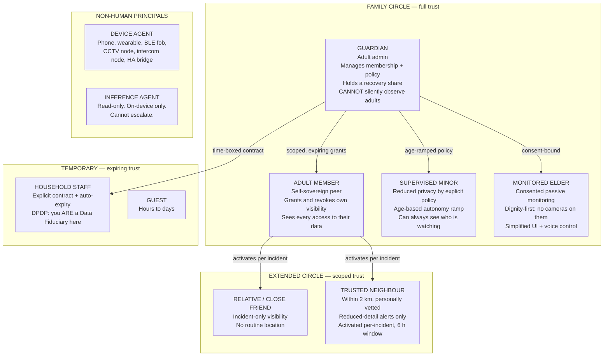

### 1.6.1 Two role rules that make the system survivable

**Rule 1 — Administration ≠ Observation.**
A Guardian can manage membership, hold a recovery share, and configure escalation policy. A Guardian **cannot** silently view an Adult Member's location; that requires a grant from that member, and the member sees every access. Separating these two powers is exactly what makes the system acceptable to other adults in the house.

**Rule 2 — The Minor Autonomy Ramp is published to the minor.**
Encode age-based transitions as data, not code, and show the child the schedule:

| Age | What changes |
|---|---|
| **< 13** | Guardians see live location and journeys. Child sees a simple "Papa & Mummy can see where I am" indicator. |
| **13** | Child gains full visibility into *who* is watching and *when they looked*. |
| **15** | Child can request grant expiry; guardian must actively renew (renewal notifies the child). Child can enable "private hours" (2 h/day, location coarsened to 1 km, guardians notified that private hours are active — not where). |
| **16** | Child can revoke routine location entirely; incident-time location remains mandatory. |
| **18** | Role auto-promotes to Adult Member. All guardian grants expire automatically. |

> A teenager who can see the ratchet loosening on a published schedule is dramatically less likely to sabotage the system than one who cannot. This is a **reliability feature**, not a courtesy.

## 1.7 Constraints & assumptions

| # | Constraint / assumption | Impact |
|---|---|---|
| C1 | All family phones are **owned by the family** and can be factory-reset once for provisioning. | Unlocks Android Device Owner mode (§5) — the single highest-leverage decision available. |
| C2 | Primary users are in **Navsari, Gujarat, India**. | ERSS-112 is deployed in Gujarat. DLT registration required for SMS. Cyclone/flood risk is real. Two-wheelers dominate. |
| C3 | Mixed Android fleet, mostly mid-range, some 4+ years old. Possibly 1–2 iPhones. | Android gets full capability; iOS gets a materially reduced feature set (§6.3). Plan for API 26+ (Android 8). |
| C4 | One intermediate developer, part-time. | Modular monolith. No Kubernetes. No microservices. Managed services wherever possible. |
| C5 | Some family members are non-technical and one may be elderly. | Gujarati/Hindi UI required. Voice control required. The system must never require them to debug anything. |
| C6 | Budget ≤ ₹10,000/month operational. | Single VM + managed Postgres + Cloudflare. No AWS-native everything. |
| C7 | The system will be used by people the developer loves. | Higher correctness bar than commercial software. Fail open (P8). Test more than feels necessary. |
| C8 | Purely domestic use is outside DPDP's scope — **until a non-family member is onboarded**. | Build consent/notice/erasure machinery from day one; it is cheap now and brutal to retrofit (§20). |

---

# PART 2 — THE PROBLEM CATALOG

> This is the heart of the document. Every problem the system exists to solve, every problem the *developer* will hit while building it, and the chosen solution for each. If you only read one part, read this one.
>
> Each entry states the problem, **why it is harder than it looks** (this is where most implementations fail), the chosen solution, the rejected alternatives, and the tier it belongs to.

## 2.A — Core safety problems

### P-001 · The victim cannot operate a phone
**Problem.** In real emergencies — crash, assault, cardiac event, panic attack — fine motor control and working memory collapse. The person cannot unlock a phone, find an app, and navigate a menu.

**Why it is hard.** Every "emergency app" is designed by calm people testing with calm hands. Under adrenaline, tunnel vision reduces the effective screen to a small central region and reaction time doubles.

**Solution (T0).** Multiple redundant, muscle-memory triggers that all work on the lock screen:
- 5× rapid power-button press (registered via `KeyEvent` monitoring in an accessibility-adjacent service, or Device Owner privileges)
- Volume-Down held 3 seconds while screen is off
- Hardware BLE fob button (§14.4)
- Wearable long-press
- Voice phrase (on-device wake word)
- In-app 88 dp button in the bottom third of the screen

**Rejected.** Shake-to-trigger (catastrophic false-positive rate on a two-wheeler). Draw-a-pattern (requires fine motor control). Widget-only (requires unlock).

---

### P-002 · False positives destroy the system
**Problem.** Eleven false alarms mean the twelfth — the real one — is ignored. This is the dominant failure mode of every alarm system ever built, from ICU monitors to nuclear control rooms.

**Why it is hard.** The instinct is to make detection *more* sensitive, because missing a real event feels worse. That instinct kills the system. A detector at 95% recall and 60% precision is strictly worse than one at 85% recall and 98% precision, because the second one is still trusted after six months.

**Solution (T0).**
1. **The PROBE state.** Before escalating on an uncertain signal, do the cheapest possible thing: a silent haptic buzz and a single question. This converts the majority of would-be false positives into non-events at the cost of one vibration.
2. **Mandatory cancel window** with escalating haptics, length varying by risk context (10 s high-risk, 45 s for an elderly fall, 5 min for a child geofence breach).
3. **Human-in-the-loop before machine escalation.** For low-confidence signals, alert one family member with "Priya's journey looks off — can someone call her?" A phone call resolves ~95% of these and costs nothing.
4. **The False Positive Ledger.** Every incident, including drills, is classified by the family as real / false / drill. Any trigger type exceeding 1 FP/month gets its threshold raised or gets disabled. This is a **P0 metric on the main dashboard** (§16.3).

---

### P-003 · The bystander effect in group alerts
**Problem.** An alert broadcasts to six people. Each assumes someone else is handling it. Nobody moves.

**Solution (T1).** **Explicit responsibility transfer.**
- Until anyone claims, every recipient's screen says, in bold: **"⚠️ NOBODY HAS RESPONDED YET."** This copy is deliberate — it creates individual responsibility instead of diffusing it.
- The first person to tap CLAIM becomes the owner. Everyone else's screen changes to "Rohan is responding. Stand by." Their alarms convert from siren to a persistent quiet banner (**not silence** — see P-030).
- The owner can tap **"I can't get there"**, which re-broadcasts as urgent.
- A **progress watchdog**: if a claimed incident shows no responder movement toward the subject and no messages for 5 minutes, the system automatically re-broadcasts.

---

### P-004 · The background agent dies silently
**Problem.** The OS or the OEM battery manager kills the background service. Nothing tells anyone. The system is dead for weeks and is discovered only on the night it was needed.

**Why it is hard.** This is not a bug you can fix once. Xiaomi (MIUI/HyperOS), Oppo/Realme (ColorOS), Vivo (Funtouch), OnePlus, and Samsung all ship proprietary battery managers that override documented Android behaviour. Android 16 tightened this further: foreground services started from the background can be denied location/mic/camera access outright, and jobs launched from a foreground service now obey their own runtime quotas.

**Solution (multi-layer, T0 + T1).** Ranked by effectiveness:
1. **Device Owner mode (§5)** — eliminates the problem entirely on provisioned devices. This is why §5 exists.
2. **Exact-alarm self-watchdog.** `AlarmManager.setExactAndAllowWhileIdle()` fires every 15 minutes and survives Doze. If it fires and the service is not running, restart it and log a `SERVICE_DEATH` event with the gap duration.
3. **Server-side heartbeat gap detection.** If a device has not reported in N hours, alert the **family**: *"Priya's safety agent has been offline for 14 hours."* This converts silent failure into visible failure — the highest-value single feature in the reliability story.
4. **Guided per-OEM onboarding** that detects `Build.MANUFACTURER`, shows a device-specific illustrated guide, and then *verifies* using `PowerManager.isIgnoringBatteryOptimizations()` and `ActivityManager.isBackgroundRestricted()`.
5. **Quarterly drills** that catch regressions after OS updates.

---

### P-005 · No connectivity at the moment of need
**Problem.** Rural Gujarat, basements, lifts, cyclone tower outages, mass-casualty network congestion. Every cloud-dependent design fails here.

**Solution (T0).** The **Degradation Ladder** with **parallel** rather than sequential transport attempts (see §4.4 and §11). The floor is total-isolation mode: 100 dB alarm on the ALARM stream, strobe, medical card, coordinates in 48 pt type, and a one-tap 112 button.

> **Critical implementation rule:** fire transports **in parallel**. Five redundant messages cost ₹1.20. A sequential fallback chain with timeouts costs 45 seconds. You are racing a clock.

---

### P-006 · Battery drain causes uninstall
**Problem.** Above ~5% per day of extra drain, users notice, blame the app, and disable it. A disabled safety app is worse than none, because everyone believes they are protected.

**Solution (T0).** A hard power budget treated exactly like a latency budget. See §6.2.6 for the full breakdown. Two techniques do most of the work:
- **Hardware FIFO sensor batching** (`maxReportLatencyUs = 30_000_000`) lets the sensor hub buffer samples without waking the application processor. This is a one-line change that moves accelerometer cost from ~200 mAh/day to ~18 mAh/day.
- **Do not hold a persistent WebSocket when idle.** FCM/APNs already maintain a system-level persistent connection you are paying for anyway. Piggyback on it. This alone can halve idle drain.

---

### P-007 · The panic path is coupled to auth
**Problem.** The access token expired. The SOS endpoint returns `401`. Nothing happens. This is a real, common, entirely preventable bug that has killed people in production systems.

**Solution (T0 + T1).** The SOS ingest endpoint **does not accept bearer tokens at all**. It accepts a **signed emergency envelope** (§9.3): the body is signed with a hardware-backed Ed25519 key that is deliberately **not** biometric-gated (an unconscious person cannot provide a fingerprint). If the device key is not in the server's cache, **accept the incident anyway**, mark it `UNVERIFIED`, and fan out with a warning banner. Fail open (P8).

---

### P-008 · Surveillance inside the family
**Problem.** Statistically the most likely harm this system will ever cause is one family member using it to control another. Every family-safety product on the market has been used as stalkerware.

**Solution (T1 + T2).** Consent-by-architecture, not by policy:
- `consent_grant.expires_at` is `NOT NULL` in the schema. **There is no permanent grant.** Renewal is a deliberate act.
- Every read of another member's data writes an `access_log` row, and a background job **surfaces it to the observed person**.
- Administration is separated from observation (Rule 1, §1.6.1).
- Geofences are evaluated on-device; the server never learns any address.
- The published Minor Autonomy Ramp (Rule 2).

---

### P-009 · You cannot dispatch emergency services
**Problem.** The instinct is "the app calls the ambulance." No third-party app in India can reliably inject a call into a state PSAP.

**Why it is hard.** ERSS-112 is deployed state-by-state (Gujarat included) and accepts signals over roughly ten channels including "IoT-based signals" and "external signals" — but that channel requires a state-level arrangement, not an API key. Meanwhile, Advanced Mobile Location (AML) sends precise location to the PSAP automatically the instant an emergency number is dialled, with no app involvement — but India's AML deployment is incremental and uneven.

**Solution.** Design as if 112 is reachable **only via the native dialer**.
- Never wrap, intercept, or programmatically place an emergency call. Doing so risks breaking AML.
- At escalation level L3, put a full-screen, 88 dp **CALL 112** button on the subject's device *and* every family member's device, with coordinates pre-formatted for reading aloud.
- Never assume AML worked. Always also display the coordinates in huge type.
- Build the **trusted-neighbour tier** instead — in India a vetted neighbour 400 m away beats an ambulance 25 minutes away.

---

### P-010 · Key loss destroys everything
**Problem.** Naive end-to-end encryption means one lost phone equals permanent loss of medical records, documents, and history — including *during* the emergency when they are needed.

**Solution (§10.4).** Three layers:
1. **Offline layer** — NFC tag / QR sticker / lock-screen widget with a deliberately *plaintext* minimal medical card (blood group, top 3 allergies, top 3 medications, 2 ICE numbers). It must work for a stranger with no app and no network. A blood group written on a helmet sticker has saved more lives than every encryption scheme ever deployed.
2. **Family layer** — on incident open, the subject's medical record is automatically re-wrapped to the incident content key. Any family member can read it during an active incident, instantly, with no unlock.
3. **Vault layer** — deep records require **Shamir 2-of-3** guardian reconstruction, plus a paper share in a fireproof safe and a fourth share with a relative in another city. **Drill this annually.**

---

### P-011 to P-020 · Remaining core problems (condensed)

| ID | Problem | Solution | Tier |
|---|---|---|---|
| **P-011** | Attacker has the phone and is watching the screen | Duress PIN with pixel-identical cancel UI; constant-time code path; identical network packet sizes and timing; two-way audio permanently disabled for duress incidents | T0 |
| **P-012** | Elderly person falls and cannot reach a phone | BLE fob on lanyard + no-motion detection + passive liveness (no unlock in N waking hours) + smart-plug activity proxy | T0/T2 |
| **P-013** | Child does not arrive at school/home | Journey monitoring with learned-route ETA prediction and corridor deviation, escalating **quietly** — guardians only, never neighbours | T2 |
| **P-014** | Family is scattered during a disaster | Disaster mode: IMD alert ingest, pre-agreed rally points, offline map tiles, "I AM SAFE" broadcast that works over SMS | T1/T2 |
| **P-015** | Nobody knows the system is degraded | Self-diagnostics screen + server-side heartbeat gaps + weekly family health digest + quarterly drills | T1 |
| **P-016** | Two family members trigger SOS simultaneously | Incident IDs are client-generated UUIDv7; the UI renders a stacked incident list ordered by severity then time; escalation timers are per-incident and independent | T1 |
| **P-017** | Repeated accidental triggers by one person (elderly, pocket) | Per-device adaptive cancel-window lengthening after 3 FPs in 7 days + proximity/light sensor pocket detection to suppress in-pocket power-button triggers | T0 |
| **P-018** | Deaf/hard-of-hearing or blind family member | Every state change has a distinct haptic pattern AND a distinct non-musical audio cue AND a high-contrast visual. Full TalkBack/VoiceOver support on the panic flow. | T0 |
| **P-019** | Family member travelling abroad / roaming | SMS fallback becomes expensive and slow. Detect `NETWORK_ROAMING`; prefer data transports; switch SMS fallback to WhatsApp deep-link + email; extend all timeouts by 50%. | T1 |
| **P-020** | The developer becomes unavailable | Printed runbook (§19) in the document vault with 2-of-3 unlock; a second person with break-glass credentials; boring tech; automated dependency updates; **an annually-drilled handover** | — |

---

## 2.B — Problems discussed with the product owner

### P-021 · Phone lost inside the house
**Problem.** The phone is somewhere in the house on silent. People spend an hour looking.

**Solution (T1 + T0 fallback).**
- **Online path:** any family member taps "Find phone". Server sends an FCM **data message** (not a notification — data messages wake the app even in Doze if high priority). The app raises volume on `STREAM_ALARM` (which ignores ringer/silent state) and plays a distinctive 20-second tone, flashes the torch, and vibrates.
- **Offline path (important, and nobody builds this):** if the target phone has no data, any family phone **within BLE range** broadcasts a `FIND_ME` GATT command. The target responds to the BLE trigger even with no internet. This is exactly the in-house case.
- **Notification channel** MUST have `setBypassDnd(true)` (requires `ACCESS_NOTIFICATION_POLICY`, granted at onboarding) so it works in Do Not Disturb.
- The alarm auto-stops after 60 s or on any screen unlock, and logs who triggered it (P-008: every use is visible to the phone's owner).

**Gotcha.** Setting `STREAM_ALARM` volume requires no special permission, but restoring the previous volume afterwards is a courtesy you must implement or you will annoy everyone.

---

### P-022 · Phone stolen, thief immediately powers it off
**Problem.** The first thing a thief does is power off the phone so it cannot be tracked.

**Why it is harder than it looks.** The "fake power menu" idea (drawing a `SYSTEM_ALERT_WINDOW` overlay that mimics the shutdown screen) **is not reliable on modern Android.** Since Android 12, the real power menu is rendered by SystemUI in a window layer that ordinary application overlays cannot cover, and Android 12+/14+ progressively restricted `SYSTEM_ALERT_WINDOW`. A long-press power-off also cannot be intercepted by a normal app. Treat any tutorial claiming otherwise as out of date.

**Solution — the honest, layered version:**

| Layer | Mechanism | Reliability |
|---|---|---|
| **1. Device Owner FRP + reset lock (§5)** | `DISALLOW_FACTORY_RESET` + `setFactoryResetProtectionPolicy()`. Phone is a brick to the thief. | ★★★★★ |
| **2. Final Breath packet** | Register a receiver for `ACTION_SHUTDOWN` and `ACTION_BATTERY_LOW`. On fire: immediately transmit last position, heading, battery, front-camera snapshot, and mark the incident `DEVICE_SILENCED` — **an escalating state, not a terminal one**. You get 2–5 seconds; make them count. Pre-serialise the payload so it is a single write. | ★★★★☆ |
| **3. Android 15+ theft protection** | Theft Detection Lock, Offline Device Lock, Remote Lock are OS-level and work better than anything you can build. Enable and document them. | ★★★★☆ |
| **4. Screen-off overlay ("fake off")** | A full-screen black `TYPE_APPLICATION_OVERLAY` triggered by **your app's own** power-button-pattern detection (not by intercepting the system menu), which makes the phone *look* off while continuing to stream. Works only while the app is running and the thief hasn't held power to force shutdown. | ★★☆☆☆ |
| **5. Silent capture** | On `DEVICE_SILENCED` or a failed unlock streak, capture a front-camera frame + ambient audio snippet + location, encrypt, upload. Requires `FOREGROUND_SERVICE_CAMERA` type and, on Android 14+, the app must have been foreground or have Device Owner privileges. | ★★★☆☆ |
| **6. CEIR / IMEI blocking** | Government portal (ceir.gov.in). Store every family device's IMEI in the vault **now**, before it is needed. | ★★★★★ (for the thief's benefit denial, not recovery) |

**Rejected:** relying primarily on the fake power menu. It is the flashiest idea and the least dependable. Build layers 1–3 first.

---

### P-023 · Elderly no-touch intercom / smart operation
**Problem.** An elderly person alone at home finds phones and remotes hard to operate. They need to call downstairs, turn on the TV, or ask for help without touching anything.

**Solution (T2).** A dedicated **spare phone as a kiosk node**:

| Component | Choice | Notes |
|---|---|---|
| Lock-down | **Device Owner + `setLockTaskPackages()`** (true kiosk mode) | Far more robust than a "kiosk launcher" app. Home/Recents/status bar all disabled. |
| Wake word | **Picovoice Porcupine** (on-device, ~1 MB, low power) | Custom Hindi/Gujarati wake word. Free tier covers personal use — verify licence terms for your case. |
| Command recognition | Android `SpeechRecognizer` with `EXTRA_PREFER_OFFLINE = true`, plus downloaded offline language packs | Offline recognition quality for Hindi/Gujarati is workable for a **closed command set**, not for open dictation. Design the command set accordingly. |
| Command set | Deliberately tiny and fixed: ~12 commands | *"Niche aao" / "Paani chahiye" / "TV chalu karo" / "Light band karo" / "Madad chahiye"* |
| Actions | Publish to MQTT → Home Assistant for device control; publish to your backend for family notifications | |
| Fallback | Always show 3 huge on-screen buttons (CALL FAMILY / HELP / LIGHTS) for when voice fails | Voice **will** fail. Never make it the only path. |
| "Madad chahiye" | Routes straight into the incident state machine as a manual trigger with a 45 s cancel window | This is the safety-critical command; it is T0, everything else is T2. |

**Gotchas.** (a) Continuous `SpeechRecognizer` sessions are throttled by Android; drive them from the wake word, not continuously. (b) The device must be exempted from Doze and battery optimisation — Device Owner handles this. (c) Plan for P-032 (battery bloat).

---

### P-024 · Spare phone as a CCTV node
**Problem.** Use an old phone as a security camera when the house is empty or someone is home alone.

**Solution (T2).**

| Concern | Implementation |
|---|---|
| Capture | CameraX (native) or Expo Camera with frame processors. **Do not record continuously.** |
| Motion detection | Downscale frames to 160×120 greyscale, compute per-block mean absolute difference against a rolling background model, trigger above threshold. Runs at 2–5 fps for near-zero CPU. |
| Debounce | Require motion in ≥3 consecutive frames; cooldown 30 s after a trigger. Prevents a curtain in a fan's breeze from filling your storage. |
| Storage | Encrypt the snapshot on-device, upload to Cloudflare R2. **Never** upload plaintext frames. |
| Thermal | Poll `BatteryManager.EXTRA_TEMPERATURE`; above 42 °C, drop to 1 fps; above 45 °C, suspend capture and raise a maintenance alert. |
| Privacy | A camera pointed inside the home is Class-A data of the highest sensitivity. **Rules: (a) an unmissable physical indicator, (b) auto-disable whenever any family member is detected home via BLE presence, (c) all frames E2EE, (d) 7-day auto-delete, (e) every family member can disable it unilaterally.** |
| Power | See P-032 — this device is plugged in 24/7 and will swell if you ignore it. |

---

### P-025 · Always-on audio listening without destroying the battery
**Problem.** Continuously running the microphone drains the battery and is heavily restricted by Android.

**Solution (T0 for the duress phrase, T2 for convenience commands).**
- **Wake-word engine**, not continuous ASR. Picovoice Porcupine runs an ~1 MB model at roughly 1–3% CPU on one core and can run on the DSP on many chipsets.
- The wake word triggers a short, bounded `SpeechRecognizer` session (max 8 s) which then closes.
- **Duress phrase is separate and higher priority**: an innocuous phrase that does not sound like a wake word (e.g. *"Mummy ko sugar ki dawai yaad dila dena"*). Detected fully on-device. Never transmitted. Fires a **silent** incident.
- **Privacy is non-negotiable here.** Android 12+ shows a system mic indicator; do not attempt to suppress it. Each family member controls their own mic buffer independently, and a Guardian **cannot** enable it on an Adult Member's device (P-008).
- Foreground service type MUST be `microphone`, with a persistent notification.

---

### P-026 · Screen time & reels addiction management
**Problem.** Excessive phone use, especially short-form video.

**Solution (T2) — three tiers, use the strongest one available:**

| Tier | Mechanism | Robustness | Notes |
|---|---|---|---|
| **Best** | Device Owner `setPackagesSuspended()` | ★★★★★ | The app literally cannot be opened. No overlay to dismiss, no race condition, no accessibility service needed. This is the correct answer for family-owned devices. |
| Good | `UsageStatsManager` for measurement + Device Owner suspension on limit breach | ★★★★★ | `UsageStatsManager` requires `PACKAGE_USAGE_STATS` (a special access, granted once via Settings). |
| Fallback (iOS / non-provisioned) | Accessibility Service detects foreground package → `SYSTEM_ALERT_WINDOW` blocking overlay | ★★☆☆☆ | Racy, dismissible, restricted on Android 14+, and Play Store policy hostile. iOS: use Screen Time / Family Sharing instead — you cannot build this. |

**Design rules that matter more than the tech.** Limits are negotiated and visible, not imposed silently. The person subject to the limit can see their own usage, request an extension (which notifies a guardian), and gets a 5-minute warning before a block. **An adult must be able to override their own limits** — otherwise this is not a wellbeing feature, it is control, and it violates §1.4.3.

---

### P-027 · Habit analysis & health integration
**Problem.** Track daily routines and health metrics, and derive useful insight.

**Solution (T2).**
- **Data sources:** Health Connect (Android) / HealthKit (iOS) for steps, heart rate, sleep, SpO₂; `UsageStatsManager` for screen time; your own incident and journey data.
- **All analysis on-device.** This is Class-A data (§10.2). Use the on-device LLM path: Apple's Foundation Models framework (iOS 26+) or ML Kit GenAI / Gemini Nano on Android; fall back to a deterministic template renderer on older devices.
- **Baselines, not diagnoses.** A simple EWMA + 3σ statistical model beats a neural net here and is auditable. The output is *"resting heart rate is 12 bpm above your 30-day baseline for the third day"*, never *"you may have an infection."*
- **Never generate medical advice.** Ever. The output surface is: baseline, current value, deviation, and "consider mentioning this to a doctor."
- Feeds the risk-context engine (§13.2) as one input among several.

---

### P-028 · Indoor tracking & floor plan
**Problem.** GPS is useless indoors. Knowing *which room* someone is in matters for elderly monitoring and for a responder entering a house. Full 3D/LiDAR is not available on most phones.

**Solution (T2) — skip 3D entirely; combine two cheap techniques:**

1. **BLE room beacons.** ₹200 ESP32-C3 or nRF52 beacons, one per room, broadcasting a room ID. The phone scans and reports the strongest RSSI. This gives reliable **room-level** accuracy for about ₹1,200 for a whole house, with no calibration.
2. **Wi-Fi RSSI fingerprinting** as a zero-hardware supplement: record the AP signal signature per room during a one-time walkthrough, then classify with k-NN. Less reliable than beacons, free.
3. **2D floor plan builder** in-app: a simple Canvas/grid editor where a user drags rooms and assigns each to a beacon ID. Renders a live dot per family member. Do **not** attempt AR scanning.

**Value.** During an incident, a responder sees *"Papa is in the upstairs bathroom"* rather than a GPS pin on the roof of the building.

---

### P-029 · Factory reset destroys the app
**Problem.** A thief (or a teenager) factory-resets the phone; every third-party app is gone.

**Solution — this is exactly what Device Owner mode solves (§5).**

| Layer | Mechanism |
|---|---|
| **Prevention** | Device Owner `addUserRestriction(DISALLOW_FACTORY_RESET)`. The reset option is removed from Settings. Recovery-mode reset still works, but then: |
| **Post-reset lock** | `setFactoryResetProtectionPolicy()` (Android 11+) binds the device to specific accounts. Combined with Google FRP, a reset device demands the original Google account credentials. It is a brick. |
| **Recovery** | Google Find My Device; Android 15+ Remote Lock; CEIR/IMEI blocking via ceir.gov.in. **Store every family IMEI in the vault today.** |
| **Acceptance** | On a non-provisioned device (e.g. an iPhone, or a phone you cannot reset), accept that the app will not survive. Do not engineer around it. Document it. |

---

## 2.C — Developer edge cases raised by the product owner

### P-030 · Multi-responder chaos (distributed acknowledgment)
**Problem.** SOS fires; six phones start a high-priority siren. One member handles it. How do the other five alarms stop?

**Solution (T1) — with two corrections to the obvious approach:**

```
1. Incident state lives server-side (Postgres, projected from the event log).
2. Member A taps CLAIM → POST /v1/incident/{id}/claim
3. Server writes an INCIDENT_CLAIMED event, publishes to NATS.
4. Fan-out over BOTH channels simultaneously:
   a) WebSocket frame (instant, for foreground devices)
   b) FCM/APNs data message (for backgrounded devices)
   Never rely on only one — a backgrounded device may have no WS.
5. Each device on receipt: stop siren, switch to a persistent quiet banner.
```

**Correction 1 — do not fully silence.** Replace the siren with a **persistent, non-dismissable quiet banner**: *"Rohan is responding to Priya's emergency. Tap to view."* Full silence causes the other five to forget an emergency is in progress.

**Correction 2 — you need an un-claim path and a watchdog.** Without them, one person claims, gets stuck in traffic, and the rest have stood down permanently. Implement `POST /incident/{id}/release` and the 5-minute progress watchdog from P-003.

**Storage note.** Firebase Realtime Database works and is a legitimate shortcut for a prototype. This blueprint uses Postgres + NATS + WebSocket because RTDB cannot hold end-to-end-encrypted state that the server cannot read, and because it adds a hard dependency on Google for a T1 function. If you want to ship faster in week 3, use RTDB and migrate later — the API contract in §9 is designed so this swap is a backend-only change.

---

### P-031 · Aggressive OEM battery kill-switches
Covered in depth as **P-004**. Additional implementation detail:

```kotlin
// Onboarding self-check — run this, and repeat it weekly
val pm = getSystemService(PowerManager::class.java)
val am = getSystemService(ActivityManager::class.java)

val checks = mapOf(
  "battery_optimisation_exempt" to pm.isIgnoringBatteryOptimizations(packageName),
  "not_background_restricted"   to !am.isBackgroundRestricted,
  "exact_alarms_permitted"      to (Build.VERSION.SDK_INT < 31 || 
                                    getSystemService(AlarmManager::class.java).canScheduleExactAlarms()),
  "notifications_enabled"       to NotificationManagerCompat.from(this).areNotificationsEnabled(),
  "dnd_bypass_granted"          to getSystemService(NotificationManager::class.java).isNotificationPolicyAccessGranted,
  "bg_location_granted"         to (checkSelfPermission(ACCESS_BACKGROUND_LOCATION) == GRANTED),
  "auto_revoke_disabled"        to !packageManager.isAutoRevokeWhitelisted()  // see P-034
)
// Any false → surface a red banner on the home screen AND report to the server,
// which raises a family-visible alert if unresolved after 48 h.
```

The OEM-specific settings deep-links live in Appendix B. Where a deep link is unavailable, show an illustrated step-by-step guide with the exact menu names for that manufacturer's skin.

---

### P-032 · 24/7 plugged-in battery bloat (CCTV / intercom nodes)
**Problem.** A phone left on a charger continuously will swell, overheat, and eventually become a fire risk.

**Why it matters more than it sounds.** These nodes are *unattended*. A swollen battery in a phone taped behind a bookshelf is a genuine hazard.

**Solution (T2, but treat it as a safety requirement):**

| Layer | Implementation |
|---|---|
| **Charge cycling (preferred)** | Smart plug (Tapo/Tuya/Shelly) + Home Assistant automation: cut power at 80% battery, restore at 40%. Keeps the cell in its happy band indefinitely. Cost: ~₹900 per node. |
| **In-app monitor** | Poll `BatteryManager` every 5 min. Report level, temperature, health (`BATTERY_HEALTH_*`), and charge counter to the server. |
| **Alerts** | Temperature > 42 °C for 10 min → warning. `BATTERY_HEALTH_OVERHEAT` or `BATTERY_HEALTH_DEAD` → **immediate high-priority family alert**, and the node self-disables camera/mic to reduce load. |
| **Physical** | Remove the case. Ensure airflow. Prefer a node phone with a *removable* or already-degraded battery. Consider running the node with the battery removed on models that support it. |
| **Scheduled check** | Add "physically inspect node phones for swelling" to the **quarterly drill checklist** (§17.4). Look for a lifted screen or a phone that no longer sits flat on a table. |

---

### P-033 · Dual-SIM SMS fallback complications
**Problem.** When data fails and the app sends SMS directly, Android may use the wrong SIM — perhaps one with no balance.

**Solution (T0).**

```kotlin
// 1. Enumerate SIMs (needs READ_PHONE_STATE)
val sm = getSystemService(SubscriptionManager::class.java)
val subs: List<SubscriptionInfo> = sm.activeSubscriptionInfoList ?: emptyList()

// 2. Determine the user's chosen/default SMS subscription
val defaultSmsSubId = SmsManager.getDefaultSmsSubscriptionId()

// 3. Build an ordered attempt list:
//    [user-configured preferred SIM] → [system default] → [every other active SIM]
val order = buildList {
    userPreferredSubId?.let { add(it) }
    if (defaultSmsSubId != INVALID_SUBSCRIPTION_ID) add(defaultSmsSubId)
    subs.forEach { add(it.subscriptionId) }
}.distinct()

// 4. Send on the FIRST SIM. If no delivery/sent PendingIntent callback
//    within 12 s, send on the NEXT. In a genuine emergency, sending on
//    BOTH SIMs immediately is the correct trade-off — it costs ₹0.40.
for (subId in order) {
    SmsManager.getSmsManagerForSubscriptionId(subId)
        .sendTextMessage(dest, null, payload, sentPI(subId), deliveredPI(subId))
}
```

**Critical gotchas:**
- You **cannot** query SIM balance programmatically. Therefore: send on all active SIMs during a real incident. Do not try to be clever.
- The `sentIntent` / `deliveredIntent` `PendingIntent` callbacks are how you know it worked. Use them and log the result code; `RESULT_ERROR_GENERIC_FAILURE` on one SIM is your signal to rely on the other.
- **Character encoding is a trap.** A GSM-7 SMS holds 160 characters. The moment your payload contains a single Devanagari or Gujarati character, it becomes UCS-2 and the limit drops to **70 characters**. **Therefore: the emergency SMS payload MUST be pure ASCII.** Names are transliterated (`Priya`, not `प्रिया`). Enforce this with a unit test.
- eSIM behaves identically through `SubscriptionManager`, but an eSIM profile can be remotely disabled by a carrier. Do not treat eSIM as more reliable than physical.

---

### P-034 · Android permission auto-revocation
**Problem.** Since Android 11, the OS automatically revokes runtime permissions from apps that have not been opened for a few months, and Android 12+ additionally hibernates them.

**Solution (T0/T1) — three layers:**

1. **Device Owner (§5) eliminates this entirely** via `setPermissionPolicy(PERMISSION_POLICY_AUTO_GRANT)` and `setPermissionGrantState(..., PERMISSION_GRANT_STATE_GRANTED)`. Permissions are granted programmatically and cannot be revoked by the OS or the user.
2. **For non-provisioned devices:** request the exemption explicitly —
```kotlin
if (packageManager.isAutoRevokeWhitelisted().not()) {
    startActivity(Intent(Settings.ACTION_APPLICATION_DETAILS_SETTINGS)
        .setData(Uri.fromParts("package", packageName, null)))
    // Guide the user to: "Pause app activity if unused" → OFF
}
```
3. **Self-diagnostic + family alert (P-031).** The weekly permission check catches a revocation within 7 days and escalates to the family if unresolved in 48 h. **This is the backstop that makes the whole thing safe:** even if a permission is silently removed, someone finds out.

---

## 2.D — Additional edge cases you WILL hit

These are the problems that appear in week 14 and cost a weekend each. Plan for them now.

### Platform & OS behaviour

| ID | Problem | Solution |
|---|---|---|
| **P-035** | **Direct Boot.** After a reboot, the device is encrypted and locked. Your app's normal storage is **inaccessible** until the first unlock. If the phone reboots at 2 a.m. and nobody unlocks it until 7 a.m., your agent is dead for 5 hours. | Store the **T0 minimal config** (family key fingerprints, emergency contact numbers, escalation policy, signing key handle) in **Device Protected Storage** (`context.createDeviceProtectedStorageContext()`), and declare the boot receiver + T0 service with `android:directBootAware="true"`. Everything else stays in Credential Protected Storage. **Most implementations miss this. It is a silent multi-hour outage.** |
| **P-036** | **Force Stop.** If a user (or an OEM cleaner) force-stops the app, Android blocks all its broadcast receivers and alarms until the user manually opens it again. | Non-provisioned devices: unsolvable — detect the gap server-side and alert the family. Device Owner devices: `setUninstallBlocked()` plus removing the app from task-killer reach largely prevents it. |
| **P-037** | **Exact alarm permission.** Android 12 added `SCHEDULE_EXACT_ALARM` (user-revocable); Android 13 added `USE_EXACT_ALARM` for alarm/calendar-class apps. Without it, your watchdog is inexact and Doze will delay it by up to 15+ minutes. | Declare `USE_EXACT_ALARM` (justified for a safety app) and fall back to requesting `SCHEDULE_EXACT_ALARM` via `ACTION_REQUEST_SCHEDULE_EXACT_ALARM`. Verify with `canScheduleExactAlarms()`. |
| **P-038** | **Notification permission (Android 13+).** `POST_NOTIFICATIONS` is a runtime permission. If denied, your entire alerting layer is invisible. | Request it in onboarding with a blocking explanation screen. Check `areNotificationsEnabled()` weekly. Device Owner: auto-grant. **If it is denied and cannot be granted, the device MUST be marked degraded and the family notified.** |
| **P-039** | **Bluetooth permission split (Android 12+).** `BLUETOOTH_SCAN` / `BLUETOOTH_ADVERTISE` / `BLUETOOTH_CONNECT` replaced the old model, and `BLUETOOTH_SCAN` requires either location permission or the `neverForLocation` flag. | Declare `BLUETOOTH_SCAN` **with** `usesPermissionFlags="neverForLocation"` for the fob use case, but **without** it for the family-mesh use case (which genuinely does derive proximity). Handle both code paths. |
| **P-040** | **Background location is a two-step flow (Android 11+).** You cannot request `ACCESS_BACKGROUND_LOCATION` in the same dialog as foreground location; the user must go to Settings and pick "Allow all the time". | Explicit two-screen onboarding with an illustration of the exact Settings screen. Verify afterwards. Never assume the request succeeded. |
| **P-041** | **Foreground service type enforcement (Android 14+).** Every FGS must declare a type, each type has prerequisite permissions, and a service started from the background may be denied location/mic/camera. | Declare `location|connectedDevice` for the main agent, `camera` for the CCTV node, `microphone` for the intercom node, `shortService` for the 3-minute burst work. Start the agent from a **foreground context or from a Device Owner–privileged path**, never from a plain background broadcast. |
| **P-042** | **Doze & App Standby buckets.** An infrequently-used app is placed in a restricted bucket where jobs and alarms are heavily deferred. | The persistent foreground service exempts you from most of it, but verify with `UsageStatsManager.getAppStandbyBucket()` and report it in diagnostics. Device Owner can whitelist. |
| **P-043** | **Storage full.** The device is out of space; the incident log write fails; nobody notices. | Pre-allocate the ring buffer and a 5 MB incident-log reserve **at install time**. Check free space daily; below 200 MB, prune non-essential caches and alert. The T0 write path MUST have a pre-allocated file it can always write to. |
| **P-044** | **OTA update / reboot loop.** After an OS update the phone reboots, sometimes several times, and OEM skins may reset battery-optimisation settings. | Re-run the full self-diagnostic on every `BOOT_COMPLETED`, and compare `Build.FINGERPRINT` against the stored value — if changed, force a re-verification flow and notify the user. |
| **P-045** | **Multi-user / work profile.** Some phones run a work profile or a second user; your app may exist twice or not at all in the active user. | Detect with `UserManager`. Support the primary user only in v1 and document it. Device Owner mode implies single-user. |

### Networking & delivery

| ID | Problem | Solution |
|---|---|---|
| **P-046** | **Captive portals.** Hotel/airport Wi-Fi reports "connected" but blocks all traffic until a login page is accepted. Your app believes it is online and does not fall back. | Never trust `NetworkCapabilities` alone. Use `NET_CAPABILITY_VALIDATED` **and** run your own 1-second HTTP HEAD probe to your own endpoint before declaring the data path healthy. If unvalidated, immediately drop to the SMS tier. |
| **P-047** | **IPv6-only / CGNAT networks.** Increasingly common on Indian mobile networks. | Ensure your server has AAAA records and your TLS/WebSocket stack is dual-stack. Use Happy Eyeballs (RFC 8305) in the client — most HTTP libraries do this, verify yours does. |
| **P-048** | **Push token rotation.** FCM/APNs tokens change on app reinstall, restore-from-backup, or occasionally at random. A stale token silently drops every notification. | Refresh and upload the token on every app start and on `onNewToken`. Server: on a `NotRegistered`/`InvalidRegistration` response, mark the device degraded and **alert the family** — this is a silent-failure class. |
| **P-049** | **Certificate pinning breaks on rotation.** You pin a cert, it expires, every client is bricked simultaneously. | Pin **two** keys: current and next. Rotate the backup before the primary expires. Include a signed, server-side kill switch that can disable pinning for a version. Set pin expiry so pinning fails *open* after a date rather than bricking devices. |
| **P-050** | **DLT / TRAI SMS registration.** In India, A2P SMS requires the sender header and every message template to be pre-registered on a DLT platform. Unregistered templates are silently dropped. | Register the header and **all** templates in week 1 (it takes 1–2 weeks). Use the **transactional** route, not promotional (promotional is blocked by DND). Include template variable placeholders exactly as registered. Test delivery to every family number before you need it. |
| **P-051** | **Carriers strip or block links in SMS.** URL shorteners in particular are commonly filtered. | Put the coordinates as **plain text** in the SMS, not only behind a link. A link is a convenience; the raw `lat,lon` is the payload. |
| **P-052** | **Clock skew between devices.** Device clocks drift and can be set manually. An incident timeline reconstructed from wall clocks will be nonsense. | Use **Hybrid Logical Clocks** (HLC) on every event: 48-bit physical ms + 16-bit logical counter + node ID. Server stamps its own receive time separately. Render timelines from HLC, display wall clock only as an annotation. |
| **P-053** | **Duplicate incidents from parallel transports.** The same SOS arrives over WS, HTTP, SMS, and BLE relay. | Client-generated **UUIDv7** `incident_id` makes every endpoint idempotent. Server deduplicates on `(incident_id, event_hlc)`. Never let the server allocate incident IDs. |
| **P-054** | **Roaming / international.** SMS costs 40× more and may not deliver; timeouts are longer. | Detect roaming; prefer data transports; substitute WhatsApp deep-link and email for the SMS tier; extend all timeouts by 50%; warn the family that the member is roaming. |

### Human & operational

| ID | Problem | Solution |
|---|---|---|
| **P-055** | **A family member's phone is in Do Not Disturb / Focus.** The most common reason a real alert is missed at night. | Android: notification channel with `setBypassDnd(true)` + `USAGE_ALARM` audio attributes + full-screen intent. iOS: PushKit VoIP push → CallKit incoming-call UI, which rings through silent and Focus **without** needing the Critical Alerts entitlement. Verify per-device during every quarterly drill. |
| **P-056** | **Pocket false triggers.** The power button gets pressed repeatedly in a pocket or a bike jacket. | Suppress the power-pattern trigger when the proximity sensor reads "near" AND the light sensor reads < 10 lux AND the device has been in `IN_VEHICLE`/`ON_FOOT` activity for > 60 s. Log suppressions so you can tune the thresholds. |
| **P-057** | **Simultaneous incidents in one family.** | Independent per-incident escalation timers. UI stacks incidents by severity then recency. The notification for a second incident uses a different sound so responders know it is not a repeat. |
| **P-058** | **An SOS is triggered while an incident is already active for the same person.** | Do not open a second incident. Append a `REESCALATE` event to the existing one and jump the ladder to the next tier immediately. |
| **P-059** | **Language.** Parents may need Gujarati or Hindi; children may prefer English. | Full i18n from day one (`en`, `hi`, `gu`). **Exception: the SMS payload is always ASCII English** (P-033). Per-member language preference, not per-device. |
| **P-060** | **Old app version in the field.** Grandma will not update. | Server MUST support any client from the last 24 months. Additive-only protobuf and API changes; never reuse a field number; never remove an endpoint. Ship a forced-update path only for genuine security fixes, and make Device Owner silent-install the primary update mechanism (§5.3). |
| **P-061** | **Guest / house-help onboarding turns you into a Data Fiduciary.** | Separate "temporary member" flow with mandatory expiry, a plain-language notice screen, explicit consent capture stored as an event, and one-tap erasure. See §20. |
| **P-062** | **The family stops using it.** Engagement decays; the app becomes a background process nobody thinks about. | Give it non-emergency daily value: family location glance, "reached safely" pings, shared shopping/checklist, document vault, screen-time dashboard, elderly check-in. **An app that is only opened during emergencies will be uninstalled before the first emergency.** |
| **P-063** | **Drill fatigue.** Quarterly drills become an annoyance and get skipped. | Keep drills to 4 minutes. Make them a game: the dashboard shows each member's response time and a family leaderboard. Automate the measurement so no one has to record anything. |
| **P-064** | **An incident spans midnight / a timezone change during travel.** | Store everything in UTC with an explicit `tz` annotation on the event. Render in the *viewer's* local time with the subject's timezone shown when they differ. |
| **P-065** | **Audio focus conflict.** The user is on a phone call to 112 while the app tries to stream incident audio. | The T0 alarm uses `STREAM_ALARM` and does **not** request audio focus. Incident audio streaming MUST detect `TelephonyManager.CALL_STATE_OFFHOOK` and pause immediately — never compete with a real emergency call. |
| **P-066** | **A family member deliberately disables the app.** | This is their right (for adults) and must be respected — but it MUST be **visible**. A disabled/uninstalled agent produces a family-visible status change: *"Priya has paused safety monitoring."* Not an alarm. Just honesty. |
| **P-067** | **Snapshot leakage in the app switcher.** The recents thumbnail shows the family map or a medical record. | `FLAG_SECURE` on all sensitive Activities; on iOS, cover the window in `applicationWillResignActive`. |
| **P-068** | **Backup exfiltration.** Android auto-backup uploads your app data to the user's Google Drive. | Set `android:allowBackup="false"` and `android:fullBackupContent` exclusions. Your data is E2EE, but the key handles and metadata should not leave the device. |
| **P-069** | **The escalation policy changes and old incidents become unexplainable.** | Stamp `policy_version` on every incident and every state transition. Never mutate a policy in place; create a new version. After-action reports render using the policy version in force at the time. |
| **P-070** | **The developer ships a bad deploy during a real emergency.** | `sos-ingest` is a separate binary with its own deploy pipeline, a 60-second soak, and automatic rollback on health-check failure. Add a deploy freeze whenever any incident is active — the escalation engine exposes `GET /internal/active-incidents`, and CI refuses to deploy if it is non-empty. |

---

# PART 3 — REQUIREMENTS

## 3.1 Functional requirements

### Tier 0 — Survival Plane (MUST work with zero infrastructure)

| ID | Requirement | Priority | Solves |
|---|---|---|---|
| FR-001 | Hardware-gesture SOS trigger operable from the lock screen (power ×5, volume-down hold, BLE fob, wearable, voice phrase) | MUST | P-001 |
| FR-002 | Deterministic cancel window with escalating haptic and audio; length varies by risk context (0–60 s) | MUST | P-002 |
| FR-003 | Duress cancel — pixel-identical UI to a real cancel; silently escalates; suppresses all local output | MUST | P-011 |
| FR-004 | Local alarm: 100 dB on `STREAM_ALARM`, torch strobe, full-screen medical card, coordinates in ≥48 pt type | MUST | P-005 |
| FR-005 | One-tap handoff to the native dialer for 112. Never wrap, intercept, or auto-place the call | MUST | P-009 |
| FR-006 | Encrypted append-only local incident log; survives app kill, force-stop, and reboot | MUST | P-035, P-043 |
| FR-007 | Pre-incident black box: 60 s rolling encrypted ring buffer of sensor data (+ optional audio), sealed on trigger | SHOULD | — |
| FR-008 | Direct SMS transmission with a ≤160-char **pure ASCII** binary-encoded incident payload, on all active SIMs | MUST | P-033, P-005 |
| FR-009 | BLE distress advertisement with rotating pseudonym + HMAC; BLE scan for family peers; silent peer relay | SHOULD | P-005 |
| FR-010 | Final Breath packet on `ACTION_SHUTDOWN` or battery ≤3%: last position, heading, battery, incident state | MUST | P-022 |
| FR-011 | Self-watchdog via exact alarm; detects and reports its own prior death with gap duration | MUST | P-004 |
| FR-012 | On-device fall, crash, and no-motion-after-impact detection | SHOULD | — |
| FR-013 | Device-Protected-Storage T0 config so the agent functions before first unlock after reboot | MUST | P-035 |
| FR-014 | Weekly self-diagnostic of all permissions, exemptions, and OS settings; server-reported | MUST | P-031, P-034 |
| FR-015 | Pocket-detection suppression of accidental hardware triggers | SHOULD | P-056 |

### Tier 1 — Coordination Plane

| ID | Requirement | Priority | Solves |
|---|---|---|---|
| FR-020 | Incident fan-out to family with per-recipient delivery receipts and acknowledgment tracking | MUST | P-003 |
| FR-021 | Explicit responsibility transfer: CLAIM / RELEASE, ownership broadcast, "nobody has responded yet" state | MUST | P-003, P-030 |
| FR-022 | Progress watchdog: re-broadcast a claimed incident showing no responder progress for 5 min | MUST | P-003 |
| FR-023 | Live location streaming during active incidents at 1–5 s cadence | MUST | — |
| FR-024 | Live one-way audio from the incident device; two-way only on responder request, never during duress | SHOULD | — |
| FR-025 | Escalation ladder with automatic tier promotion on acknowledgment timeout (L1 → L2 → L3) | MUST | — |
| FR-026 | Trusted-neighbour tier: pre-vetted, ≤2 km, reduced-detail alerts, 6-hour activation window | SHOULD | P-009 |
| FR-027 | End-to-end encrypted family messaging with incident-scoped threads | SHOULD | — |
| FR-028 | Check-in / safe-arrival confirmation, both explicit and inferred | MUST | P-013 |
| FR-029 | Multi-device sync of incident state with HLC-ordered deterministic merge | MUST | P-052, P-053 |
| FR-030 | After-action record: full timeline, notification matrix, four-clock measurements, family classification | MUST | P-002 |
| FR-031 | Automated TTS voice call as the final notification channel | SHOULD | — |
| FR-032 | Silent / covert incident mode: black screen, no audio, no vibration, full telemetry | MUST | P-011 |
| FR-033 | Remote find-phone alarm over FCM, with BLE fallback when the target has no data | SHOULD | P-021 |
| FR-034 | Family-visible agent health status; alert when a member's agent is silent > 6 h | MUST | P-004, P-048 |
| FR-035 | "I AM SAFE" broadcast usable over SMS during a disaster | SHOULD | P-014 |

### Tier 2 — Intelligence Plane

| ID | Requirement | Priority | Solves |
|---|---|---|---|
| FR-040 | On-device geofencing with enter/exit/dwell; coordinates never leave the device | MUST | P-005 (privacy) |
| FR-041 | Learned routine baselines with statistical anomaly detection | SHOULD | P-027 |
| FR-042 | Journey monitoring with predicted ETA and corridor-deviation escalation | SHOULD | P-013 |
| FR-043 | Elderly passive monitoring: activity, no-motion, unlock liveness, smart-plug proxy | SHOULD | P-012 |
| FR-044 | Home Assistant integration for smoke, gas, water, door, camera, and lock control | SHOULD | — |
| FR-045 | Wearable integration (Wear OS, watchOS, Garmin) for HR, falls, SpO₂ | MAY | — |
| FR-046 | Spare-phone CCTV node with motion detection, thermal throttling, and E2EE snapshots | MAY | P-024, P-032 |
| FR-047 | Spare-phone voice intercom node in kiosk mode with offline wake word | SHOULD | P-023 |
| FR-048 | Screen-time measurement and app suspension on limit breach | MAY | P-026 |
| FR-049 | Family document + medical vault with Shamir 2-of-3 quorum unlock | SHOULD | P-010 |
| FR-050 | Disaster mode: IMD alerts, rally points, offline map tiles | MAY | P-014 |
| FR-051 | Guest / temporary membership with mandatory auto-expiry | MUST | P-061 |
| FR-052 | On-device AI incident summarisation for responders | MAY | — |
| FR-053 | Consent ledger UI: who can see what, when it expires, full access history, one-tap revoke | MUST | P-008 |
| FR-054 | Indoor room-level positioning via BLE beacons + 2D floor plan | MAY | P-028 |
| FR-055 | Anti-theft: silent capture, screen-off overlay, remote lock, IMEI vault entry | SHOULD | P-022 |
| FR-056 | Quarterly automated drill with four-clock measurement and per-member scorecard | MUST | P-010, P-063 |

## 3.2 Non-functional requirements

| ID | Requirement | Target | Measurement |
|---|---|---|---|
| NFR-001 | SOS ingest availability | 99.99% | End-to-end canary every 15 min |
| NFR-002 | Trigger → first family push (online) | p95 < 5 s, p99 < 12 s | HLC client stamp vs server stamp |
| NFR-003 | Trigger → SMS dispatched | p95 < 60 s | Aggregator delivery receipt |
| NFR-004 | Trigger → first human acknowledgment | p95 < 120 s | Claim event timestamp |
| NFR-005 | Passive battery cost | < 4% / 24 h | Overnight automated fleet test |
| NFR-006 | Active-incident battery cost | < 15% / hour | Same |
| NFR-007 | Agent liveness | > 99.5% wall-clock | Server heartbeat gap analysis |
| NFR-008 | False-positive escalations | < 1 / user / month | After-action classification ledger |
| NFR-009 | Cold start → armed SOS button | < 800 ms | Instrumented startup trace |
| NFR-010 | Offline full-function duration | ≥ 30 days | Airplane-mode soak test |
| NFR-011 | Client crash-free sessions | > 99.9% | Sentry |
| NFR-012 | RPO / RTO | RPO ≤ 5 min / RTO ≤ 30 min | Quarterly restore drill |
| NFR-013 | Class-A plaintext at rest on server | **Zero** | Schema lint in CI |
| NFR-014 | p95 control-plane API latency from India | < 200 ms | Real-user monitoring |
| NFR-015 | Monthly infrastructure cost | < ₹8,000 | Billing alert |
| NFR-016 | Supported client age | 24 months backward compatible | Contract tests against old clients |
| NFR-017 | Minimum Android API | 26 (Android 8.0) | Build config |
| NFR-018 | Minimum iOS | 15.0 | Build config |
| NFR-019 | Accessibility | Panic flow fully completable via TalkBack / VoiceOver | Manual audit each release |
| NFR-020 | Localisation | `en`, `hi`, `gu` complete for all user-facing strings | String-coverage lint |

## 3.3 Traceability matrix (excerpt — maintain this)

| Requirement | Component | Test case | Status |
|---|---|---|---|
| FR-001 | `T0/TriggerService.kt`, `T0/PowerButtonWatcher.kt` | T-001, T-002 | ☐ |
| FR-002 | `T0/StateMachine.kt` | T-003 | ☐ |
| FR-003 | `T0/DuressHandler.kt` | T-004 (timing-equivalence test) | ☐ |
| FR-008 | `T0/SmsTransport.kt` | T-010, T-011 (ASCII lint) | ☐ |
| FR-013 | `T0/DeviceProtectedConfig.kt` | T-015 (reboot-no-unlock test) | ☐ |
| FR-021 | `backend/escalation`, `app/incident` | T-030 | ☐ |
| NFR-002 | canary | T-100 | ☐ |
| NFR-005 | fleet battery harness | T-101 | ☐ |

> Keep this table complete. It is how a reviewer verifies that nothing was quietly dropped.

---

# PART 4 — SYSTEM ARCHITECTURE

## 4.1 The three-plane model

```
╔══════════════════════════════════════════════════════════════════════════════╗
║ TIER 0 · SURVIVAL PLANE                                                      ║
║ Native Kotlin / Swift. On-device. Deterministic. No network dependency.      ║
║ Constraints it MUST satisfy: 2% battery · no signal · screen locked ·        ║
║ app force-stopped · device rebooted but not unlocked · user unconscious.     ║
║ Contains: trigger detection · state machine · black box · local alarm ·      ║
║           SMS transport · BLE mesh · self-watchdog · medical card            ║
╠══════════════════════════════════════════════════════════════════════════════╣
║ TIER 1 · COORDINATION PLANE                                                  ║
║ Go services + Flutter UI. Network. Degrades gracefully to SMS.               ║
║ Contains: fan-out · acknowledgment · ownership · escalation ladder ·         ║
║           live location · live audio · notification orchestration            ║
╠══════════════════════════════════════════════════════════════════════════════╣
║ TIER 2 · INTELLIGENCE PLANE                                                  ║
║ Go + Flutter + on-device ML. May be offline for a week with zero impact.     ║
║ Contains: geofences · journeys · routines · AI · smart home · vault ·        ║
║           screen time · CCTV · intercom · dashboards · analytics             ║
╚══════════════════════════════════════════════════════════════════════════════╝
              ▲ dependencies flow DOWNWARD only. Never upward. ▲
```

## 4.2 Context diagram

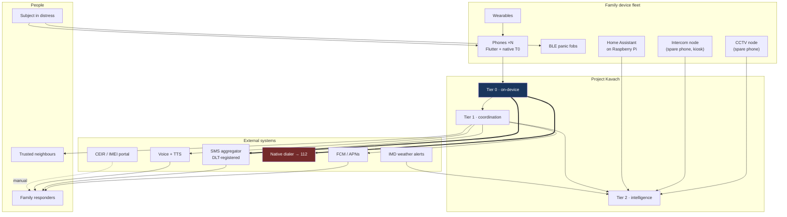

## 4.3 Container diagram

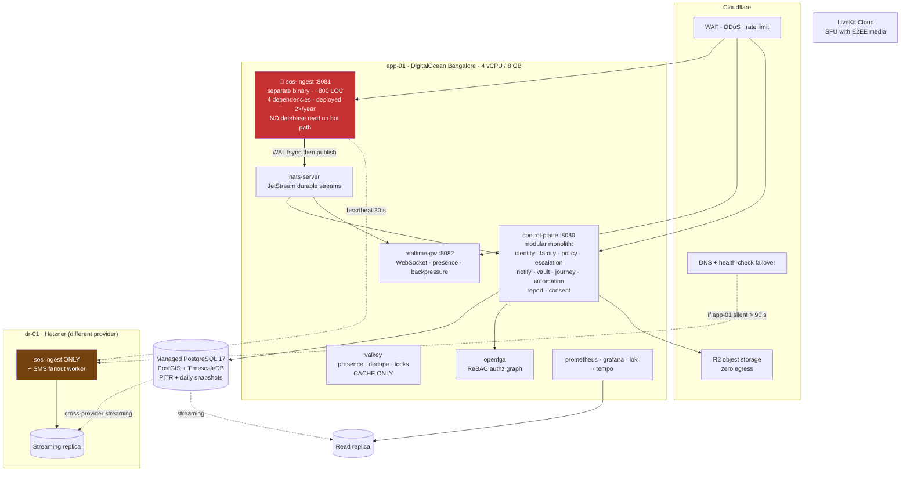

## 4.4 The degradation ladder

```
╔═══════════════════════════════════════════════════════════════════════════════╗
║ L0  ZERO INFRASTRUCTURE                            "Nothing works. Still helps"║
║     100 dB alarm on STREAM_ALARM · torch strobe · medical card full screen    ║
║     lat/long in 48 pt · one-tap CALL 112 · NFC/QR medical passport            ║
╠═══════════════════════════════════════════════════════════════════════════════╣
║ L1  PEER ONLY                                      "No towers. Family is near"║
║     BLE distress advertisement (rotating pseudonym + HMAC)                    ║
║     Family device relay · Wi-Fi Direct for bulk evidence transfer             ║
╠═══════════════════════════════════════════════════════════════════════════════╣
║ L2  SMS ONLY                                  "1 bar. Data dead. SMS still goes"║
║     ≤160-char pure-ASCII Z85 payload → family numbers AND SMS gateway         ║
║     ★ SMS transparently rides satellite NTN where the carrier supports it ★   ║
╠═══════════════════════════════════════════════════════════════════════════════╣
║ L3  PUSH ONLY                                 "Our server is down. Google is up"║
║     Device-to-device via FCM/APNs data push using cached tokens               ║
╠═══════════════════════════════════════════════════════════════════════════════╣
║ L4  HTTP ONLY                            "WebSocket blocked by proxy / portal"║
║     HTTP/1.1 POST to ingest · 3 s long-poll for state                         ║
╠═══════════════════════════════════════════════════════════════════════════════╣
║ L5  FULL FIDELITY                                            "Everything works"║
║     WebSocket · 1–5 s live location · live audio/video · real-time ACK        ║
╚═══════════════════════════════════════════════════════════════════════════════╝

★ RULE: L1–L4 fire IN PARALLEL, not in sequence. Server deduplicates by
  incident UUID. Five redundant messages cost ₹1.20. Sequential fallback
  costs 45 seconds. You are racing a clock.
```

## 4.5 Architecture Decision Record (ADR) log

| ID | Decision | Alternatives rejected | Reasoning |
|---|---|---|---|
| **ADR-001** | Three-plane separation by criticality | Single-tier app | The dominant failure mode of safety systems is coupling the critical path to non-critical infrastructure. This is the foundational decision; everything else follows. |
| **ADR-002** | `sos-ingest` as a separate binary | Endpoint inside the monolith | You *will* ship a bug to the control plane. When you do, SOS must still work. Independent deploy, independent blast radius. |
| **ADR-003** | Go for all backend | Node/TS (velocity), Elixir (best technical fit), Rust (safety) | One language, one toolchain, one static binary, tiny memory footprint, famously stable stdlib. Elixir is arguably the better technical fit (OTP supervision, Phoenix Presence, LiveView) — **take it if you are genuinely excited to learn it**; the decisive factor is which one you will still be maintaining in 2034. |
| **ADR-004** | Modular monolith, not microservices | Microservices, serverless | One developer. Inter-service plumbing would consume 60% of the effort for 8 users. Enforced module boundaries give 90% of the decoupling at 10% of the cost. |
| **ADR-005** | Docker Compose, not Kubernetes | k8s, k3s, Nomad | A control plane to maintain, a networking model to debug, and an upgrade treadmill, in exchange for orchestration you will never use. k3s is a two-day migration if you ever need it. |
| **ADR-006** | PostgreSQL + PostGIS + TimescaleDB as the only datastore | Polyglot persistence, MongoDB | One backup procedure, one restore drill, one set of operational knowledge. Postgres full-text search removes any need for Elasticsearch. |
| **ADR-007** | NATS JetStream, not Kafka | Kafka, RabbitMQ, Redis Streams | Single 15 MB binary vs a 1 GB JVM heap. Built-in KV store removes a Redis dependency. Kafka at family scale is absurd. |
| **ADR-008** | MLS (RFC 9420) for E2EE | Signal-protocol clone, bespoke scheme, no E2EE | Core primitive is a *group* with multiple devices per member and dynamic membership. TreeKEM gives O(log n) group ops with forward secrecy and post-compromise security. Now mainstream (RCS UP 3.0, Discord, Matrix migration), with mature libraries and a Flutter binding. **Never invent cryptography.** |
| **ADR-009** | ReBAC (OpenFGA), not RBAC | Role-based access control | Family relations are a graph with time and purpose dimensions. RBAC cannot express "Papa can see live location, only during an active journey, only until 12 September, only for safety purposes." |
| **ADR-010** | Geofences evaluated on-device only | Server-side geofencing | Removes home address, school, workplace, and daily routine from the server permanently. Functional cost is near zero; privacy benefit is enormous. |
| **ADR-011** | Flutter + native T0 modules | React Native, KMP, fully native ×2 | Dart isolates handle sensor streams cleanly; a maintained OpenMLS Dart binding exists; one rendering engine means pixel-identical panic UI everywhere. **This is the least important decision here** — the native modules matter ten times more than the framework. |
| **ADR-012** | Append-only event log; no CRDT library for incidents | Automerge/Yjs everywhere | Append-only logs merge by set union — conflict-free by construction. Reach for Yjs only for genuinely concurrent text editing (shared notes). |
| **ADR-013** | Escalation policy is server-authoritative and versioned; devices never write it | Offline-editable policy | Some things must be totally ordered. Two divergent escalation policies is an unrecoverable class of bug. |
| **ADR-014** | Durable timers in a Postgres table with `FOR UPDATE SKIP LOCKED`, polled at 250 ms | In-memory timers, cron, external scheduler | Survives restarts and deploys; safe concurrent workers with no coordination; **you can inspect pending escalations with a `SELECT` at 3 a.m.** |
| **ADR-015** | **Android Device Owner provisioning for all family-owned phones** | Standard app install | Single highest-leverage decision available. Eliminates OEM battery kill, permission auto-revocation, force-stop, uninstall, and factory reset in one move. See §5. |
| **ADR-016** | Home Assistant as the entire smart-home plane | Build Matter/Zigbee support | Saves 8–12 months plus perpetual protocol maintenance. Cost: a dependency on a ₹4,000 Pi. Mitigate with a UPS and a hot spare. |
| **ADR-017** | LiveKit Cloud for the SFU | Self-hosted SFU + coturn | Running a reliable TURN/SFU stack solo is a full-time job. Use insertable-stream E2EE so the SFU sees ciphertext. |
| **ADR-018** | Fail open on the safety path | Fail closed (standard security practice) | Deliberate inversion of normal security doctrine. A false alarm costs a phone call; a suppressed real alarm costs a life. Documented explicitly so no future reviewer "fixes" it. |
| **ADR-019** | Never auto-dial 112 | Auto-dial on high confidence | Legally, technically, and ethically wrong; risks breaking AML; a silent call with no speaker is often deprioritised. Human confirmation, one tap away. |
| **ADR-020** | SMS payload is pure ASCII English | Localised SMS | A single Devanagari character converts the message to UCS-2 and cuts the limit from 160 to 70 characters. Enforced by a unit test. |

---

# PART 5 — THE DEVICE OWNER STRATEGY

> **Read this section before writing any Android code. It changes what is possible.**

## 5.1 Why this matters more than anything else in this document

Almost every hard Android problem in Part 2 — OEM battery kills (P-004), permission auto-revocation (P-034), force-stop (P-036), factory reset (P-029), uninstall by a teenager, kiosk mode (P-023), app blocking (P-026), silent updates (P-060) — has the **same solution**: provision the device as an Android **Device Owner** (a fully managed device).

This is normally used for corporate fleets. It applies perfectly here because of constraint **C1**: *the family owns the phones.*

**What it costs:** one factory reset per device and about 15 minutes of ADB work, done once, before a Google account is added.
**What it buys:** an Android device that behaves the way the documentation says it does.

| Problem | Without Device Owner | With Device Owner |
|---|---|---|
| OEM kills the background service | Constant fight, unreliable, per-vendor hacks | Whitelisted; service is stable |
| Permissions auto-revoked after weeks idle | Silent failure, discovered too late | `PERMISSION_POLICY_AUTO_GRANT` — cannot be revoked |
| User force-stops the app | Agent dead until manually reopened | Effectively prevented |
| Teenager uninstalls the app | Trivial | `setUninstallBlocked()` — option is greyed out |
| Thief factory-resets the phone | App gone, no trace | `DISALLOW_FACTORY_RESET` + FRP policy — the phone is a brick |
| Kiosk mode for the elderly intercom | Third-party launcher, escapable | `setLockTaskPackages()` — true, unescapable kiosk |
| Blocking Instagram after a screen-time limit | Accessibility overlay, racy and dismissible | `setPackagesSuspended()` — the app cannot open at all |
| Pushing an app update | Play Store, or manual APK install on 8 phones | Silent install via `PackageInstaller` |

## 5.2 Provisioning runbook

> ⚠️ **This wipes the device.** Do it during initial setup, or back the phone up first.
> ⚠️ **A Google account must NOT be added before provisioning.** If one is, the command fails and you must factory-reset again.

```bash
# ── ON THE PHONE ─────────────────────────────────────────────────────────────
# 1. Factory reset the device.
# 2. On the welcome screen, SKIP Wi-Fi and SKIP adding any Google account.
#    (You can connect Wi-Fi later, after provisioning.)
# 3. Settings → About phone → tap "Build number" 7 times → Developer options.
# 4. Developer options → enable "USB debugging".

# ── ON YOUR LAPTOP ───────────────────────────────────────────────────────────
# 5. Install your DPC app (the Kavach APK, which declares a DeviceAdminReceiver).
adb install -r kavach-release.apk

# 6. Promote it to Device Owner.
adb shell dpm set-device-owner \
    in.example.kavach/.dpc.KavachDeviceAdminReceiver

# Expected output:
#   Success: Device owner set to package in.example.kavach
#   Active admin set to component {in.example.kavach/.dpc.KavachDeviceAdminReceiver}

# 7. Verify.
adb shell dumpsys device_policy | grep -A3 "Device Owner"

# 8. Now finish Android setup: connect Wi-Fi, add a Google account if desired.
```

**Manifest requirements:**

```xml
<receiver
    android:name=".dpc.KavachDeviceAdminReceiver"
    android:permission="android.permission.BIND_DEVICE_ADMIN"
    android:exported="true">
    <meta-data android:name="android.app.device_admin"
               android:resource="@xml/device_admin_policies" />
    <intent-filter>
        <action android:name="android.app.action.DEVICE_ADMIN_ENABLED" />
        <action android:name="android.app.action.PROFILE_PROVISIONING_COMPLETE" />
    </intent-filter>
</receiver>
```

**Alternative provisioning without a laptop:** on the welcome screen, tap the same spot 6 times to open the QR provisioning flow, then scan a provisioning QR that points to a hosted APK with its checksum. Useful for phones you cannot physically connect. Documented in Appendix D.

## 5.3 Capabilities to configure on first run

```kotlin
class DeviceOwnerConfigurator(private val ctx: Context) {
    private val dpm = ctx.getSystemService(DevicePolicyManager::class.java)
    private val admin = ComponentName(ctx, KavachDeviceAdminReceiver::class.java)

    fun applyAll() {
        require(dpm.isDeviceOwnerApp(ctx.packageName)) { "Not device owner" }

        // ── Reliability: never lose permissions again (P-034) ──────────────
        dpm.setPermissionPolicy(admin, DevicePolicyManager.PERMISSION_POLICY_AUTO_GRANT)
        listOf(
            Manifest.permission.ACCESS_FINE_LOCATION,
            Manifest.permission.ACCESS_BACKGROUND_LOCATION,
            Manifest.permission.SEND_SMS,
            Manifest.permission.READ_PHONE_STATE,
            Manifest.permission.POST_NOTIFICATIONS,
            Manifest.permission.CAMERA,
            Manifest.permission.RECORD_AUDIO,
            Manifest.permission.BLUETOOTH_SCAN,
            Manifest.permission.BLUETOOTH_ADVERTISE,
            Manifest.permission.BODY_SENSORS,
        ).forEach {
            dpm.setPermissionGrantState(admin, ctx.packageName, it,
                DevicePolicyManager.PERMISSION_GRANT_STATE_GRANTED)
        }

        // ── Survivability (P-029, P-036) ───────────────────────────────────
        dpm.setUninstallBlocked(admin, ctx.packageName, true)
        dpm.addUserRestriction(admin, UserManager.DISALLOW_FACTORY_RESET)
        dpm.addUserRestriction(admin, UserManager.DISALLOW_SAFE_BOOT)
        dpm.addUserRestriction(admin, UserManager.DISALLOW_ADD_USER)
        dpm.addUserRestriction(admin, UserManager.DISALLOW_DEBUGGING_FEATURES) // after setup!

        // ── Anti-theft (P-022) ─────────────────────────────────────────────
        // Android 11+: bind post-reset unlock to specific accounts
        dpm.setFactoryResetProtectionPolicy(admin,
            FactoryResetProtectionPolicy.Builder()
                .setFactoryResetProtectionAccounts(familyRecoveryAccountIds)
                .setFactoryResetProtectionEnabled(true)
                .build())

        // ── Battery + Doze (P-004) ─────────────────────────────────────────
        // Device owner apps are exempt from most background restrictions by default,
        // but assert it explicitly and verify.
        dpm.setGlobalSetting(admin, Settings.Global.STAY_ON_WHILE_PLUGGED_IN, "3") // node phones only

        // ── Silent updates (P-060) ─────────────────────────────────────────
        // Use PackageInstaller with a device-owner session: no user prompt.
    }

    // ── Kiosk mode for the intercom node (P-023) ───────────────────────────
    fun enableKiosk() {
        dpm.setLockTaskPackages(admin, arrayOf(ctx.packageName))
        dpm.setLockTaskFeatures(admin, DevicePolicyManager.LOCK_TASK_FEATURE_HOME
            or DevicePolicyManager.LOCK_TASK_FEATURE_NOTIFICATIONS)
        dpm.setKeyguardDisabled(admin, true)
        // Activity then calls startLockTask()
    }

    // ── Screen-time enforcement (P-026) ────────────────────────────────────
    fun suspend(packages: List<String>, suspended: Boolean) {
        dpm.setPackagesSuspended(admin, packages.toTypedArray(), suspended)
    }
}
```

## 5.4 Risks, limits, and rollback

| Risk | Mitigation |
|---|---|
| **You lock yourself out.** `DISALLOW_DEBUGGING_FEATURES` plus a bug in your DPC could make a phone unmanageable. | Apply `DISALLOW_DEBUGGING_FEATURES` **last**, and only after the fleet is stable for a month. Keep one phone unprovisioned as a control. Always ship a `clearDeviceOwnerApp()` escape hatch behind a guardian-authenticated action. |
| **Factory reset restriction can trap a legitimate resale/handover.** | Document the removal procedure in the runbook (§19.7). `dpm.clearDeviceOwnerApp(packageName)` from within the app removes all policies. |
| **This is genuine power over another person's phone.** | **Ethical requirement: every family member MUST be told, in plain language, exactly what device management gives you, and MUST consent.** Show a "This device is managed" screen listing every active restriction, always accessible. Android already shows a system-level managed-device notice — do not attempt to hide it. For adult members, offer a **reduced policy set** (reliability restrictions only: permission auto-grant, uninstall block; **no** app suspension, **no** kiosk). |
| **iPhones cannot do any of this** without Apple Business/School Manager and Automated Device Enrolment, which are impractical for a family. | Accept a reduced iOS feature set (§6.3). Document the gap honestly so nobody assumes parity. |
| **Play Store distribution becomes irrelevant.** | Distribute the APK yourself: host signed APKs, install via Device Owner silent install. This is a feature — no Play policy review for the accessibility, SMS, and overlay permissions you need. |

---

# PART 6 — MOBILE APPLICATION SPECIFICATION

## 6.1 Module map

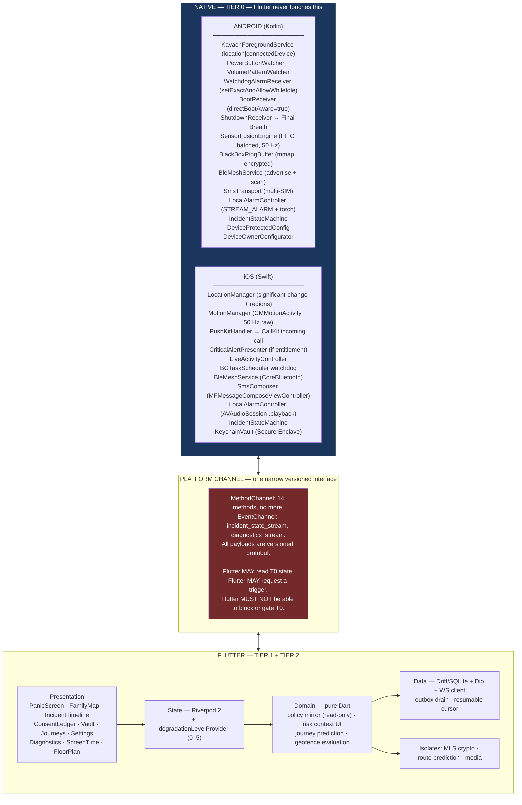

**The test that proves the boundary is correct:** kill the Dart VM and verify that (a) the SOS gesture still fires, (b) the SMS still sends, (c) the alarm still sounds, (d) the black box still seals. If any of these fail, T0 has leaked into Flutter. Fix it before proceeding.

## 6.2 Android native specification

### 6.2.1 Service topology

| Component | Type | Lifetime | Purpose |
|---|---|---|---|
| `KavachForegroundService` | FGS, type `location\|connectedDevice` | Always | Sensor fusion, BLE, location, state machine host |
| `IncidentService` | FGS, type `location\|microphone\|camera` | During incidents only | High-rate telemetry, audio streaming, capture |
| `WatchdogAlarmReceiver` | `BroadcastReceiver` + exact alarm | Every 15 min | Detects and restarts a dead agent |
| `BootReceiver` | `BroadcastReceiver`, `directBootAware=true` | On boot | Restarts the agent **before first unlock** |
| `ShutdownReceiver` | `BroadcastReceiver` | On `ACTION_SHUTDOWN` | Final Breath packet |
| `SmsResultReceiver` | `BroadcastReceiver` | Per SMS | Records sent/delivered per SIM |
| `KioskActivity` | Activity + `startLockTask()` | Intercom node only | Voice UI kiosk |
| `CctvService` | FGS, type `camera` | CCTV node only | Motion detection |

### 6.2.2 Direct Boot handling (P-035) — do not skip this

```xml
<!-- AndroidManifest.xml -->
<service android:name=".t0.KavachForegroundService"
         android:foregroundServiceType="location|connectedDevice"
         android:directBootAware="true"
         android:exported="false" />

<receiver android:name=".t0.BootReceiver"
          android:directBootAware="true"
          android:exported="true">
    <intent-filter>
        <action android:name="android.intent.action.LOCKED_BOOT_COMPLETED" />
        <action android:name="android.intent.action.BOOT_COMPLETED" />
    </intent-filter>
</receiver>
```

```kotlin
// Two storage contexts. Know which one you are in.
val deviceCtx = context.createDeviceProtectedStorageContext()  // available pre-unlock
val credCtx   = context                                        // available post-unlock

// T0 minimal config lives in Device Protected Storage:
//   - emergency contact phone numbers (plain, ASCII)
//   - escalation policy snapshot (JSON, ~4 KB)
//   - device signing key ALIAS (the key itself is in StrongBox)
//   - family peer public-key fingerprints (for BLE HMAC)
//   - last known location
// Everything else — messages, medical records, vault — stays credential-protected.

// Migrate once, at first unlock:
if (!deviceCtx.getFileStreamPath("t0.cfg").exists()) {
    deviceCtx.moveSharedPreferencesFrom(credCtx, "t0_prefs")
}
```

**Consequence:** after a 2 a.m. reboot, the agent is alive, can detect a fall, can sound the alarm, and can send SMS — without anyone unlocking the phone.

### 6.2.3 Trigger detection

```kotlin
// Power-button pattern. Requires either an AccessibilityService, a Device Owner
// privileged path, or ACTION_SCREEN_ON/OFF counting (the portable fallback).
class PowerButtonWatcher(private val onTrigger: () -> Unit) : BroadcastReceiver() {
    private val presses = ArrayDeque<Long>()

    override fun onReceive(ctx: Context, intent: Intent) {
        if (intent.action !in setOf(Intent.ACTION_SCREEN_ON, Intent.ACTION_SCREEN_OFF)) return
        val now = SystemClock.elapsedRealtime()
        presses.addLast(now)
        while (presses.isNotEmpty() && now - presses.first() > 3_000) presses.removeFirst()

        if (presses.size >= 5 && !isProbablyInPocket(ctx)) {   // P-056
            presses.clear()
            onTrigger()
        }
    }

    // Pocket detection: suppress accidental triggers
    private fun isProbablyInPocket(ctx: Context): Boolean {
        val proximityNear = LastSensorValues.proximityCm < 3f
        val dark          = LastSensorValues.luxAverage5s < 10f
        val moving        = LastActivity.type in setOf(ON_FOOT, ON_BICYCLE, IN_VEHICLE)
        return proximityNear && dark && moving
    }
}
```

Register this receiver **programmatically** (screen on/off cannot be declared in the manifest since Android 8) from the foreground service.

### 6.2.4 Multi-SIM SMS transport (P-033)

Implementation is given in full in §2.C P-033. Two rules restated because they are easy to get wrong:

1. **Send on every active SIM simultaneously during a real incident.** You cannot check balance. ₹0.40 is not a consideration.
2. **The payload MUST be pure ASCII.** Enforce with a unit test:

```kotlin
@Test fun `sms payload is always GSM-7 safe`() {
    val payload = SmsPayloadEncoder.encode(sampleIncident)
    assertTrue(payload.all { it.code in 32..126 })
    assertTrue(payload.length <= 160)
}
```

### 6.2.5 The SMS payload format

160 characters is very little. Every byte is budgeted.

```
K1|<inc8>|<name8>|<type>|<lat>,<lon>|<acc>|<bat>|<ts>|<sig8>

K1        protocol version                          2 ch
inc8      first 8 chars of incident UUID (base36)   8 ch
name8     transliterated ASCII first name, ≤8       8 ch
type      SOS|CRA|FAL|MED|DED|SAF                   3 ch
lat,lon   6 decimal places                         21 ch
acc       accuracy in metres                        4 ch
bat       battery percent                           3 ch
ts        unix seconds base36                       7 ch
sig8      first 8 chars of HMAC-SHA256 (base64url)  8 ch
separators + fixed text                            ~20 ch
────────────────────────────────────────────────────────
TOTAL                                              ~84 ch

Remaining ~70 characters carry a human-readable tail so that a family
member's stock SMS app shows something meaningful:

  "PRIYA NEEDS HELP. Crash detected. 20.945123,72.932011 Open maps."
```

**Two SMS destinations, always both:**
1. Directly to each family member's phone number (works with zero server involvement).
2. To your SMS gateway's inbound number, which converts it into a server-side incident (gives you fan-out to everyone, including people whose numbers you did not hardcode).

### 6.2.6 Power budget

```
DAILY BUDGET — 4% of a 4500 mAh battery = 180 mAh/day

┌──────────────────────────────┬─────────┬──────────────────────────────────────┐
│ Component                    │ mAh/day │ Technique                            │
├──────────────────────────────┼─────────┼──────────────────────────────────────┤
│ Location — IDLE              │    35   │ Significant-change only. NO           │
│                              │         │ continuous GNSS, ever.               │
│ Location — WATCH state       │  +90/h  │ 5 s GNSS, only while WATCH is active │
│ Geofence monitoring          │    12   │ OS hardware geofencing API           │
│ Accelerometer + gyro         │    18   │ ★ Hardware FIFO batching:            │
│                              │         │ maxReportLatencyUs = 30_000_000.     │
│                              │         │ Without this it is ~200 mAh/day.     │
│ BLE scan — IDLE              │    22   │ 3 s / 30 s duty cycle + offloaded    │
│                              │         │ ScanFilter (no CPU wake on miss)     │
│ BLE scan — WATCH             │  +45/h  │ Continuous                           │
│ Server heartbeat             │    15   │ ★ Piggyback on FCM. Do NOT hold a    │
│                              │         │ persistent socket when idle.         │
│ Sensor-fusion inference      │     8   │ NPU/DSP, int8 quantised              │
│ Wake locks + scheduling      │    25   │ Coalesce every timer into one        │
│                              │         │ 15-minute aligned WorkManager job    │
│ Black box ring buffer        │    18   │ mmap; no fsync until sealed          │
├──────────────────────────────┼─────────┼──────────────────────────────────────┤
│ TOTAL IDLE                   │   153   │ ✅ within the 180 budget              │
│ ACTIVE INCIDENT              │ ~900/h  │ = 20%/h. Acceptable; time-bounded.   │
└──────────────────────────────┴─────────┴──────────────────────────────────────┘
```

## 6.3 iOS specification — and an honest capability gap

**State this plainly to the family: an iPhone in this system is a second-class citizen.** Not because of effort, but because iOS deliberately forbids most of what makes T0 reliable.

| Capability | Android | iOS | Workaround |
|---|---|---|---|
| Persistent background agent | ✅ Foreground service | ⚠️ Only via location background mode | Register for significant-location-change; accept gaps |
| Restart after reboot without unlock | ✅ Direct Boot | ❌ Impossible | None. iOS agent is dead until first unlock. |
| Survive force-quit by user | ✅ Device Owner | ❌ Impossible | None. Detect gap server-side; alert family. |
| Power-button gesture trigger | ✅ | ❌ Not available to apps | Use the native iOS Emergency SOS (5× side button) as a *separate* mechanism; add an Action Button / Back Tap shortcut |
| Programmatic SMS send | ✅ `SmsManager` | ❌ Requires user tap in `MFMessageComposeViewController` | Pre-fill and present the composer; the user must press send. **Document this gap loudly.** |
| Ring through silent + Focus | Channel `bypassDnd` | ⚠️ Critical Alerts entitlement (hard to obtain) | **PushKit VoIP push → CallKit incoming call.** Rings through silent and Focus with no special entitlement. This is the practical answer. |
| Kiosk mode | ✅ `setLockTaskPackages` | ⚠️ Guided Access (manual, per-session) | Not viable for an intercom node. Use an Android phone. |
| App blocking / screen time | ✅ `setPackagesSuspended` | ❌ | Use Apple Screen Time + Family Sharing |
| Prevent uninstall / factory reset | ✅ | ❌ | None |
| BLE background advertising | ✅ | ⚠️ Restricted; only the "overflow" area, discoverable by iOS apps only | Family mesh degrades on iOS. Test carefully. |

**Design consequence.** Every family member's *primary* safety device SHOULD be Android. iPhones are supported as **responder devices** (receiving alerts, viewing incidents, claiming) with reduced capability as **subject devices**. If someone insists on an iPhone as their primary, give them a **BLE panic fob** (§14.4) to compensate, and set expectations in writing.

**PushKit + CallKit is the single most important iOS technique here.** Note the constraint: iOS requires you to report an incoming call to CallKit for *every* VoIP push, or it will revoke your VoIP push privileges. So actually create a call — a real WebRTC audio session to the incident. Which you wanted anyway.

## 6.4 The panic UI — hard constraints

This screen will be used by someone with adrenaline-narrowed vision and shaking hands, possibly in the rain, possibly in the dark, possibly one-handed.

| Constraint | Specification |
|---|---|
| Primary action size | ≥ 88 dp tall, full width (2× the WCAG minimum) |
| Position | Bottom third only — thumb-reachable one-handed on a 6.7" device |
| Contrast | ≥ 7:1. Never rely on colour alone. |
| Text | ≤ 4 words per element. Present tense. **"Getting help."** not "Emergency services are being contacted." |
| Motion | No animation except the cancel countdown ring. Animation reads as "loading" and increases panic. |
| Audio | Every state change gets a distinct, non-musical cue. The user will be looking away. |
| Haptic | The cancel countdown uses an **accelerating** haptic pattern — it communicates urgency without vision. |
| Failure state | **There is no error screen.** If the network fails: "Sent by SMS" or "Alarm on — show this screen to anyone nearby", plus huge coordinates. Never a red ✗. |
| Accessibility | Complete the entire panic flow with TalkBack/VoiceOver only. Your parents will need this eventually. |
| Language | Renders in the member's chosen language. Coordinates are always Latin digits. |

## 6.5 OEM compatibility matrix

| Manufacturer | Skin | Known problems | Required onboarding steps |
|---|---|---|---|
| Xiaomi / Redmi / POCO | MIUI / HyperOS | Kills FGS aggressively; blocks autostart; "battery saver" resets weekly | Security app → Permissions → **Autostart ON**; Battery saver → **No restrictions**; Recents → lock the app card |
| Oppo / Realme / OnePlus | ColorOS / OxygenOS | Sleep standby optimisation; app freeze | Battery → **Allow background activity**; disable "Sleep standby optimisation"; App list → lock |
| Vivo / iQOO | Funtouch / OriginOS | High-background-power consumption killer | iManager → App manager → Autostart **ON**; Background power **High** |
| Samsung | One UI | "Put unused apps to sleep"; Adaptive Battery | Battery → **Never sleeping apps** → add; disable "Put unused apps to sleep" |
| Motorola / Nokia | Near-stock | Mostly fine | Standard battery-optimisation exemption |
| Google Pixel | Stock | Mostly fine; Adaptive Battery may still bucket | Standard exemption |

**With Device Owner provisioning, most of the above becomes unnecessary.** Keep the matrix for phones you cannot provision. Full deep-link intents in Appendix B.

---

# PART 7 — BACKEND SPECIFICATION

## 7.1 `sos-ingest` — the critical binary

**Design constraints (these are requirements, not guidelines):**
- ≤ 1000 lines of Go
- ≤ 5 direct dependencies
- **No database read on the request path**
- No ORM, no reflection, no template engine
- No shared code with the control plane
- Deployed at most twice a year
- Its own health check, its own deploy pipeline, its own rollback

```go
// Handler skeleton. This is the most important 60 lines in the system.
func (s *Server) HandleIncidentOpen(w http.ResponseWriter, r *http.Request) {
    body, err := io.ReadAll(io.LimitReader(r.Body, 8<<10))
    if err != nil { http.Error(w, "", 400); return }

    var req pb.IncidentOpen
    if err := proto.Unmarshal(body, &req); err != nil { http.Error(w, "", 400); return }

    // 1. Verify signature against the IN-MEMORY key cache. Never touch the DB.
    verified := false
    if pk, ok := s.keyCache.Load(req.DeviceId); ok {
        verified = ed25519.Verify(pk, canonical(&req), sigFromHeader(r))
    }
    // ADR-018: FAIL OPEN. An unverified incident is still an incident.
    if !verified {
        req.Flags |= pb.Flag_UNVERIFIED
        s.metrics.UnverifiedIncidents.Inc()
    }

    // 2. Durability BEFORE acknowledgment. fsync the WAL.
    if err := s.wal.AppendSync(body); err != nil {
        // Even a WAL failure must not lose the incident: try NATS anyway.
        s.log.Error("wal_append_failed", "err", err)
    }

    // 3. Publish. At-least-once; the consumer deduplicates on incident_id.
    _ = s.nats.Publish("fam."+req.FamilyId+".incident", body)

    // 4. Respond with the server timestamp so the client can show
    //    "help is on the way" — which is itself a safety feature.
    w.Header().Set("Content-Type", "application/x-protobuf")
    w.WriteHeader(200)
    _ = writeProto(w, &pb.IncidentAck{
        IncidentId:  req.IncidentId,
        ServerTsMs:  uint64(time.Now().UnixMilli()),
        Verified:    verified,
    })
}
```

**Key cache refresh:** a background goroutine reloads all device public keys from Postgres every 60 minutes and on a NATS `device.key.changed` message. If Postgres is unreachable, the cache simply goes stale — incidents keep flowing, flagged `UNVERIFIED`.

## 7.2 `realtime-gw`

- One goroutine pair per connection (read/write).
- Resumable sessions: the client sends `?cursor=<hlc>`; the gateway replays from the NATS durable stream, then goes live.
- Presence in Valkey with a 45-second TTL, refreshed by heartbeat.
- **Backpressure priority rule** — this is a correctness issue, not a performance one:

```go
select {
case conn.send <- frame:
default:
    switch frame.Priority {
    case CRITICAL:  // incident state transitions, CLAIM, RELEASE, escalation
        // NEVER drop. Block up to 5 s, then force a full resync.
        // A dropped state transition means a responder's phone still thinks
        // the incident is unclaimed. That is a correctness bug.
        blockOrResync(conn, frame)
    case HIGH:      // messages, alerts
        conn.overflow.Push(frame)  // bounded queue, 200 items
    case LOW:       // location, presence, battery
        conn.coalesce(frame)       // keep only the LATEST per key
    }
}
```

Coalescing location is correct: a client 40 frames behind wants the *newest* position, not a replay of a 40-second-old track.

## 7.3 `control-plane` module map

| Module | Responsibility |
|---|---|
| `identity` | Passkeys, device enrolment, attestation, key cache publication |
| `family` | Membership, roles, invites, autonomy ramp, temporary members |
| `policy` | Escalation policies, versioning, distribution to devices |
| `escalation` | Durable timers, ladder execution, ACK tracking, ownership, watchdog |
| `notify` | Channel orchestration (FCM, APNs, PushKit, SMS, voice), delivery receipts |
| `vault` | Encrypted blob custody, Shamir share coordination |
| `journey` | Trips, ETAs, corridors, check-ins, dead-man timers |
| `automation` | Rules, schedules, HA bridge ingest, IMD alerts |
| `report` | After-action generation, four-clock metrics, drill scorecards |
| `consent` | Grant ledger, access logging, surfacing job, revocation |
| `device` | Heartbeats, health, diagnostics ingest, gap detection |

**Boundary enforcement:** add a CI check (`go-arch-lint` or a hand-written import-graph test) that fails the build if, for example, `vault` imports `journey`. Cross-module calls go through consumer-defined interfaces or NATS events. This is what lets you extract a module into its own binary in 2029 without a rewrite.

## 7.4 Escalation engine — durable timers

**Do not use `time.AfterFunc`. Do not use cron.** Escalation timers must survive process restarts, deploys, and crashes.

```sql
-- Polled every 250 ms by a single leader-elected worker.
SELECT id, incident_id, action, target_tier, policy_version
FROM escalation_timer
WHERE fire_at <= now() AND state = 'pending'
ORDER BY fire_at
FOR UPDATE SKIP LOCKED
LIMIT 100;
```

`FOR UPDATE SKIP LOCKED` gives safe concurrent workers with zero external coordination. 250 ms polling on a table with fewer than 1000 rows is free. It is boring, debuggable, survives everything, and **you can inspect pending escalations with a `SELECT` at 3 a.m.** — which you will need to do.

## 7.5 The incident state machine (authoritative definition)

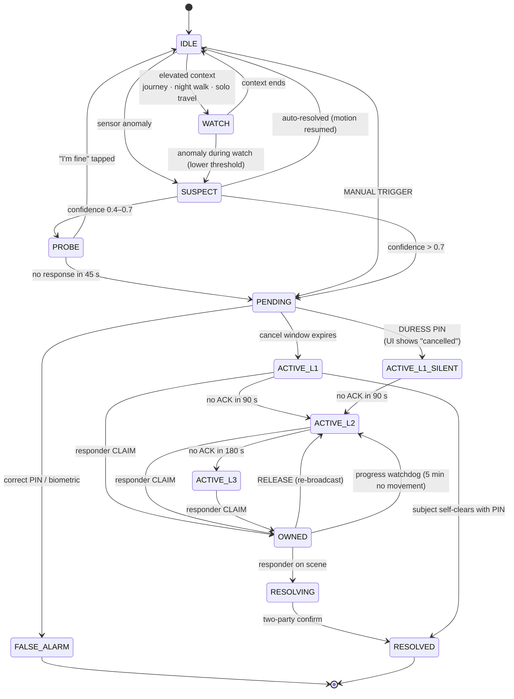

**Implementation requirements:**
- The machine is implemented **twice**: once in Kotlin/Swift (T0, authoritative on-device) and once in Go (server, for escalation). Both are generated from **one shared table of transitions** checked into the repo as YAML, with a code generator. Divergence between the two implementations is a class of bug you cannot afford.
- Every transition writes an `incident_event` row with `policy_version`.
- The current `incident.state` column is a **materialised projection**, recomputable at any time by folding the event log. If it is ever wrong, recompute it.

### Per-scenario escalation policies

| Scenario | Detection | Cancel window | L1 | L2 at | Notes |
|---|---|---|---|---|---|
| Manual panic | Gesture | 10–30 s | All family + live audio | 90 s | Audio on by default |
| Two-wheeler crash | Impact > 4 g + no motion 10 s + speed drop | 20 s, loud | All family, type `CRASH` | 60 s | Black box sealed; helmet-beacon state attached |
| Fall (elder) | Accel signature + no motion 30 s | 45 s, very loud | Primary caregiver first, then all | 120 s | Voice-call the elder before the family; check for confusion |
| Medical (self-reported) | Manual + category | 0 s | Family + medical record auto-attached | 60 s | Nearest hospital surfaced; no audio unless requested |
| Home emergency | HA smoke/gas/water | 60 s (high FP rate) | Everyone home **and** everyone away | 180 s | Auto-unlock smart locks; cut gas valve |
| Child geofence breach | On-device geofence + no response | **5 min** | Guardians only | **never** reaches neighbours | Deliberately the slowest, quietest policy in the system |
| Dead-man / missed check-in | Timer | 15 min | Designated contact only | 30 min | Phone call first |
| Device silenced (P-022) | `ACTION_SHUTDOWN` during WATCH/incident | 0 s | All family | 60 s | Escalating, not terminal |
| Missing device | No heartbeat + no location | 4 h | Owner, then family | — | Not an emergency unless correlated |
| Disaster (IMD) | External feed | n/a | All: "Are you safe?" | — | Inverts the model: system asks, humans answer |

---

# PART 8 — DATA MODEL

## 8.1 PostgreSQL schema (core tables)

```sql
CREATE EXTENSION IF NOT EXISTS postgis;
CREATE EXTENSION IF NOT EXISTS timescaledb;
CREATE EXTENSION IF NOT EXISTS pgcrypto;

-- ─────────────────────────────────────────────────────────────────────────────
-- TENANCY. family_id appears on every table and every query filters on it.
-- Costs nothing now; enables federation and sharding later without migration.
-- ─────────────────────────────────────────────────────────────────────────────
CREATE TABLE family (
    id                      uuid PRIMARY KEY DEFAULT gen_random_uuid(),
    display_name            text NOT NULL,
    mls_group_id            bytea NOT NULL,
    current_policy_version  int  NOT NULL DEFAULT 1,
    created_at              timestamptz NOT NULL DEFAULT now()
);

CREATE TYPE member_role AS ENUM
    ('guardian','adult','minor','elder','relative','neighbour','staff','guest');

CREATE TABLE member (
    id                  uuid PRIMARY KEY DEFAULT gen_random_uuid(),
    family_id           uuid NOT NULL REFERENCES family(id) ON DELETE CASCADE,
    display_name        text NOT NULL,
    ascii_short_name    text NOT NULL CHECK (ascii_short_name ~ '^[A-Za-z]{1,8}$'), -- P-033
    role                member_role NOT NULL,
    dob                 date,                        -- drives the autonomy ramp
    locale              text NOT NULL DEFAULT 'en',  -- en | hi | gu
    identity_pubkey     bytea NOT NULL,
    phone_e164          text,                        -- for SMS/voice fallback
    membership_expires_at timestamptz,               -- NULL = permanent
    created_at          timestamptz NOT NULL DEFAULT now()
);
CREATE INDEX ON member (family_id);

CREATE TABLE device (
    id                  uuid PRIMARY KEY DEFAULT gen_random_uuid(),
    family_id           uuid NOT NULL REFERENCES family(id) ON DELETE CASCADE,
    member_id           uuid NOT NULL REFERENCES member(id) ON DELETE CASCADE,
    platform            text NOT NULL CHECK (platform IN ('android','ios','node','fob','ha')),
    model               text,
    manufacturer        text,
    os_version          text,
    signing_pubkey      bytea NOT NULL,              -- Ed25519, hardware-backed
    attestation_state   text NOT NULL DEFAULT 'unverified',
    is_device_owner     boolean NOT NULL DEFAULT false,
    imei                text,                        -- for CEIR (P-029)
    push_token_fcm      text,
    push_token_apns     text,
    push_token_voip     text,
    last_heartbeat_at   timestamptz,
    battery_pct         int,
    battery_temp_c      numeric(4,1),                -- P-032
    battery_health      text,                        -- P-032
    agent_healthy       boolean NOT NULL DEFAULT true,
    diagnostics         jsonb NOT NULL DEFAULT '{}', -- permission self-check (P-031)
    created_at          timestamptz NOT NULL DEFAULT now()
);
CREATE INDEX ON device (family_id);
CREATE INDEX ON device (last_heartbeat_at) WHERE agent_healthy;

-- ─────────────────────────────────────────────────────────────────────────────
-- INCIDENTS. incident_event is STRICTLY APPEND-ONLY (see trigger below).
-- ─────────────────────────────────────────────────────────────────────────────
CREATE TABLE incident (
    id                  uuid PRIMARY KEY,            -- UUIDv7, CLIENT-generated
    family_id           uuid NOT NULL REFERENCES family(id),
    subject_member_id   uuid NOT NULL REFERENCES member(id),
    state               text NOT NULL,               -- materialised projection
    trigger             text NOT NULL,
    policy_version      int  NOT NULL,
    duress              boolean NOT NULL DEFAULT false,
    is_drill            boolean NOT NULL DEFAULT false,
    coarse_h3_r7        text,                        -- ≈1 km. ONLY plaintext location.
    owner_member_id     uuid REFERENCES member(id),
    opened_at           timestamptz NOT NULL,
    first_notified_at   timestamptz,                 -- four-clock t3
    first_ack_at        timestamptz,                 -- four-clock t4
    resolved_at         timestamptz,
    outcome             text CHECK (outcome IN ('real','false_alarm','drill','unknown')),
    outcome_note        text
);
CREATE INDEX ON incident (family_id, opened_at DESC);
CREATE INDEX ON incident (state) WHERE state LIKE 'ACTIVE%' OR state = 'OWNED';

CREATE TABLE incident_event (
    id                  bigserial PRIMARY KEY,
    incident_id         uuid NOT NULL REFERENCES incident(id) ON DELETE CASCADE,
    family_id           uuid NOT NULL,
    hlc                 bytea NOT NULL,              -- hybrid logical clock, 12 bytes
    event_type          text  NOT NULL,
    sealed_payload      bytea,                       -- MLS ciphertext. Server cannot read.
    source_device_id    uuid,
    source_transport    text,                        -- ws|http|sms|ble_relay|push
    policy_version      int,
    server_received_at  timestamptz NOT NULL DEFAULT now(),
    UNIQUE (incident_id, hlc)                        -- dedupe across transports (P-053)
);
CREATE INDEX ON incident_event (incident_id, hlc);

-- APPEND-ONLY ENFORCEMENT. Do not remove this.
CREATE OR REPLACE FUNCTION forbid_mutation() RETURNS trigger AS $$
BEGIN RAISE EXCEPTION 'incident_event is append-only'; END;
$$ LANGUAGE plpgsql;
CREATE TRIGGER incident_event_immutable
  BEFORE UPDATE OR DELETE ON incident_event
  FOR EACH ROW EXECUTE FUNCTION forbid_mutation();

-- ─────────────────────────────────────────────────────────────────────────────
-- ESCALATION
-- ─────────────────────────────────────────────────────────────────────────────
CREATE TABLE escalation_timer (
    id              bigserial PRIMARY KEY,
    incident_id     uuid NOT NULL REFERENCES incident(id) ON DELETE CASCADE,
    family_id       uuid NOT NULL,
    fire_at         timestamptz NOT NULL,
    action          text NOT NULL,       -- escalate_l2 | escalate_l3 | watchdog | repeat_l1
    target_tier     int,
    policy_version  int NOT NULL,
    state           text NOT NULL DEFAULT 'pending',  -- pending|fired|cancelled
    fired_at        timestamptz
);
CREATE INDEX ON escalation_timer (fire_at) WHERE state = 'pending';

CREATE TABLE notification (
    id              bigserial PRIMARY KEY,
    incident_id     uuid NOT NULL REFERENCES incident(id) ON DELETE CASCADE,
    family_id       uuid NOT NULL,
    recipient_id    uuid NOT NULL REFERENCES member(id),
    tier            int  NOT NULL,       -- 1 | 2 | 3
    detail_level    text NOT NULL,       -- full | reduced
    created_at      timestamptz NOT NULL DEFAULT now(),
    acknowledged_at timestamptz
);

CREATE TABLE delivery_attempt (
    id              bigserial PRIMARY KEY,
    notification_id bigint NOT NULL REFERENCES notification(id) ON DELETE CASCADE,
    channel         text NOT NULL,       -- fcm|apns|voip|sms|voice|email|ws
    device_id       uuid,
    sim_subscription_id int,             -- P-033
    attempted_at    timestamptz NOT NULL DEFAULT now(),
    result          text,                -- sent|delivered|failed|expired
    provider_ref    text,
    error_code      text
);

-- ─────────────────────────────────────────────────────────────────────────────
-- CONSENT. This is the anti-stalkerware machinery. Treat it as load-bearing.
-- ─────────────────────────────────────────────────────────────────────────────
CREATE TABLE consent_grant (
    id                  uuid PRIMARY KEY DEFAULT gen_random_uuid(),
    family_id           uuid NOT NULL REFERENCES family(id),
    grantor_member_id   uuid NOT NULL REFERENCES member(id),
    grantee_member_id   uuid NOT NULL REFERENCES member(id),
    scope               text NOT NULL,   -- live_location|history|vitals|audio|documents|screen_time
    purpose             text NOT NULL,   -- safety|incident_only|routine|care
    granted_at          timestamptz NOT NULL DEFAULT now(),
    expires_at          timestamptz NOT NULL,   -- ★ NOT NULL. No permanent grants. ★
    revoked_at          timestamptz,
    granted_via         text NOT NULL    -- self|guardian_policy|autonomy_ramp
);
CREATE INDEX ON consent_grant (grantor_member_id, expires_at);

CREATE TABLE access_log (
    id                  bigserial PRIMARY KEY,
    family_id           uuid NOT NULL,
    grant_id            uuid REFERENCES consent_grant(id),
    accessor_member_id  uuid NOT NULL REFERENCES member(id),
    subject_member_id   uuid NOT NULL REFERENCES member(id),
    what                text NOT NULL,
    context             text,            -- incident_id, or 'routine'
    at                  timestamptz NOT NULL DEFAULT now(),
    surfaced_to_subject boolean NOT NULL DEFAULT false  -- ★ a job MUST drive this to true ★
);
CREATE INDEX ON access_log (subject_member_id, at DESC);
CREATE INDEX ON access_log (surfaced_to_subject) WHERE NOT surfaced_to_subject;

-- ─────────────────────────────────────────────────────────────────────────────
-- TELEMETRY (TimescaleDB hypertables, compressed + auto-dropped)
-- ─────────────────────────────────────────────────────────────────────────────
CREATE TABLE location_point (
    device_id       uuid NOT NULL,
    family_id       uuid NOT NULL,
    ts              timestamptz NOT NULL,
    sealed_coords   bytea NOT NULL,      -- E2EE. Server cannot read.
    coarse_h3_r7    text,                -- routing only
    accuracy_m      int,
    battery_pct     int,
    risk_context    smallint             -- 0–4, opaque integer
);
SELECT create_hypertable('location_point','ts', chunk_time_interval => INTERVAL '1 day');
ALTER TABLE location_point SET (timescaledb.compress, timescaledb.compress_segmentby='device_id');
SELECT add_compression_policy('location_point', INTERVAL '7 days');
SELECT add_retention_policy('location_point', INTERVAL '90 days');   -- per-member override

CREATE TABLE device_heartbeat (
    device_id       uuid NOT NULL,
    family_id       uuid NOT NULL,
    ts              timestamptz NOT NULL,
    battery_pct     int,
    battery_temp_c  numeric(4,1),
    agent_uptime_s  bigint,
    degradation_lvl smallint,            -- 0–5, matches §4.4
    diagnostics_ok  boolean
);
SELECT create_hypertable('device_heartbeat','ts', chunk_time_interval => INTERVAL '1 day');
SELECT add_retention_policy('device_heartbeat', INTERVAL '400 days');  -- DPDP log floor

-- ─────────────────────────────────────────────────────────────────────────────
-- ROW LEVEL SECURITY (defence in depth behind OpenFGA)
-- ─────────────────────────────────────────────────────────────────────────────
ALTER TABLE incident        ENABLE ROW LEVEL SECURITY;
ALTER TABLE incident_event  ENABLE ROW LEVEL SECURITY;
ALTER TABLE location_point  ENABLE ROW LEVEL SECURITY;
ALTER TABLE consent_grant   ENABLE ROW LEVEL SECURITY;

CREATE POLICY family_isolation ON incident
    USING (family_id = current_setting('app.family_id')::uuid);
-- Repeat for every RLS-enabled table.
```

## 8.2 On-device SQLite schema (SQLCipher)

| Table | Purpose | Notes |
|---|---|---|
| `incident`, `incident_event` | Mirror of server, own family only | Source of truth for own incidents |
| `outbox` | Every unsent mutation with per-transport attempt counters | Drains on connectivity |
| `inbox_cursor` | Server stream position | Enables resumable sync |
| `local_geofence` | **Full precise coordinates** | ★ NEVER synced to the server (ADR-010) |
| `blackbox_ring` | Fixed-size, pre-allocated, mmap'd, encrypted | Circular writes; sealed on trigger |
| `policy_cache` | The full escalation policy | So T0 escalates correctly with no network |
| `peer_keys` | Family device public keys | For offline BLE HMAC verification |
| `t0_config` | **Device Protected Storage** copy of the minimal config | P-035 |
| `diagnostics` | Local self-check history | P-031 |

## 8.3 Retention policy

| Data | Default retention | Configurable by | Rationale |
|---|---|---|---|
| Location points | 90 days | Each member, for their own data | Minimise the honeypot |
| Incident events | Forever | Family (deletion requires 2-of-3) | Forensic and legal value |
| Device heartbeats | 400 days | — | DPDP Rule 6 imposes a one-year log-retention floor |
| Delivery attempts | 400 days | — | Same |
| Access log | 400 days | — | Same — and this is the accountability record |
| Media (audio/video) | 30 days post-resolution | Family | Storage cost + sensitivity |
| CCTV frames | 7 days | Family | High sensitivity |
| Screen-time data | 90 days | The person themself | Their data, their call |

## 8.4 Migration policy

- **Additive only.** Never drop a column that a shipped client reads. Never reuse a protobuf field number.
- Every migration is forward-only, idempotent, and tested against a restored production snapshot before deploy.
- The server MUST support any client from the last 24 months (NFR-016). Grandma will not update (P-060).
- Schema changes touching `incident_event` require an ADR entry.

---

# PART 9 — API SPECIFICATION

## 9.1 Conventions

| | |
|---|---|
| Base URL | `https://api.kavach.example` |
| Versioning | Path-based: `/v1/...`. `v1` is frozen and additive-only. |
| Content type | `application/json` for the control plane, `application/x-protobuf` for the critical path |
| Auth (control plane) | `Authorization: Bearer <15-min access token>` |
| Auth (critical path) | `X-Device-Id` + `X-Sig` (Ed25519). **No bearer token. No expiry.** |
| Idempotency | All mutating endpoints accept `Idempotency-Key`; incident endpoints use `incident_id` |
| Errors | RFC 7807 `application/problem+json` |
| Time | RFC 3339 UTC everywhere; HLC for event ordering |

## 9.2 Endpoints

### Critical path — `sos-ingest` (separate binary, separate host)

| Method | Path | Auth | Notes |
|---|---|---|---|
| `POST` | `/v1/incident/open` | Signed envelope | Idempotent on `incident_id`. **Fails open.** |
| `POST` | `/v1/incident/append` | Signed envelope | Append an event to an existing incident |
| `POST` | `/v1/incident/relay` | Signed envelope | BLE peer relay; carries the original signature |
| `POST` | `/v1/incident/sms-inbound` | Gateway shared secret | Webhook from the SMS aggregator |
| `GET` | `/healthz` | none | Liveness for the canary |

### Control plane

| Method | Path | Purpose |
|---|---|---|
| `POST` | `/v1/auth/passkey/begin` · `/finish` | WebAuthn registration and assertion |
| `POST` | `/v1/devices` | Enrol a device (pubkey + attestation) |
| `PATCH` | `/v1/devices/{id}` | Update push tokens, diagnostics, battery health |
| `POST` | `/v1/devices/{id}/heartbeat` | Liveness + degradation level |
| `GET` | `/v1/family` | Members, roles, health summary |
| `POST` | `/v1/family/invites` | Create an invite (with expiry for temporary roles) |
| `GET` | `/v1/incidents` | List, filterable |
| `GET` | `/v1/incidents/{id}` | Full incident with event log |
| `POST` | `/v1/incidents/{id}/claim` | Take ownership |
| `POST` | `/v1/incidents/{id}/release` | Give up ownership → re-broadcast |
| `POST` | `/v1/incidents/{id}/resolve` | Two-party resolution |
| `POST` | `/v1/incidents/{id}/classify` | Family classification → FP ledger |
| `GET` | `/v1/incidents/{id}/after-action` | Timeline + four clocks + notification matrix |
| `GET` | `/v1/policies/current` | Escalation policy for device cache |
| `GET/POST/DELETE` | `/v1/consents` | Grant ledger CRUD |
| `GET` | `/v1/consents/access-log` | Who looked at my data, when |
| `POST` | `/v1/journeys` · `PATCH /{id}` | Start / update / arrive |
| `POST` | `/v1/checkins` | Explicit "I'm safe" |
| `POST` | `/v1/find-phone/{device_id}` | Remote alarm (P-021) |
| `POST` | `/v1/drills` | Start a drill |
| `GET` | `/v1/vault/objects` · `POST` | Encrypted blob custody |
| `POST` | `/v1/ha/events` | Home Assistant bridge ingest |
| `GET` | `/internal/active-incidents` | Deploy-freeze check (P-070) |

### Realtime — `wss://rt.kavach.example/v1/stream?cursor=<hlc>`

| Direction | Frame | Priority |
|---|---|---|
| S→C | `incident.state_changed` | CRITICAL |
| S→C | `incident.claimed` / `released` | CRITICAL |
| S→C | `escalation.tier_changed` | CRITICAL |
| S→C | `message.new` | HIGH |
| S→C | `location.update` | LOW (coalesced) |
| S→C | `presence.changed` | LOW (coalesced) |
| S→C | `device.health_changed` | HIGH |
| C→S | `heartbeat` | — |
| C→S | `location.report` | LOW |
| C→S | `ack` | CRITICAL |

## 9.3 The critical-path contract

```protobuf
syntax = "proto3";
package kavach.v1;

message IncidentOpen {
  bytes    incident_id     = 1;   // UUIDv7, CLIENT-generated → idempotency
  bytes    family_id       = 2;
  bytes    device_id       = 3;
  uint64   client_ts_ms    = 4;
  bytes    hlc             = 5;   // 12 bytes: 48-bit physical, 16-bit logical, 48-bit node
  Trigger  trigger         = 6;
  uint32   confidence_pct  = 7;
  uint32   risk_context    = 8;   // 0–4, opaque
  bytes    sealed_payload  = 9;   // MLS ciphertext: precise location, vitals, notes
  string   coarse_h3_r7    = 10;  // ≈1 km cell. Server-readable. Routing only.
  uint32   battery_pct     = 11;
  bool     duress          = 12;  // ★ ALWAYS present, ALWAYS same wire size ★
  uint32   policy_version  = 13;
  bool     is_drill        = 14;
  uint32   flags           = 15;
  bytes    padding         = 16;  // ★ pad to a FIXED total size ★
}

enum Trigger {
  TRIGGER_UNSPECIFIED = 0;
  MANUAL              = 1;
  FALL                = 2;
  CRASH               = 3;
  NO_MOTION           = 4;
  DEADMAN             = 5;
  GEOFENCE            = 6;
  SENSOR_HOME         = 7;   // Home Assistant
  DEVICE_SILENCED     = 8;   // P-022
  BLE_FOB             = 9;
  VOICE_PHRASE        = 10;
  RELAY               = 11;  // came via a family peer
  DRILL               = 12;
}

message IncidentAck {
  bytes  incident_id  = 1;
  uint64 server_ts_ms = 2;
  bool   verified     = 3;
}
```

**Five deliberate decisions:**

1. **`incident_id` is client-generated UUIDv7.** Time-sortable, globally unique, and it makes the endpoint perfectly idempotent. Fire the request five times over five transports; the server deduplicates.
2. **HLC, not wall clock.** Device clocks drift and lie (P-052). HLC gives causally correct ordering across devices even with skew.
3. **`sealed_payload` is opaque to the server.** The server routes; it does not read.
4. **`coarse_h3_r7` is deliberately too coarse to identify a home.** It exists only to find nearby trusted neighbours.
5. **`duress` is always present, and `padding` forces a fixed total message size.** An attacker with network visibility MUST NOT be able to distinguish a duress incident from a normal one by packet size or timing. This is the one place in the system where you write constant-time code.

## 9.4 Error codes

| Code | HTTP | Meaning | Client behaviour |
|---|---|---|---|
| `KV-1001` | 400 | Malformed protobuf | Log; do not retry; fall back to SMS |
| `KV-1002` | 401 | Bad signature | **Retry anyway with `flags=UNVERIFIED`.** Never block an SOS. |
| `KV-1003` | 409 | Duplicate incident | Success. Treat as 200. |
| `KV-1004` | 413 | Payload too large | Strip the black box; retry with a minimal payload |
| `KV-1005` | 429 | Rate limited | **Never applied to the first incident from a device.** Retry with backoff. |
| `KV-2001` | 403 | Consent grant expired or revoked | Show the reason; offer to request renewal |
| `KV-2002` | 403 | Purpose mismatch | Show which purpose the grant covers |
| `KV-5001` | 503 | Downstream unavailable | Immediately escalate to the next transport tier |

---

# PART 10 — SECURITY & PRIVACY SPECIFICATION

## 10.1 Threat model

Ordered by **actual likelihood × impact for a family system**. Note that the top threat is the one almost nobody models.

| ID | Threat | L × I | Controls |
|---|---|---|---|
| **T1** | ★ **Intra-family surveillance / coercive control** | HIGH × HIGH | Expiring grants; access log surfaced to the subject; admin ≠ observation; published autonomy ramp; on-device geofences; §1.4.3 "Never Build" |
| **T2** | Device theft / seizure while unlocked | HIGH × HIGH | Biometric gate on Class-A reads; remote MLS-state wipe; duress PIN; 15-min token TTL; vault needs separate unlock; `FLAG_SECURE` |
| **T3** | Server compromise | MED × CRITICAL | E2EE means the loot is ciphertext + 1 km cells. No plaintext addresses, medical data, or photos exist server-side. |
| **T4** | Targeted attacker with physical access to the victim | LOW × CRITICAL | Constant-time duress path; fixed-size envelopes; covert mode; BLE relay continues even if the primary device is silenced |
| **T5** | Network adversary / traffic analysis | MED × MED | TLS 1.3; dual-pin certificates; fixed-size incident envelopes; padded timing; cover traffic during WATCH |
| **T6** | Malicious or compromised family device | LOW × HIGH | MLS post-compromise security: rotate the group key; an evicted device cannot read future messages. Device attestation. Key transparency log. |
| **T7** | Supply-chain compromise | MED × HIGH | Vendored deps; SBOM; lockfiles; Go's minimal tree; `sos-ingest` has ≤5 dependencies |
| **T8** | Alarm flooding / DoS | LOW × MED | Per-device rate limit applied **only after** the first incident is accepted; Cloudflare in front |
| **T9** | Legal compulsion | LOW × MED | You genuinely cannot produce plaintext. Publish what you can and cannot produce. Minimise retention. |

## 10.2 Data classification — the resolution of the privacy/intelligence trade-off

You cannot have both full end-to-end encryption and rich server-side intelligence. Here is the honest resolution.

| Class | Contents | Server sees | Enables |
|---|---|---|---|
| **A — E2EE always** | Precise location + history, health data, audio/video, messages, documents, photos, medical records, **geofence coordinates**, home address, screen-time detail | Ciphertext only | Nothing server-side. All processing on-device. |
| **B — Encrypted at rest, server-readable** | Incident state, trigger type, confidence, risk level 0–4, coarse H3 r7 cell, device health, battery, ACK status, policy version, degradation level | Plaintext to the app, encrypted on disk | Escalation, routing, fan-out, neighbour matching, ops |
| **C — Minimal plaintext** | UUIDs, timestamps, push tokens, delivery receipts, phone numbers (for SMS/voice fallback) | Yes | Transport, debugging |

**Server-side geofencing is eliminated entirely (ADR-010).** Geofences are Class A, evaluated on-device by the OS geofencing API. On a boundary crossing the device emits a Class-B event: `{geofence_id: <opaque uuid>, transition: EXIT}`. The server orchestrates the response without ever learning where "school" is.

> **This single decision removes your home address, your children's school, your workplace, and ten years of daily routine from the server permanently, at almost zero functional cost. It is the highest-leverage privacy decision available.**

## 10.3 Encryption

### Protocol: MLS (RFC 9420)

| Concern | Choice | Reasoning |
|---|---|---|
| Group protocol | **MLS**, via OpenMLS (Rust) with the Dart/Flutter binding | Core primitive is a *group* with multiple devices per member and dynamic membership. TreeKEM = O(log n) group ops with forward secrecy and post-compromise security. Now mainstream (RCS Universal Profile 3.0, Discord, Matrix migration). |
| Ciphersuite | `MLS_128_DHKEMX25519_AES128GCM_SHA256_Ed25519` | The mandatory-to-implement suite; hardware-accelerated everywhere |
| Post-quantum | Not in v1. Plan hybrid X-Wing (ML-KEM-768 + X25519). | Harvest-now-decrypt-later matters for a 30-year document vault, not for incident data with a 90-day life. Revisit in 2028. |
| At rest (device) | SQLCipher AES-256 | Key in StrongBox / Secure Enclave |
| At rest (server) | Volume-level encryption + application-layer for Class B | Class A is already ciphertext; this is defence in depth |
| Media | Per-object AES-256-GCM, key wrapped to the MLS group, ciphertext in R2 | Object storage never sees plaintext; R2's zero egress matters for cost |
| Vault | **Independent key**, never derived from MLS | The vault must survive total loss of all devices. Different threat model → different key. |
| Key transparency | Append-only log of device-key additions per family; clients verify inclusion | Prevents a compromised server from silently adding a device to the group — the classic E2EE server attack |

### Key hierarchy

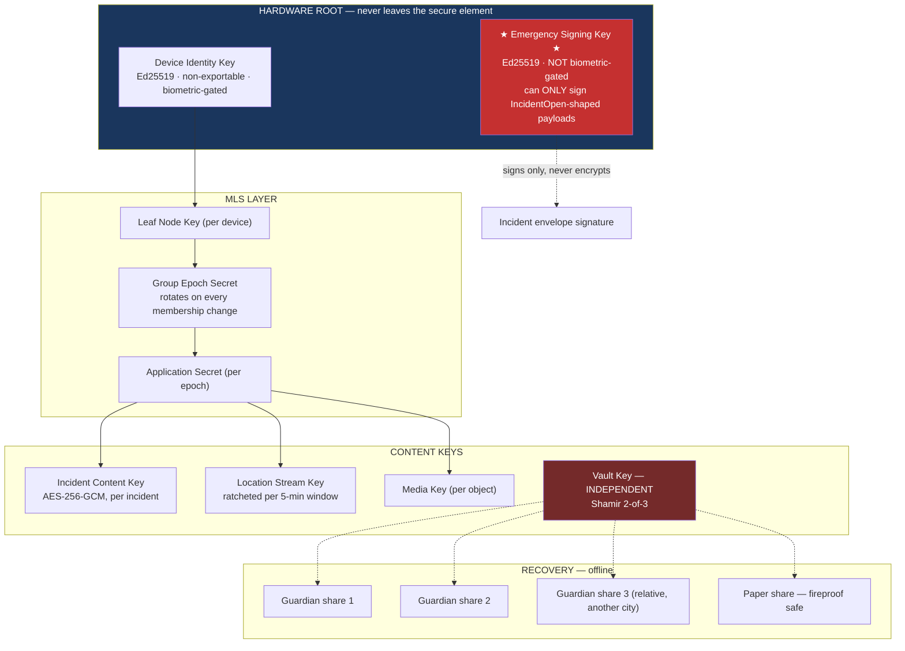

**The critical detail:** you need **two** keys in secure hardware. One biometric-gated for normal auth, and one **not** biometric-gated but restricted to signing `IncidentOpen`-shaped payloads. On Android: `setUserAuthenticationRequired(false)` with StrongBox. On iOS: a Keychain item with `kSecAttrAccessibleAfterFirstUnlockThisDeviceOnly` and **no** biometric access control.

> **An unconscious person cannot provide a fingerprint.** If you gate the emergency key on biometrics, you have built a system that works only for people who are conscious — which excludes exactly the people who need it most.

## 10.4 Break-glass: three layers

**Scenario:** Papa is unconscious. His medical record is E2EE with a key only his devices hold. The paramedic needs his blood group and drug allergies *now*.

| Layer | Mechanism | Latency |
|---|---|---|
| **1 — Offline** | NFC tag / QR sticker / lock-screen widget with a **plaintext** minimal card: blood group, top 3 allergies, top 3 medications, 2 ICE numbers, first name only | Instant, works for a stranger with no app and no network |
| **2 — Family** | On incident open, the subject's medical record is auto-rewrapped to the incident content key. Any family member reads it during an active incident with no unlock. | < 1 s |
| **3 — Vault** | Deep records (history, scans, insurance) require Shamir 2-of-3 guardian reconstruction | Minutes, deliberate |

## 10.5 Hardening checklist

| Layer | Control |
|---|---|
| Transport | TLS 1.3 only; **dual** certificate pins with a documented rotation procedure and a pin-expiry that fails open rather than bricking devices (P-049); HSTS preload |
| App | Root/jailbreak detection as a *signal*, not a block; Play Integrity / DeviceCheck attestation; `android:allowBackup="false"` (P-068); `FLAG_SECURE` on sensitive screens (P-067); no secrets in the binary |
| Storage | SQLCipher; keys in StrongBox/Secure Enclave; Device Protected Storage for T0 config |
| Backend | Non-root containers, read-only rootfs, seccomp; **no SSH access — deploy via CI only**; Postgres RLS behind OpenFGA |
| Secrets | SOPS + age committed encrypted to git; rotate quarterly |
| Supply chain | `go.sum` verification; Dependabot; SBOM generation; **annual manual review of every direct dependency** |
| Logging | ★ Structured logging with a **compile-time-enforced PII deny-list**. A custom `slog.Handler` that panics in development if a field key matches. No location, names, phone numbers, or message content in any log line, ever. |

## 10.6 Authorization model (OpenFGA)

```
model
  schema 1.1

type member
  relations
    define self: [member]

type family
  relations
    define guardian:  [member]
    define adult:     [member]
    define minor:     [member]
    define elder:     [member]
    define neighbour: [member with time_window]
    define member_of: guardian or adult or minor or elder
    define can_admin: guardian

type location_stream
  relations
    define owner:       [member]
    define viewer:      [member with grant_conditions]
    define guardian_of: [member]
    define can_view:    owner or viewer or (guardian_of and subject_is_minor)

type incident
  relations
    define family:           [family]
    define subject:          [member]
    define responder:        [member]
    define can_view_full:    subject or member_of from family
    define can_view_reduced: neighbour from family
    define can_claim:        can_view_full or can_view_reduced

condition grant_conditions(now: timestamp, expires: timestamp,
                           purpose: string, required_purpose: string,
                           incident_active: bool, incident_only: bool) {
  now < expires &&
  purpose == required_purpose &&
  (!incident_only || incident_active)
}

condition time_window(now: timestamp, activated_at: timestamp) {
  now < activated_at + duration("6h")
}
```

**Two properties RBAC cannot give you:**

1. **Purpose binding.** A grant made "for safety" cannot satisfy a "routine curiosity" check. The purpose is part of the authorization decision and it is logged.
2. **`can_view_reduced`.** Neighbours get a structurally different view enforced by the *authorization layer*, not by application `if` statements. Security properties enforced by application code eventually leak; properties enforced by the authz layer do not.

Every authorization decision is logged with its policy version and the grant that satisfied it. When your daughter asks "why could he see that?", you can answer precisely.

---

# PART 11 — OFFLINE & SYNC SPECIFICATION

## 11.1 Mental model

**The device is the source of truth. The server is a replica and a relay.** Every operation executes locally first, appends to a local log, and *then* syncs. There is no loading state and no operation that requires connectivity to succeed.

## 11.2 Conflict resolution — and why NOT to reach for a CRDT library

A common and expensive mistake: hearing "offline-first" and immediately importing Automerge or Yjs.

**Incidents are append-only event logs, and append-only logs are conflict-free by construction.** The merge of two divergent incident logs is their set union, ordered by HLC. There is nothing to resolve.

| Data | Strategy | Why |
|---|---|---|
| Incident events | Append-only union, HLC-ordered | Conflict-free by construction (ADR-012) |
| Location points | Append-only, timestamped | Same |
| Member profile fields | Last-writer-wins per field, HLC tiebreak | Conflicts are rare and benign |
| **Escalation policy** | **Server-authoritative, versioned. Devices never write.** | Two divergent escalation policies is an unrecoverable bug class (ADR-013) |
| Consent grants | Server-authoritative with signed offline receipts | Security-relevant; must be totally ordered |
| Family checklist / shared notes | **Yjs** | Genuine concurrent text editing. Earn the dependency here, nowhere else. |

## 11.3 Sync protocol

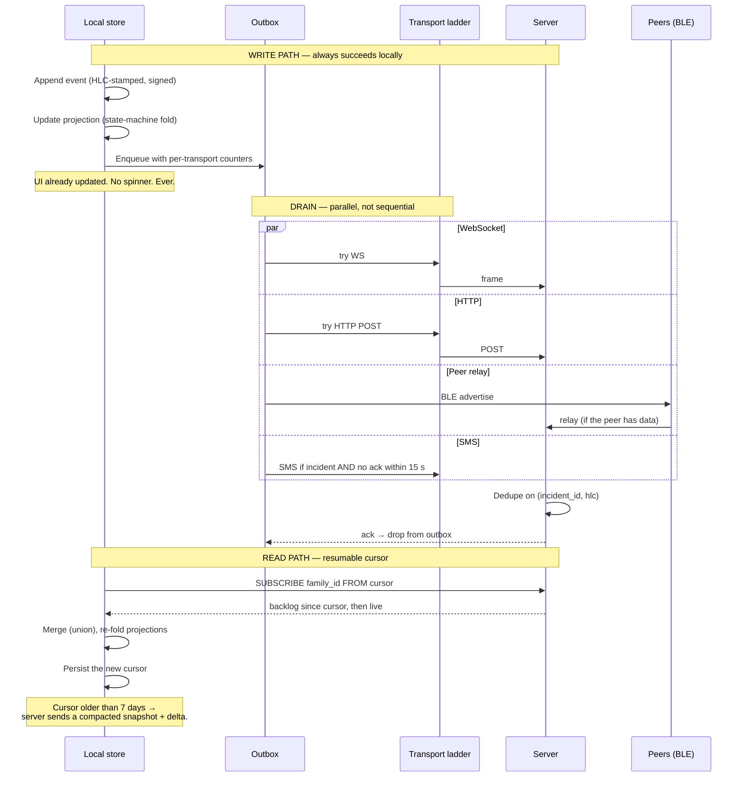

## 11.4 Connectivity detection (P-046)

```kotlin
// NEVER trust NetworkCapabilities alone. Captive portals lie.
suspend fun realConnectivity(): DegradationLevel {
    val caps = cm.getNetworkCapabilities(cm.activeNetwork)
    val claimsInternet = caps?.hasCapability(NET_CAPABILITY_INTERNET) == true
    val validated      = caps?.hasCapability(NET_CAPABILITY_VALIDATED) == true

    if (!claimsInternet) return DegradationLevel.SMS_ONLY

    // Our own 1-second probe against our own endpoint. Cached for 30 s.
    val probeOk = withTimeoutOrNull(1000) { httpHead("$BASE/healthz") } != null

    return when {
        !validated || !probeOk -> DegradationLevel.SMS_ONLY   // captive portal
        wsConnected            -> DegradationLevel.FULL
        else                   -> DegradationLevel.HTTP_ONLY
    }
}
```

## 11.5 BLE family mesh

```mermaid
sequenceDiagram
    participant P as Phone in distress<br/>NO CELLULAR
    participant B as Brother's phone<br/>40 m away, has 4G
    participant S as Backend
    participant F as Rest of family

    Note over P: SOS triggered. No network.
    P->>P: Open incident locally, seal black box
    loop every 2 s, 30 s duty cycle
        P-->>B: BLE ADV: incident_id, risk, coarse pos, HMAC
    end
    B->>B: Scan match against the family group key
    B->>B: Verify HMAC → authentic family distress
    Note over B: Brother's phone becomes a SILENT relay.<br/>He is not notified yet.
    B->>S: POST /v1/incident/relay (signed, over 4G)
    S->>S: Dedupe by incident_id; source = BLE_RELAY
    S->>F: Full fan-out, "relayed via Rohan's device"
    S->>B: NOW notify Rohan — he is the CLOSEST responder
    Note over B: The highest-value alert in the system:<br/>"Priya needs help. She is within 50 m of you."
```

**Payload format (BLE advertisement is limited to 31 bytes total):**

```
Service UUID (2 bytes, 16-bit alias)
Manufacturer data (24 bytes):
  ├─ 1 byte   version + flags (duress bit is NOT set separately — see below)
  ├─ 8 bytes  incident_id prefix
  ├─ 1 byte   risk/severity
  ├─ 6 bytes  coarse position (H3 r9 packed)
  └─ 8 bytes  HMAC-SHA256 truncated, keyed with the family group secret
```

**Privacy:** the advertised identifier is a **rotating pseudonym** derived as `HMAC(group_secret, floor(unix_time / 900))`, so a third-party scanner cannot track a family device across time. Family devices can compute the same value and recognise it.

**Battery:** duty-cycle at 10% (scan 3 s every 30 s) in IDLE using `SCAN_MODE_LOW_POWER` with a **hardware-offloaded** `ScanFilter` so the app is never woken for non-matching advertisements. Go continuous only when risk context is elevated or a family member is in WATCH.

---

# PART 12 — NOTIFICATION & ESCALATION SPECIFICATION

## 12.1 The ladder

```
┌──────────────────────────────────────────────────────────────────────────────┐
│ T+0s     L1 · SIMULTANEOUS BLAST                                             │
│          ├─ FCM data message (high priority) → full-screen intent            │
│          ├─ APNs alert + Critical Alert (if the entitlement was granted)     │
│          ├─ ★ PushKit VoIP → CallKit incoming-call UI ★                      │
│          │   Rings through silent AND Focus/DND. No entitlement needed.      │
│          │   THE most reliable iOS wake-up available to third parties.       │
│          ├─ Live Activity (iOS) / ongoing notification (Android)             │
│          └─ Wear OS / watchOS haptic burst                                   │
│                                                                              │
│ T+30s    No ACK → REPEAT L1, louder, different tone                          │
│          Humans genuinely miss the first one. Do not skip this step.         │
│                                                                              │
│ T+60s    No ACK → SMS to all L1 members                                      │
│          Independent of your infra AND of Google/Apple.                      │
│          Rides satellite NTN transparently where the carrier supports it.    │
│                                                                              │
│ T+90s    No ACK → L2 EXPANSION                                               │
│          ├─ Trusted neighbours: reduced-detail push + SMS                    │
│          ├─ Extended relatives                                               │
│          └─ Automated TTS voice call to the primary contact                  │
│                                                                              │
│ T+180s   No ACK → L3 FULL                                                    │
│          ├─ TTS voice calls to ALL contacts, in parallel                     │
│          ├─ Full-screen "CALL 112" prompt on every family device             │
│          └─ Subject device: max alarm + medical card + huge coordinates      │
│                                                                              │
│ ANY TIME First CLAIM → ladder HALTS. Ownership broadcast.                    │
│          Others switch from siren to a persistent quiet banner (NOT silence).│
└──────────────────────────────────────────────────────────────────────────────┘
```

## 12.2 Getting through Do Not Disturb

| Platform | Mechanism | Reality |
|---|---|---|
| **iOS Critical Alerts** | `UNNotificationSound.defaultCriticalSound` | Requires an Apple-granted entitlement with written justification. **Genuinely hard to obtain for a private app.** Apply anyway; have a plan B. |
| **iOS PushKit + CallKit** | VoIP push → incoming-call UI | ★ **This is plan B and it is excellent.** Rings through silent and Focus with no special entitlement. Constraint: you MUST report a call to CallKit for every VoIP push or iOS revokes your privileges — so actually create the WebRTC audio session. Which you wanted anyway. |
| **Android full-screen intent** | `USE_FULL_SCREEN_INTENT` | Restricted since Android 14 to calling/alarm-category apps; auto-granted for those. Declare the app appropriately; provide a settings path if denied. |
| **Android DND bypass** | Channel with `setBypassDnd(true)` | Requires `ACCESS_NOTIFICATION_POLICY` (a special access). Include it in onboarding. |
| **Android alarm stream** | `AudioManager.STREAM_ALARM` | Plays at alarm volume regardless of ringer state. Underused and highly effective. |

## 12.3 Responsibility transfer (P-003, P-030)

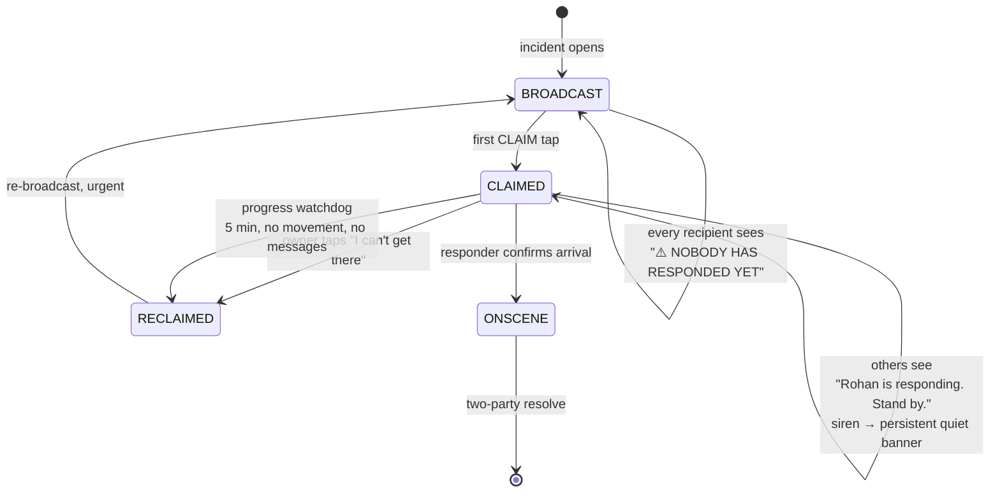

The `RECLAIMED` transition is essential. Without it, one person claims, gets stuck in traffic, and everyone else stands down permanently.

## 12.4 Why the system never auto-dials 112

1. **Legal and ethical.** False auto-dials consume finite public emergency capacity. In aggregate a buggy app causes measurable harm to *other people's* emergencies.
2. **Technical.** You cannot reliably place an emergency call programmatically on either platform, and attempting to intercept or wrap one risks breaking AML — the very thing that makes the 112 call useful.
3. **Practical.** A silent 112 call with no speaker is often deprioritised. A family member who calls 112 **and can describe the situation** produces a dramatically better dispatch outcome.

**What you do instead:** at L3, a full-screen 88 dp **CALL 112** button on every family device, with coordinates pre-formatted for reading aloud. One tap. Then get out of the way.

---

# PART 13 — AI & AUTOMATION SPECIFICATION

## 13.1 The governing constraint

> **AI never decides. AI adjusts a confidence input to a deterministic state machine, or summarises for a human.**
>
> If you cannot state in one sentence what the deterministic system does when the model returns garbage, the model does not belong in that path.

## 13.2 Where AI earns its place

| Capability | Runs | Model | Why on-device | Fallback if the model fails |
|---|---|---|---|---|
| Fall detection | Device NPU | 1D-CNN on accel/gyro, ~200 KB, int8 | Raw motion is Class A; must work offline | Threshold heuristic: impact > 3.5 g + no motion 30 s |
| Crash detection | Device NPU | Same, tuned for two-wheeler physics | Same | Same |
| Audio event (glass, scream, impact) | Device NPU | YAMNet-derived, ~4 MB | Audio never leaves the device | Amplitude spike + spectral flatness |
| Voice duress phrase | Device | Keyword spotter, ~1 MB, always-on | Must be instant and private | Manual trigger |
| Routine baseline / anomaly | Device | **EWMA + 3σ. No neural net.** | Behavioural data is maximally sensitive | Fixed thresholds |
| Route prediction / ETA | Device | Markov model over learned routes | Location is Class A | Naive great-circle ETA |
| ★ Incident summarisation for responders | Device | On-device LLM (Apple Foundation Models on iOS 26+; ML Kit GenAI / Gemini Nano on Android; LiteRT-LM for custom) | Summarises Class-A content | Structured template renderer — 80% as good |
| After-action narrative | Server or device | LLM over **Class-B data only** | — | Template |
| FP tuning analysis | Offline, your laptop | Anything | — | Manual review |

**Incident summarisation is the highest-value LLM application here.** When Rohan gets the alert at 2 a.m. he does not want a JSON blob. He wants:

> *"Priya, 3.2 km away on the Bilimora road. Phone impacted at 21:44, hasn't moved since. Heart rate 118 and climbing. Audio picked up traffic and no speech. She has a penicillin allergy. Nearest hospital is 4 km north."*

That is a one-paragraph generation from structured data and it materially compresses the responder's decision time.

## 13.3 Where AI must NOT go

| Tempting use | Why not |
|---|---|
| "Should we escalate?" | Non-deterministic, unauditable, unexplainable after the fact. Use the state machine. |
| "Is this a real emergency?" | Same. The confidence score feeds the machine; the machine decides. |
| Predicting who is "at risk" | Profiling your own family. Poor base rates make it useless anyway. |
| Auto-generating messages to emergency services | Hallucinated medical detail is actively dangerous. Templates only. |
| Analysing family messages for "concerning content" | Surveillance in a safety costume. §1.4.3. Absolutely not. |
| Cloud LLM over raw location / health / audio | Violates the Class-A boundary. Non-negotiable. |

> On that fifth row: it will be tempting — *"what if AI could detect that my teenager is depressed?"* The answer is: build a relationship with your teenager. A system that reads their messages will be discovered, will destroy trust, and will make them **less** safe. This is the clearest line in the document.

## 13.4 Sensor fusion pipeline

```mermaid
flowchart LR
    subgraph RAW["Raw — 50 Hz, hardware FIFO batched"]
        A["Accel"]; G["Gyro"]; B["Baro"]; M["Magnet"]
        L["GNSS"]; H["Heart rate"]; AU["Mic (opt-in)"]
    end
    subgraph PRE["Preprocess — on DSP, no app-CPU wake"]
        W["Sliding window 4 s / 50% overlap"]
        F["Bandpass 0.5–15 Hz"]
        FE["Features: SMV, jerk, entropy,<br/>spectral centroid, tilt"]
    end
    subgraph INF["Inference — NPU, int8"]
        M1["Fall"]; M2["Crash"]; M3["Activity"]; M4["Audio event"]
    end
    subgraph FUSE["Fusion — DETERMINISTIC, hand-written"]
        BAY["Weighted evidence accumulator.<br/>NOT a neural net.<br/>You must be able to READ it."]
        CTX["× risk_context multiplier"]
        CONF["confidence ∈ [0,1]"]
    end
    RAW --> PRE --> INF --> FUSE --> SM["→ Incident State Machine"]
    style FUSE fill:#2c5282,color:#fff
    style BAY fill:#744210,color:#fff
```

The fusion stage is explicitly **not** a learned model. It is a readable, testable ~80-line function. That is the layer you will be tuning for two years, and you must be able to reason about why it fired.

## 13.5 Risk context engine

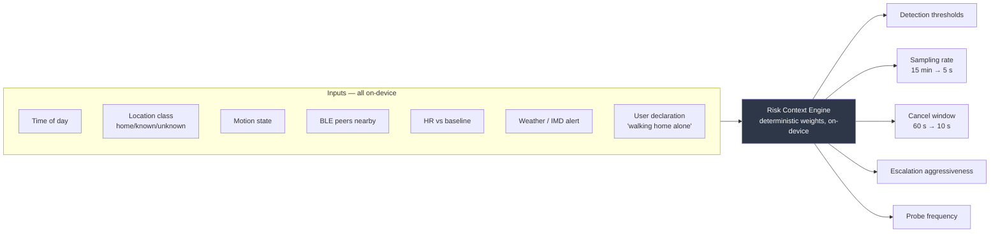

**Worked example.** Sister walking home from the station at 21:40, unknown location class, no BLE peers nearby, monsoon rain, HR 15% above baseline → risk context HIGH. The system silently raises location sampling to 5 s, drops the fall threshold, shortens the cancel window to 10 s, pre-warms the WebSocket, and pre-caches the neighbour list. **She did nothing and noticed nothing.** If her phone hits the ground, the family knows in eight seconds instead of never.

**Privacy note:** the risk engine needs continuous multi-sensor context, which is exactly why it runs entirely on-device and emits only a single opaque integer (0–4) to the server — never its inputs.

---

# PART 14 — DEVICE, SENSOR & IOT INTEGRATION

## 14.1 Integration hierarchy

| Class | Devices | Protocol | Tier |
|---|---|---|---|
| Primary | Phones | Native | T0 |
| Body-worn | Wear OS, Apple Watch, Garmin | Companion app / BLE | T0–T1 |
| Dedicated safety | nRF52 / ESP32 BLE fob | BLE GATT | T0 |
| Vehicle | OBD-II dongle, or phone-only | BLE / phone sensors | T1 |
| Home | Anything Matter/Zigbee/Z-Wave/Wi-Fi | **Via Home Assistant** | T2 |
| Nodes | Spare phones (CCTV, intercom) | Your app in a node role | T2 |
| Environmental | IMD alerts, AQI | HTTP feeds | T2 |

## 14.2 Home Assistant as the smart-home plane (ADR-016)

> **Do not build a Matter controller. Do not build Zigbee support. Do not write device drivers.**

Home Assistant supports 3,000+ integrations, runs on a ₹4,000 Raspberry Pi, is entirely local, and exposes a clean WebSocket + REST API and native MQTT.

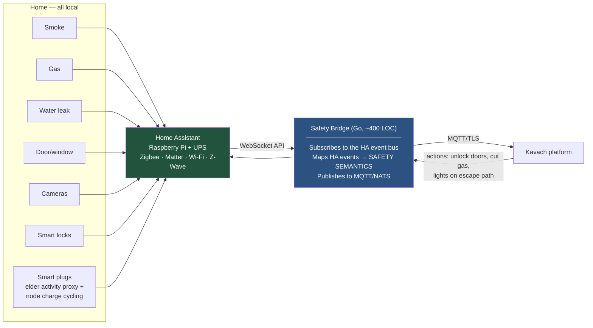

**The bridge is where your value is.** HA says `binary_sensor.kitchen_smoke: on`. Your bridge translates that into a *safety-semantic* event: incident type, severity, who is home, and suggested actions (unlock the doors so people can get out, cut the gas valve, turn on every light along the escape path). HA has no concept of an incident; you do.

## 14.3 Spare-phone node roles

| Role | Config | Key requirements |
|---|---|---|
| **CCTV node** | Device Owner + kiosk, camera FGS | Motion detection at 2–5 fps on 160×120 greyscale; ≥3-frame debounce; 30 s cooldown; E2EE snapshots to R2; thermal throttle at 42 °C, suspend at 45 °C; **auto-disable when any family member is home** (BLE presence); 7-day retention; unmissable physical indicator (P-024) |
| **Intercom node** | Device Owner + `setLockTaskPackages` + `setKeyguardDisabled` | Porcupine wake word → bounded `SpeechRecognizer` session (offline pack, max 8 s) → 12 fixed commands → MQTT to HA; always show 3 huge fallback buttons; *"Madad chahiye"* routes into the T0 state machine (P-023) |
| **Both** | Smart-plug charge cycling 40–80% | Battery bloat is a fire risk on unattended 24/7 devices (P-032). Quarterly physical inspection is on the drill checklist. |

## 14.4 The BLE panic fob — build this

An nRF52840 or ESP32-C3 with a coin cell, a button, and a buzzer. ~₹800 in parts, ~₹1,500 assembled, two-year battery life.

**Why it is disproportionately valuable:**
- **Grandparents.** A button on a lanyard is usable by someone who cannot navigate a phone UI under stress.
- **Redundancy.** Works when the phone is in another room, charging, or dead.
- **Helmet integration.** Embedded in the lining, it gives you a second accelerometer *at head level* and helmet-worn detection — dramatically reducing two-wheeler false positives from a phone bouncing in a pocket.
- **iPhone compensation.** The single best mitigation for the iOS capability gap (§6.3).

**Protocol:** BLE advertisement with a rotating pseudonym and an HMAC over `(device_id, monotonic_counter, button_state)` keyed with the family group secret. Any family phone in range opens an incident. The counter prevents replay; the rotating pseudonym prevents third-party tracking.

## 14.5 Indoor positioning (P-028)

1. **BLE room beacons** — one ₹200 ESP32-C3 per room broadcasting a room ID; the phone reports the strongest RSSI. Room-level accuracy for ~₹1,200 whole-house, zero calibration.
2. **Wi-Fi RSSI fingerprinting** as a free supplement: record the AP signature per room in a one-time walkthrough, classify with k-NN.
3. **2D floor plan builder** in-app: a Canvas/grid editor where the user drags rooms and assigns beacon IDs. Live dot per family member. **Do not attempt AR/LiDAR scanning.**

**Value:** during an incident a responder sees *"Papa is in the upstairs bathroom"* instead of a GPS pin on the roof.

---

# PART 15 — INFRASTRUCTURE & DEVOPS

## 15.1 Topology

| Tier | Provider | Spec | ₹/month |
|---|---|---|---|
| Primary app | DigitalOcean **Bangalore** | 4 vCPU / 8 GB / 100 GB NVMe | 2,000 |
| Managed Postgres | DigitalOcean | 4 vCPU / 16 GB / 200 GB + replica | 4,000 |
| DR | **Hetzner** (deliberately a different provider) | 3 vCPU / 4 GB | 700 |
| Edge | Cloudflare | Free tier + R2 | 25 |
| Media | LiveKit Cloud | Free tier at family scale | 0 |

**Why Bangalore, not Frankfurt.** Latency to Gujarat is ~25 ms vs ~170 ms — a meaningful fraction of the 5 s p95 budget — and data stays in India for DPDP comfort.

**Why cross-provider DR.** Protects against provider-level failure, not just region-level. Costs the same as cross-region within one provider and is a materially stronger guarantee.

## 15.2 Deployment

**Docker Compose + systemd. Not Kubernetes (ADR-005).**

```yaml
# docker-compose.yml (abridged)
services:
  sos-ingest:
    image: registry/kavach-sos-ingest:${SOS_TAG}
    restart: unless-stopped
    healthcheck: { test: ["CMD","/healthz"], interval: 10s, retries: 3 }
    deploy: { resources: { limits: { memory: 256M } } }
    # Deployed SEPARATELY and RARELY. Its own pipeline, its own rollback.

  realtime-gw:  { image: registry/kavach-rt:${TAG},  restart: unless-stopped }
  control-plane:{ image: registry/kavach-ctl:${TAG}, restart: unless-stopped }
  nats:         { image: nats:2-alpine, command: "-js -sd /data" }
  valkey:       { image: valkey/valkey:8-alpine }
  openfga:      { image: openfga/openfga:latest }
```

**Deploy pipeline:**
```
git push → GitHub Actions → test → build → push image → SSH → docker compose pull && up -d
```

Two rules:
1. **Blue-green for `control-plane`** (two ports, nginx switch). 60-second soak, automatic rollback on health-check failure.
2. **Deploy freeze during active incidents (P-070).** CI queries `GET /internal/active-incidents` and refuses to deploy if the result is non-empty.

## 15.3 Cost model

| Item | ₹/month |
|---|---|
| App VM | 2,000 |
| Managed Postgres + replica | 4,000 |
| DR VM | 700 |
| Cloudflare + R2 | 25 |
| SMS (~200 transactional @ ₹0.20) | 40 |
| Voice/TTS (~15 min @ ₹0.65) | 10 |
| Push (FCM/APNs) | 0 |
| LiveKit Cloud | 0 |
| Monitoring (self-hosted) | 0 |
| Apple Developer (₹8,900/yr) | 750 |
| Domain + misc | 150 |
| **TOTAL** | **≈ 7,675** |

≈ ₹92,000/year, about ₹1,280 per family member per month. A commercial medical-alert service in India runs ₹800–2,000/month **per person**.

**Where money would leak if you are careless:**

| Trap | Bad choice | Cost | Fix |
|---|---|---|---|
| Egress fees | AWS S3 for media | ₹8/GB | Cloudflare R2 — zero egress |
| Over-provisioned managed services | RDS Multi-AZ + ElastiCache + MSK | ₹25,000/mo | One managed PG + NATS/Valkey on the app VM |
| Chatty telemetry | Every location point to a hosted metrics SaaS | ₹3,000/mo | Self-host Prometheus; sample hard |
| Serverless in the hot path | Lambda per heartbeat | ₹4,000/mo | One VM handles everything |
| Kubernetes | Managed EKS/GKE control plane | ₹6,000/mo + your time | Docker Compose |
| Cloud LLM | API call per summary | ₹1,500/mo + a privacy violation | On-device |

> **Your time is the dominant cost.** ₹7,675/month is noise. The genuinely expensive decisions are the ones that consume months: building your own IoT stack, your own SFU, running Kubernetes, or writing bespoke cryptography. Optimise for your hours until the rupees exceed ₹25,000/month.

## 15.4 Scalability — read this before you over-engineer

**You will have 6–30 devices. You do not have a scaling problem. You have an evolution problem.**

A single 4 vCPU / 8 GB Go server handles roughly 50,000 concurrent WebSockets. You are three to four orders of magnitude below any point where scaling matters. Every hour spent on Kubernetes, sharding, or autoscaling is an hour not spent on the OEM battery-killer problem that will actually break your system.

**Cheap decisions that preserve optionality (do these):**

| Decision | Cost now | Buys |
|---|---|---|
| `family_id` on every table + RLS | ~zero | Sharding, federation, per-family key isolation, no migration |
| Stateless services; all state in PG/NATS/Valkey | ~zero | Add a second instance any time |
| NATS subjects namespaced `fam.{id}.*` | ~zero | Trivial consumer partitioning |
| TimescaleDB hypertable for location | ~zero | The only unbounded table is already partitioned and compressed |
| Enforced module boundaries | one CI check | Extract a module to its own binary in a day |
| API versioning from `v1` | ~zero | Old clients keep working (P-060) |

**The scaling problem you WILL have** is schema evolution over ten years while an old app version is still on a phone your mother refuses to update. Solve *that*.

---

# PART 16 — OBSERVABILITY

## 16.1 Stack

| Layer | Tool |
|---|---|
| Metrics | Prometheus + Grafana (self-hosted on the app VM) |
| Traces | OpenTelemetry → Tempo. **Trace IDs originate on the device**, so one SOS is traceable phone → server → push → recipient. |
| Logs | Loki, with a compile-time PII deny-list |
| Errors | Sentry (or self-hosted GlitchTip) |
| Uptime | UptimeRobot / Better Stack — **external to your infrastructure** |
| Alerting | Grafana → Telegram/ntfy, plus SMS for P0. **Do not route alerting through the system you are monitoring.** |

## 16.2 ★ The end-to-end canary — the single highest-value investment

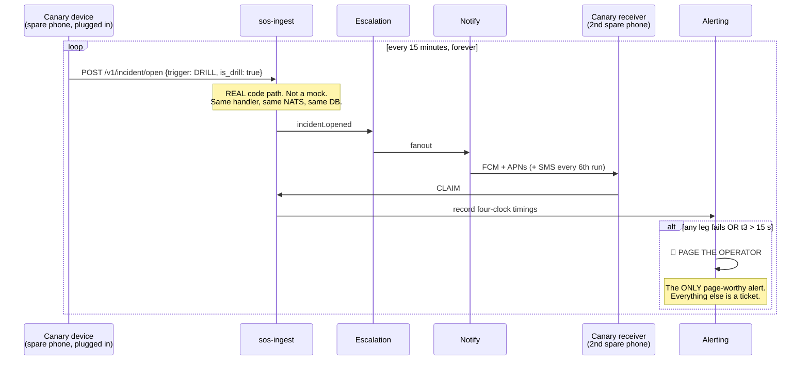

**Why this matters more than any dashboard:** CPU graphs, error rates, and uptime checks all look green while your FCM credentials silently expire, your DLT template gets deregistered, or an APNs certificate lapses. The canary catches every one of those within 15 minutes.

Add a **weekly full-fidelity canary** that runs all the way through SMS and a voice call, so you catch aggregator and DLT problems before an emergency does.

## 16.3 Dashboards

**Dashboard 1 — Safety Chain Health (the only one you check daily):**

```
┌───────────────────────────────────────────────────────────────────┐
│ 🟢 Canary: last success 4 min ago · t3 p95 = 2.8 s (budget 5 s)   │
│ 🟢 sos-ingest: 100% success over 30 d · p99 latency 42 ms         │
│ 🟡 Devices: 5/6 agents healthy                                    │
│    ⚠️  Ma's phone: last heartbeat 19 h ago — LIKELY OEM KILL       │
│ 🟢 Push: FCM 99.8% · APNs 99.9% (7 d rolling)                     │
│ 🟢 SMS: DLT template active · last test delivery 6 h ago          │
│ 🟢 Escalation timers: 0 overdue                                   │
│ 🟢 DR replica lag: 1.4 s                                          │
│ 🟢 Node phones: CCTV 38 °C · Intercom 35 °C · battery health OK   │
└───────────────────────────────────────────────────────────────────┘
```

> That one yellow line — a family member's agent silently dead for 19 hours — is worth more than every other metric in the system combined.

**Dashboard 2 — Four Clocks.** Histograms of t1−t0, t2−t1, t3−t2, t4−t3, split by trigger type and degradation level.

**Dashboard 3 — False Positive Ledger.** Every incident classified real/false/drill, with the trigger and confidence that produced it. This is your tuning feedback loop and a P0 metric.

## 16.4 Alert routing

| Severity | Condition | Route |
|---|---|---|
| **P0 — page** | Canary fails · `sos-ingest` unhealthy · escalation timer overdue > 60 s | Telegram + SMS + repeat every 5 min until acknowledged |
| **P1 — notify** | Agent silent > 6 h · push token invalid · DR replica lag > 60 s · node battery health bad | Telegram |
| **P2 — ticket** | Disk > 80% · FP rate rising · dependency CVE | Weekly digest |

---

# PART 17 — TESTING & DRILL STRATEGY

## 17.1 Test pyramid

| Level | Coverage target | What |
|---|---|---|
| Unit | 80% of T0 logic, 60% overall | State machine transitions, HLC ordering, SMS encoding, crypto wrappers |
| Property-based | State machine + sync | Random event orderings must produce identical projections on all devices |
| Integration | All API endpoints | Against a real Postgres and a real NATS in Docker |
| Contract | Old clients | Replay recorded requests from a 12- and 24-month-old client build |
| End-to-end | The full ladder | Real devices, real push, real SMS |
| **Chaos** | Failure paths | See §17.3 |
| **Drills** | The whole system + the humans | See §17.4 |

## 17.2 The mandatory device test matrix

Every release MUST pass on:

| Device class | Example | Why |
|---|---|---|
| Aggressive-OEM mid-range | Redmi Note (MIUI/HyperOS) | The most likely real-world configuration in India |
| Old, low-RAM | Any 4-year-old device, 3 GB RAM, Android 10 | Grandparent's phone |
| Modern stock | Pixel | Baseline correctness |
| iOS | Any supported iPhone | Verifies the reduced-capability path |
| Device Owner provisioned | One of the above | Verifies §5 policies apply |
| Node phone | Spare, plugged in | Verifies thermal and battery-health handling |

## 17.3 Chaos test list — run these deliberately

| ID | Test | Expected |
|---|---|---|
| T-201 | Kill `control-plane` mid-incident | Incident continues; `sos-ingest` unaffected; escalation resumes on restart |
| T-202 | Kill Postgres | `sos-ingest` still returns 200; incidents queue in NATS; reconcile on recovery |
| T-203 | Kill NATS | `sos-ingest` writes WAL and returns 200; replays on recovery |
| T-204 | Airplane mode on the subject device | SMS + BLE fire; local alarm sounds; UI shows "Sent by SMS" |
| T-205 | Airplane mode on **all** devices | L0 total-isolation mode; alarm, medical card, coordinates, CALL 112 button |
| T-206 | Force-stop the app, then trigger the BLE fob | Device Owner devices: agent restarts. Non-provisioned: documented failure, server raises a gap alert. |
| T-207 | Reboot the phone, do **not** unlock, then simulate a fall | Agent alive via Direct Boot; alarm sounds; SMS sends (P-035) |
| T-208 | Set the device clock 3 hours forward | HLC ordering still correct; timeline renders sensibly (P-052) |
| T-209 | Captive-portal Wi-Fi | Detected as unvalidated; immediate drop to SMS tier (P-046) |
| T-210 | Fire the same incident over WS, HTTP, SMS, and BLE simultaneously | Exactly one incident; four `source_transport` values recorded (P-053) |
| T-211 | Two family members trigger SOS within 2 seconds | Two independent incidents; independent timers; distinct notification sounds (P-057) |
| T-212 | Claim, then let the responder go silent for 6 minutes | Progress watchdog re-broadcasts (P-003) |
| T-213 | Duress PIN — measure packet size and timing vs a normal cancel | **Statistically indistinguishable.** Automate this test. (T4) |
| T-214 | Fill device storage to 100% | Pre-allocated reserve still accepts the incident write (P-043) |
| T-215 | Revoke background location, wait 7 days | Self-diagnostic detects it; family alert fires at 48 h (P-034) |
| T-216 | Restore from backup into a scratch VM | Full restore; a 6-month-old incident renders; projections recompute from the event log |
| T-217 | Rotate the TLS certificate | Backup pin holds; no client is bricked (P-049) |
| T-218 | Simulate `NotRegistered` from FCM | Device marked degraded; family alerted (P-048) |

## 17.4 The quarterly drill protocol

**Duration: 4 minutes. Calendared. Non-negotiable (P10, P-063).**

```
┌─ QUARTERLY FAMILY SAFETY DRILL ─────────────────────────────────────────┐
│                                                                          │
│  T-24h   System sends: "Drill this week, sometime. Act normally."       │
│          (Do NOT announce the exact time — you are testing DND, not     │
│           people's willingness to sit by their phone.)                  │
│                                                                          │
│  T+0     A randomly-selected member's device fires a real incident       │
│          flagged is_drill=true. Full ladder runs, real notifications,    │
│          real sounds. Only the SMS/voice tiers are simulated by default. │
│                                                                          │
│  T+0..4m Family responds exactly as they would for real: claim, call,    │
│          resolve.                                                        │
│                                                                          │
│  T+5m    Automated scorecard to the family:                             │
│            • Per-member: alert received? at what latency? acknowledged?  │
│            • Who claimed first, and how long it took                     │
│            • Any device that did NOT receive the alert, and WHY          │
│            • Four-clock measurements vs the SLO targets                  │
│                                                                          │
│  T+1d    Fix everything the drill revealed. This is the entire point.   │
│                                                                          │
│  ANNUAL EXTRAS (once per year, in one of the four drills):              │
│    □ Full-fidelity: real SMS and real TTS voice calls to every member   │
│    □ Key-recovery drill: actually reconstruct the vault from Shamir     │
│      shares. 20 minutes. The difference between an inconvenience and    │
│      losing your family's medical history forever.                      │
│    □ Backup restore drill into a scratch VM                             │
│    □ Runbook drill: someone ELSE executes §19 while you watch silently  │
│    □ Physical inspection of node phones for battery swelling (P-032)    │
│    □ Verify every family member's IMEI is recorded in the vault         │
└──────────────────────────────────────────────────────────────────────────┘
```

**Make it a game.** The dashboard shows response times and a family leaderboard. Automate all measurement so nobody has to record anything.

---

# PART 18 — THE BUILD PLAN

> **Read this before writing any code.** The order matters more than the code. Building in the wrong order is how a project like this becomes an impressive demo that fails on the night it is needed.

## 18.1 Phase overview

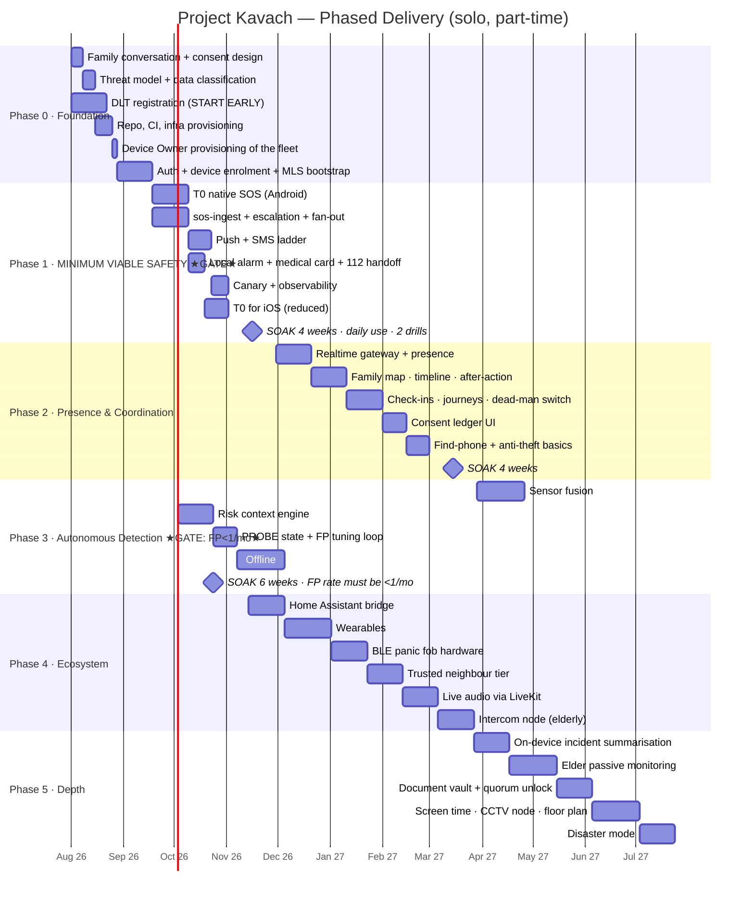

> **Phase 1 IS the project.** Roughly 12 weeks to a system that genuinely works. If you build only Phase 1 and nothing else, your family is meaningfully safer than they are today. If you build Phases 3–5 while Phase 1 is shaky, you have a demo.

## 18.2 Phase 0 — Foundation (4 weeks)

| Week | Tasks | Acceptance criteria |
|---|---|---|
| **W1** | ★ **Family conversation.** Explain what will be built, what device management means (§5.4), what each person can see about each other, and let each person choose their participation level. Get explicit consent, in writing, per person.<br/>★ **Start DLT registration** — it takes 1–2 weeks and blocks Phase 1. | Every family member has said yes, in writing, and knows what they said yes to. DLT application submitted. |
| **W2** | Threat model workshop (§10.1). Data classification of every field you plan to store (§10.2). Write ADR-001 through ADR-020 into the repo. | Every planned field is classified A/B/C. No unclassified field exists. |
| **W3** | Provision DO Bangalore VM, managed Postgres, Cloudflare, Hetzner DR. Terraform it. GitHub Actions skeleton. SOPS secrets. Postgres schema v1 applied. | `terraform apply` from zero reproduces the whole environment. CI runs on push. |
| **W4** | ★ **Device Owner provisioning of the entire fleet** (§5.2). Auth: passkeys + device enrolment + hardware key generation. MLS group bootstrap. | Every family Android phone reports `is_device_owner = true`. An MLS group exists with all devices as members. A message encrypted on phone A decrypts on phone B and is unreadable on the server. |

## 18.3 Phase 1 — Minimum Viable Safety (8 weeks) ★ THE GATE ★

| Week | Tasks | Acceptance criteria |
|---|---|---|
| **W5** | `sos-ingest` binary. Protobuf contract. WAL. NATS publish. Ed25519 verification with fail-open. | `curl` with a signed protobuf returns 200 in < 50 ms p99. Killing Postgres does not affect it. |
| **W6** | Android T0 skeleton: foreground service, Direct Boot config, boot receiver, watchdog alarm, self-diagnostics. | Reboot the phone, do not unlock it, and confirm via `adb logcat` that the service is running (P-035). Force-stop it and confirm the watchdog restarts it. |
| **W7** | Incident state machine (generated from the shared YAML) in Kotlin + Go. Trigger detection: power ×5, volume hold, in-app button. Cancel window with escalating haptics. Duress PIN. | State machine unit tests pass in **both** implementations from the same YAML fixture set. Duress and cancel are timing-indistinguishable (T-213). |
| **W8** | Local alarm (`STREAM_ALARM` + torch + full-screen medical card + 48pt coordinates). 112 dialer handoff. Black box ring buffer. | With airplane mode on and the app force-stopped, a fob press produces a 100 dB alarm, a readable medical card, and a working CALL 112 button (T-205). |
| **W9** | Escalation engine: durable timers, ladder L1→L2→L3, CLAIM/RELEASE, progress watchdog. | Timer accuracy ±500 ms across a service restart. Killing the control plane mid-incident and restarting it resumes escalation correctly (T-201). |
| **W10** | Notification orchestrator: FCM data messages, full-screen intents, DND-bypass channels, APNs + PushKit/CallKit. | An alert rings through Do Not Disturb on every device in the test matrix (§17.2). |
| **W11** | SMS transport: multi-SIM, ASCII payload encoder, gateway inbound webhook, delivery receipts. Voice/TTS tier. | With data disabled, an SOS delivers an SMS to every family member within 60 s, on both SIMs, and creates a server-side incident (T-204). ASCII lint test passes. |
| **W12** | Canary. Grafana dashboards 1–3. P0 alert routing. Backup + restore drill. | The canary has run for 72 hours with zero failures. A restore into a scratch VM works (T-216). |
| **W13–16** | ★ **SOAK.** Daily real use by the whole family. Two drills. **Write no new features.** Fix only what the soak reveals. | ✅ NFR-001 through NFR-009 met. ✅ 2 drills passed. ✅ Zero unexplained canary failures for 14 consecutive days. ✅ Every family member has successfully triggered and cancelled a test SOS unaided. |

> **Do not proceed past week 16 until every box above is ticked.** This gate exists because everything after it is optional and everything before it is not.

## 18.4 Phase 2 — Presence & Coordination (10 weeks + 4 soak)

| Milestone | Acceptance criteria |
|---|---|
| Realtime gateway + presence | 8 concurrent connections stable for 7 days. Backpressure test: a slow consumer never delays a fast one; **no CRITICAL frame is ever dropped**. |
| Family map + timeline + after-action | An after-action report for a 6-month-old incident renders correctly, including the four clocks and the notification matrix. |
| Journeys + dead-man switch | A simulated missed arrival escalates on schedule. A simulated 14 h no-unlock on the elder's phone escalates. |
| Consent ledger | Every read of another member's data appears in the subject's ledger within 60 s. Revoking a grant takes effect on all devices within 30 s. |
| Find-phone + anti-theft | Find-phone works over FCM **and** over BLE with the target offline (P-021). Final Breath packet fires on `ACTION_SHUTDOWN` (P-022). |

## 18.5 Phase 3 — Autonomous Detection (13 weeks + 6 soak) ★ STRICT GATE ★

| Milestone | Acceptance criteria |
|---|---|
| Fall + crash detection | ≥90% recall on a labelled test set collected by *deliberately* dropping and crash-simulating with a test phone. Collect at least 200 negative samples from normal daily activity. |
| Risk context engine | Battery cost stays within NFR-005 across all risk levels. Emits only the opaque 0–4 integer to the server. |
| PROBE state | ≥70% of would-be escalations from auto-detection are resolved at PROBE without waking the family. |
| BLE mesh | With the subject's phone in airplane mode and a family phone 40 m away, the incident reaches the server via relay within 30 s (§11.5). |
| **★ THE GATE ★** | **False-positive rate < 1 per user per month, sustained over the 6-week soak.** If it is not, you raise thresholds or disable trigger types until it is. **You do not proceed.** |

> An automatic detector that cries wolf makes your family *less* safe than no automatic detector. This gate is the most important one in the plan.

## 18.6 Phases 4 & 5

Build in the listed order. Each item is independently valuable and independently shippable. Two ordering notes:

- **Build the BLE fob before the wearables.** It is cheaper, more reliable, helps the grandparents *and* the iPhone users, and takes a weekend.
- **Build the intercom node before the CCTV node.** It creates daily positive value for an elderly family member; the CCTV node creates a privacy liability that needs the consent machinery to be mature first.

---

# PART 19 — OPERATIONAL RUNBOOK

> **Print this. Put a copy in the fireproof safe. Put a copy in the document vault with 2-of-3 unlock. Have someone else execute it once a year while you watch and say nothing (P-020).**

## 19.1 Contact card

```
System owner:        ______________________  Phone: ______________
Break-glass person:  ______________________  Phone: ______________
Credentials:         Document vault, entry "kavach-ops"
                     Unlock: 2 of 3 guardian shares
Cloud console:       DigitalOcean, account ______________
DNS + edge:          Cloudflare, account ______________
SMS aggregator:      ______________________  Support: ____________
Repo:                github.com/______________
```

## 19.2 "Something is wrong" triage

```
1. Is the canary green?           → Grafana, Dashboard 1
   NO  → go to 19.3
   YES → the core safety path works. The problem is in T1/T2. Lower urgency.

2. Is a family member's agent silent?  → Dashboard 1, Devices row
   YES → go to 19.4

3. Are escalation timers overdue?
   YES → restart control-plane (19.5). Timers are durable; they will fire late,
         not never.

4. Is the DR replica lagging > 60 s?
   YES → non-urgent. Check Postgres load. Ticket it.
```

## 19.3 Canary is red

```bash
ssh app-01

# 1. Which leg failed? The canary logs the exact stage.
docker compose logs --tail=200 canary | grep FAIL

# 2. Ingest healthy?
curl -s -o /dev/null -w '%{http_code}\n' https://api.kavach.example/healthz

# 3. If ingest is down — restart it FIRST, diagnose second.
docker compose restart sos-ingest
sleep 20 && curl -s .../healthz

# 4. Still down? FAIL OVER TO DR. This takes 2 minutes.
#    Cloudflare dashboard → DNS → api.kavach.example → point to dr-01 IP
#    DR runs sos-ingest + SMS fanout only. Degraded but the safety path works.

# 5. If ingest is fine but notifications failed:
docker compose logs --tail=200 control-plane | grep -E 'fcm|apns|sms'
#    Common causes, in order of likelihood:
#      a) FCM service-account key expired      → rotate, see 19.6
#      b) APNs certificate expired             → rotate, see 19.6
#      c) DLT template deregistered            → contact the aggregator
#      d) SMS aggregator balance exhausted     → top up
```

## 19.4 A family member's agent is silent

```
1. Call them. Ask them to open the app. (Solves it ~60% of the time.)
2. In the app: Settings → Diagnostics → run the self-check.
3. Read the failures:
   - "Battery optimisation not exempt"   → Appendix B deep link for that OEM
   - "Background location revoked"       → re-grant, two-step flow (P-040)
   - "Notifications disabled"            → re-grant POST_NOTIFICATIONS
   - "Auto-revoke enabled"               → disable "pause app activity if unused"
4. If the phone is Device Owner provisioned and this still happened,
   something is genuinely wrong. Capture `adb bugreport` and investigate.
5. If the phone is NOT provisioned — provision it (§5.2). This is the fix.
```

## 19.5 Standard service restarts

```bash
# Safe, in this order. sos-ingest LAST and only if truly necessary.
docker compose restart control-plane   # safe any time except mid-incident
docker compose restart realtime-gw     # clients reconnect with their cursor
docker compose restart nats            # JetStream is file-backed; messages survive
docker compose restart sos-ingest      # ★ CHECK FOR ACTIVE INCIDENTS FIRST ★

curl -s https://api.kavach.example/internal/active-incidents
# Must return []. If not, WAIT. Do not restart during a live emergency.
```

## 19.6 Credential rotation calendar

| Credential | Expiry | Rotation procedure |
|---|---|---|
| APNs auth key | No expiry, but revocable | Apple Developer → Keys → regenerate → SOPS → deploy |
| FCM service account | 10 years | GCP IAM → new key → SOPS → deploy |
| TLS certificate | 90 days (auto via Cloudflare/ACME) | Automatic. **Verify the backup pin covers the next key** (P-049). |
| Postgres password | Quarterly | DO console → reset → SOPS → deploy → verify |
| SMS aggregator API key | Annual | Aggregator portal → SOPS → deploy |
| DLT templates | On any message-text change | Re-register **before** shipping the change |
| Shamir shares | On any guardian change | Regenerate all shares. Old shares must be destroyed. |

## 19.7 Removing Device Owner from a phone

```bash
# From inside the app, as an authenticated guardian:
#   Settings → Device Management → Remove management
# This calls dpm.clearDeviceOwnerApp(packageName), which removes ALL policies.
#
# If the app is broken and cannot do it:
adb shell dpm remove-active-admin in.example.kavach/.dpc.KavachDeviceAdminReceiver
# If DISALLOW_DEBUGGING_FEATURES is active, ADB is unavailable and the only
# path is a factory reset from recovery — which then hits the FRP policy.
# ★ This is why you keep one unprovisioned control phone. ★
```

## 19.8 Disaster recovery

| Failure | RTO | RPO | Action |
|---|---|---|---|
| Service crash | 10 s | 0 | Docker restart policy handles it |
| App VM lost | 15 min | ~2 s | Cloudflare DNS → DR IP. Devices retry automatically. |
| Postgres primary lost | 30 min | ~5 s | Promote the replica; update the connection string; deploy |
| Entire region lost | 30 min | ~5 s | DR takes `/incident/*` only. Degraded: no history, but SOS + SMS fan-out works. |
| **Both providers down** | — | — | **Devices operate at L0–L2. Direct SMS + BLE mesh + 112. This is the design.** |
| Data corruption | 4 h | ≤24 h | PITR to a pre-corruption point |
| Ransomware / total compromise | 8 h | ≤24 h | Restore from the offline Backblaze copy; rotate every credential |

**Backup regime (3-2-1):**

| Layer | What | Where | Frequency | Retention |
|---|---|---|---|---|
| 1 | Continuous WAL archiving | R2 | Continuous | 30 days PITR |
| 2 | `pg_dump -Fc`, age-encrypted | **Backblaze B2** (different provider) | Daily 03:00 IST | 90 days |
| 3 | Full snapshot on a physical drive | **Your home safe** | Monthly, manual | 12 months |
| + | MLS group state + key material | Guardian devices + paper Shamir shares | On every membership change | Forever |
| + | SOPS-encrypted config + secrets | Git, mirrored to two hosts | Every change | Forever |

> **An untested backup is a folder, not a backup.** Restore drills are quarterly and calendared.

---

# PART 20 — LEGAL & COMPLIANCE

## 20.1 India — DPDP Act 2023 + DPDP Rules 2025

**Current position (as of mid-2026):** the DPDP Rules were notified in November 2025 with phased enforcement — the Data Protection Board effective immediately, Consent Manager registration around November 2026, and substantive obligations enforceable from May 2027 with penalties up to ₹250 crore.

**Does it apply to you?**

| Situation | Status |
|---|---|
| Purely your own household, no outsiders | Personal/domestic processing — **outside the Act's scope** |
| You onboard a driver, house-help, tutor, or neighbour volunteer | **You become a Data Fiduciary.** Full obligations apply. |
| You ever offer this to another family | Definitely a Data Fiduciary |

**Build the machinery now.** It is cheap now and brutal to retrofit. Requirements you already satisfy or nearly satisfy:

| DPDP requirement | Your implementation |
|---|---|
| Notice before collection | Onboarding notice screen, per role, in the person's language |
| Consent, itemised and withdrawable | `consent_grant` table with mandatory expiry + one-tap revoke |
| Purpose limitation | `purpose` is part of every authorization decision (§10.6) |
| Data minimisation | Class A/B/C model; on-device geofencing (§10.2) |
| Security safeguards (Rule 6): encryption, access control, one-year log retention | MLS E2EE, OpenFGA + RLS, 400-day retention on `access_log`, `delivery_attempt`, `device_heartbeat` |
| Breach notification (Rule 7): 72 h to the Board + notice to each affected person | **Write the breach-notification runbook now** (Appendix E.3). You will not write it well during a breach. |
| Erasure on withdrawal | `DELETE /v1/consents/{id}` + a documented data-deletion job |
| Children's data | Verifiable parental consent for under-18s; the autonomy ramp is your implementation |

## 20.2 Other Indian law to be aware of

| Law | Relevance |
|---|---|
| **IT Act, s.66E** (violation of privacy) | Capturing images of a private area without consent is an offence. The CCTV node must never point at bedrooms or bathrooms. Encode this as a setup checklist item. |
| **BNS provisions on voyeurism and stalking** | Covert recording of family members without consent is legally and ethically out of bounds. See §1.4.3. |
| **Telegraph Act / TRAI DLT rules** | A2P SMS requires DLT registration of the header and every template. Transactional route only. |
| **Consent for recording calls/audio** | Recording a conversation you are not a party to is problematic. The black box audio buffer is **self-recording by the subject** — a materially different legal position. Keep it that way. |
| **Motor Vehicles Act** | Do not build anything that requires phone interaction while riding. Voice and passive detection only. |

## 20.3 The family agreement (do this in week 1)

Write and sign a one-page plain-language agreement covering:

1. **What is collected**, per person, per data class.
2. **Who can see what**, and for how long.
3. **What device management means** on managed phones — every active restriction, listed.
4. **How to opt out**, and what that costs (reduced protection, visible to the family).
5. **The limits of the system** — explicitly: *"This is not a substitute for calling 112. It may fail. It is a second layer, not the first."*
6. **What happens to the data** if someone leaves the family, or dies.

> Have every adult sign it. Have every minor read it. Revisit it annually. This is not legal theatre — it is the artefact that makes the difference between a family safety system and a family surveillance system, and the family knows the difference even if the code does not.

---

# PART 21 — RISK REGISTER

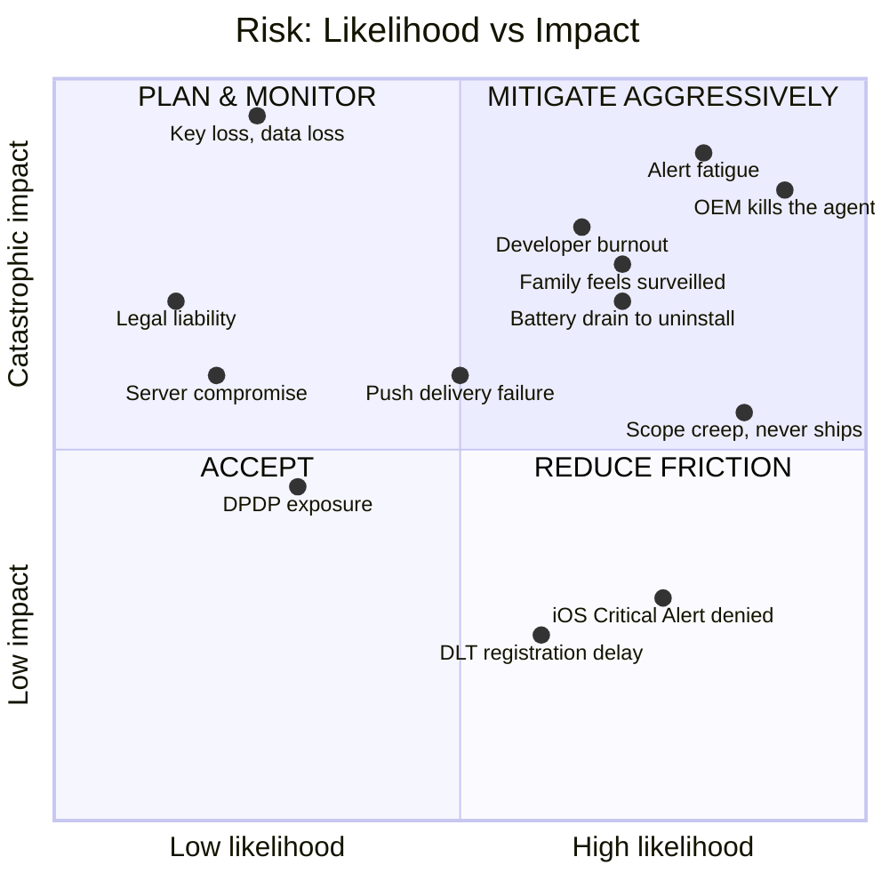

| ID | Risk | Mitigation |
|---|---|---|
| **RISK-001** | OEM battery managers kill the agent | Device Owner (§5) → exact-alarm watchdog → **server-side heartbeat gap alerting to the family** → guided per-OEM onboarding → quarterly drills |
| **RISK-002** | Alert fatigue causes real alerts to be ignored | PROBE state; per-scenario cancel windows; FP ledger as a P0 metric; hard rule that any trigger exceeding 1 FP/month is retuned or disabled |
| **RISK-003** | Family perceives surveillance and disengages | Consent ledger with surfaced access logs; expiring grants; autonomy ramp; admin≠observation; on-device geofences; **and the non-technical mitigation: the week-1 family conversation** |
| **RISK-004** | Scope creep — never ships | The Phase 1 gate is deliberately tiny. Ship the panic button + fan-out + SMS in 12 weeks, then **stop and use it for a month** before writing another line. Everything in Parts 13–14 is worthless if Part 7 does not exist. |
| **RISK-005** | Key loss → permanent data loss | Shamir 2-of-3 + paper share + geographically distributed shares + **annual recovery drill** |
| **RISK-006** | Developer becomes unavailable | Printed runbook; second person with break-glass access; boring tech; automated dependency updates; **choose a scope maintainable in 2 hours/month, not 20** |
| **RISK-007** | Legal liability from a failure | Never promise dispatch; prominent "not a substitute for 112"; the 112 button is always one tap away; no AI-generated medical advice; the signed family agreement documenting limitations |
| **RISK-008** | DPDP exposure once a non-family member is onboarded | Build notice/consent/erasure from day one; separate temporary-member flow with mandatory expiry (§20.1) |
| **RISK-009** | Battery drain → uninstall | Power budget as an SLO; hardware FIFO batching; no idle persistent socket; fleet battery regression test each release |
| **RISK-010** | iOS Critical Alerts entitlement denied | PushKit + CallKit is the plan-B and it works. Apply for the entitlement anyway. Give iPhone users a BLE fob. |

## 21.1 Common mistakes in safety-critical systems — put this on the wall

1. Testing only the happy path. Test at 2% battery, on 2G, on a five-year-old phone, in a lift, with DND on, at 3 a.m.
2. Treating push as reliable. It is not. Always have SMS.
3. Sequential fallback chains. Fire in parallel.
4. Coupling the panic path to auth, database, or config. Isolate it.
5. No self-monitoring. Silent failure is the norm, not the exception.
6. Building for the buyer rather than the monitored. The monitored person always wins eventually.
7. Optimising the wrong clock — shaving 100 ms off t3 while t4 is six minutes because your mother has DND on.
8. No versioned policy. You cannot explain past behaviour after changing the rules.
9. Never running a drill. Untested is decoration.
10. Confusing "encrypted" with "private." Metadata is data. Coarse location over time is a home address.
11. AI in the decision path. Advises, never decides.
12. No plan for the developer's own absence.

---

# PART 22 — GLOSSARY

| Term | Meaning |
|---|---|
| **AML** | Advanced Mobile Location. Sends precise handset location to the emergency call centre automatically when an emergency number is dialled. Not app-controllable. |
| **Black box** | The 60-second rolling encrypted sensor (and optional audio) buffer sealed on trigger. |
| **Break-glass** | Emergency access to encrypted data by someone who does not normally hold the key. |
| **Canary** | The synthetic end-to-end SOS fired every 15 minutes to prove the whole chain works. |
| **Class A / B / C** | Data sensitivity classification. A = E2EE always; B = server-readable; C = plaintext metadata. |
| **CLAIM** | A responder taking ownership of an incident, halting escalation. |
| **Degradation level** | 0–5, describing which transports are currently available (§4.4). |
| **Device Owner** | Android fully-managed-device mode. The core reliability strategy (§5). |
| **DLT** | Distributed Ledger Technology registration required by TRAI for A2P SMS in India. |
| **DPC** | Device Policy Controller — the app component that exercises Device Owner powers. |
| **Direct Boot** | The Android state after reboot but before first unlock. Only device-protected storage is available. |
| **DPDP** | India's Digital Personal Data Protection Act 2023 and Rules 2025. |
| **ERSS-112** | India's Emergency Response Support System, the unified 112 emergency number. |
| **Final Breath** | The last packet sent when a device is shutting down or at critical battery. |
| **Four Clocks** | Detection, confirmation, notification, and response latency — the core metric framework. |
| **H3 r7** | Uber's hexagonal geospatial index at resolution 7, roughly 1 km across. The only plaintext location the server holds. |
| **HLC** | Hybrid Logical Clock. Causally-correct event ordering across devices with skewed clocks. |
| **MLS** | Messaging Layer Security, RFC 9420. The group end-to-end encryption protocol. |
| **PROBE** | The cheap-intervention state: one haptic buzz and one question before escalating. |
| **PSAP** | Public Safety Answering Point — the emergency call centre. |
| **ReBAC** | Relationship-based access control. Zanzibar/OpenFGA style. |
| **T0 / T1 / T2** | Survival, Coordination, and Intelligence planes. |
| **WATCH** | The elevated-risk state that raises sensitivity and pre-warms transports. |

---

# PART 23 — APPENDICES

## Appendix A — Android permission manifest and justifications

| Permission | Why | User-facing justification string |
|---|---|---|
| `ACCESS_FINE_LOCATION` | Incident location | "So your family can find you in an emergency" |
| `ACCESS_BACKGROUND_LOCATION` | Journeys, geofences, incidents while the app is closed | "So safety features work even when the app is closed" |
| `ACCESS_COARSE_LOCATION` | Fallback | — |
| `SEND_SMS` | Offline emergency messages | "So we can reach your family even with no internet" |
| `READ_PHONE_STATE` | Multi-SIM selection (P-033) | "To choose the right SIM for emergency messages" |
| `POST_NOTIFICATIONS` | All alerts | "So you receive emergency alerts" |
| `USE_FULL_SCREEN_INTENT` | Alerts that break through | "So emergency alerts can wake your screen" |
| `ACCESS_NOTIFICATION_POLICY` | DND bypass | "So emergency alerts get through Do Not Disturb" |
| `USE_EXACT_ALARM` | Watchdog (P-037) | "To keep safety monitoring running reliably" |
| `SCHEDULE_EXACT_ALARM` | Fallback for `USE_EXACT_ALARM` | Same |
| `RECEIVE_BOOT_COMPLETED` + `LOCKED_BOOT_COMPLETED` | Restart after reboot (P-035) | "To restart protection after your phone restarts" |
| `FOREGROUND_SERVICE` + `_LOCATION` + `_CONNECTED_DEVICE` + `_CAMERA` + `_MICROPHONE` | Service types (P-041) | Per feature |
| `BLUETOOTH_SCAN` / `_ADVERTISE` / `_CONNECT` | Family mesh, fob, beacons (P-039) | "To find family members nearby when there's no signal" |
| `BODY_SENSORS` / `READ_HEALTH_DATA_IN_BACKGROUND` | Heart rate baselines | "To detect medical emergencies" |
| `CAMERA` | Anti-theft capture, CCTV node | "For theft protection and home monitoring" |
| `RECORD_AUDIO` | Duress phrase, incident audio, intercom | "For voice emergency commands and evidence" |
| `SYSTEM_ALERT_WINDOW` | Screen-off overlay, app blocking fallback | "For theft protection and screen-time limits" |
| `PACKAGE_USAGE_STATS` | Screen time (P-026) | "To measure app usage for screen-time limits" |
| `REQUEST_IGNORE_BATTERY_OPTIMIZATIONS` | Reliability (P-004) | "So protection isn't switched off by battery saver" |
| `BIND_DEVICE_ADMIN` | Device Owner (§5) | "To keep this app protected and reliable" |

## Appendix B — OEM battery settings deep links

| OEM | Intent / path |
|---|---|
| Xiaomi (MIUI/HyperOS) | `com.miui.securitycenter/com.miui.permcenter.autostart.AutoStartManagementActivity`; also Battery saver → app → No restrictions |
| Oppo / Realme (ColorOS) | `com.coloros.safecenter/.permission.startup.StartupAppListActivity` (varies by version) |
| Vivo (Funtouch/OriginOS) | `com.iqoo.secure/.ui.phoneoptimize.BgStartUpManager` |
| Huawei | `com.huawei.systemmanager/.startupmgr.ui.StartupNormalAppListActivity` |
| Samsung | `Settings.ACTION_APPLICATION_DETAILS_SETTINGS` → Battery → Unrestricted; plus "Never sleeping apps" |
| OnePlus | `com.oneplus.security/.chainlaunch.view.ChainLaunchAppListActivity` |
| Universal fallback | `Settings.ACTION_IGNORE_BATTERY_OPTIMIZATION_SETTINGS` |

> These intents change between OS versions and are often not exported. **Always wrap in try/catch and fall back to an illustrated manual guide.** Cross-check against dontkillmyapp.com at each release.

## Appendix C — Repository structure

```
kavach/
├── docs/
│   ├── PRD.md                      ← this document
│   ├── adr/                        ← ADR-001 … ADR-0nn, one file each
│   ├── runbook.md                  ← Part 19, printable
│   └── family-agreement.md         ← Part 20.3
├── proto/
│   ├── incident.proto              ← the critical-path contract
│   └── sync.proto
├── spec/
│   └── state-machine.yaml          ← ★ single source of truth, generates BOTH
│                                      the Kotlin and the Go state machines
├── backend/
│   ├── cmd/sos-ingest/             ← ≤1000 LOC, ≤5 deps, its own pipeline
│   ├── cmd/realtime-gw/
│   ├── cmd/control-plane/
│   ├── internal/identity|family|policy|escalation|notify|vault|journey|
│   │            automation|report|consent|device/
│   ├── migrations/
│   └── tools/archlint/             ← CI module-boundary enforcement
├── mobile/
│   ├── lib/                        ← Flutter: T1 + T2
│   ├── android/app/src/main/kotlin/…/t0/   ← ★ Tier 0. Native. Sacred.
│   ├── android/app/src/main/kotlin/…/dpc/  ← Device Owner controller
│   └── ios/Runner/T0/              ← ★ Tier 0 Swift
├── firmware/
│   ├── panic-fob/                  ← nRF52 / ESP32-C3
│   └── room-beacon/
├── bridge/
│   └── home-assistant/             ← ~400 LOC Go
├── infra/
│   ├── terraform/
│   ├── compose/
│   └── grafana/
└── canary/                         ← the most important 300 lines you will write
```

## Appendix D — First-week checklist

```
□ Family conversation held; every adult has consented in writing
□ Family agreement (§20.3) drafted and signed
□ DLT registration submitted (blocks Phase 1 — start on day one)
□ Every family device IMEI recorded in a temporary secure note
□ Apple Developer + Google Play accounts created
□ Domain registered; Cloudflare configured
□ DigitalOcean + Hetzner accounts created; billing alerts set
□ Repo created with the Appendix C structure
□ ADR-001 through ADR-020 committed
□ Data classification of every planned field completed (§10.2)
□ One phone designated as the UNPROVISIONED CONTROL device
□ Two spare phones identified for canary sender + receiver
```

## Appendix E — Recurring checklists

### E.1 Per-release checklist
```
□ All Definition of Done items (§0.5) satisfied for every changed feature
□ Full device test matrix (§17.2) passed
□ Chaos tests T-201 … T-218 passed
□ Canary green for 72 h on staging
□ Battery regression: idle drain still < 4%/24 h
□ ASCII SMS payload lint passed
□ Old-client contract tests (12 and 24 months) passed
□ No new Class-A field reaching the server (schema lint)
□ Traceability matrix (§3.3) updated
□ Runbook updated if any operational procedure changed
```

### E.2 Monthly checklist
```
□ Review the False Positive Ledger; retune or disable any trigger > 1 FP/month
□ Review agent-liveness percentages per device
□ Check node phone battery temperature and health trends (P-032)
□ Apply dependency updates; review any new direct dependency
□ Verify the offline backup ran and is restorable (spot check)
□ Review the access log for anything surprising
```

### E.3 Breach response (write this before you need it)
```
T+0h    Contain. Rotate every credential. Revoke all sessions.
T+2h    Assess: which data classes? Class A means ciphertext only —
        say so precisely, do not overstate or understate.
T+24h   Notify every affected family member in plain language.
T+72h   IF you are a Data Fiduciary (any non-family member onboarded):
        notify the Data Protection Board of India (DPDP Rule 7).
T+7d    Written post-mortem. What failed. What changes. Publish it
        to the family.
```

### E.4 Family onboarding checklist (per person)
```
□ Explained what is collected and who can see it
□ Explained device management, if applicable, and listed every restriction
□ They chose their participation level
□ Consent recorded as an event with a timestamp
□ App installed; device enrolled; MLS group joined
□ All permissions granted and VERIFIED by the self-diagnostic
□ Battery optimisation exemption verified
□ DND bypass verified with a real test alert
□ They have successfully triggered a test SOS and cancelled it, unaided
□ They know the duress PIN and have practised it once
□ Medical card filled in; NFC tag / QR sticker produced
□ Emergency contacts confirmed and phone numbers verified by test SMS
□ They know where the CALL 112 button is
□ IMEI recorded in the vault
```

---

# CLOSING — THE TEN THINGS THAT MATTER

If this document is ever reduced to one page, reduce it to this.

1. **Build the Survival Plane first, in native code.** Twelve weeks: hardware trigger, cancel window, family fan-out with acknowledgment, SMS fallback, local alarm with medical card, 112 handoff. Nothing else. That is 90% of the life-saving value at 10% of the effort. **Then stop and use it for a month.**

2. **Provision every family Android phone as a Device Owner.** One factory reset and fifteen minutes per phone eliminates the OEM battery killer, permission auto-revocation, force-stop, uninstall, and factory reset — the five problems that would otherwise consume a year.

3. **Make `sos-ingest` a separate, sacred binary.** Under 1000 lines, five dependencies, no database read on the hot path, deployed twice a year. When you break the control plane — and you will — SOS keeps working.

4. **Build the canary before you build the second feature.** A real synthetic SOS every 15 minutes that pages you when the chain breaks. It will catch more real failures than every other observability investment combined.

5. **Make silent failure impossible.** Server-side heartbeat gap detection that tells the *family* when someone's agent has gone quiet. This is the difference between a system that works and a system that everyone believes works.

6. **Make consent visible and expiring, from day one.** No permanent grants. Every access surfaced to the observed person. Administration separated from observation. A published autonomy ramp. This is what keeps the app installed on your daughter's phone in 2032.

7. **Evaluate geofences on-device. Never send precise location to your server in plaintext.** One decision, and your home address, your children's school, and ten years of routine simply do not exist on any server. The functional cost is near zero.

8. **Fire your transports in parallel, not sequentially.** Five redundant messages cost ₹1.20. A sequential fallback chain costs 45 seconds. You are racing a clock.

9. **Treat the false-positive rate as a P0 metric and gate Phase 3 on it.** An automatic detector that cries wolf makes your family less safe than no detector at all.

10. **Run drills quarterly and a key-recovery drill annually.** Put them in the calendar. An emergency system that has never been tested under realistic conditions is a decoration, and an untested backup is a folder.

**And one thing not to do:** do not build the AI features early. They are the most fun and the least valuable per hour invested. Every hour spent on incident summarisation before the SMS fallback works is an hour spent on the wrong thing.

---

> ### The key takeaway
>
> **A family safety platform is not a feature set. It is a chain, and its value equals the reliability of its weakest link at the exact moment it is needed — which will be the moment when the battery is dead, the network is gone, and nobody is looking at their phone.**
>
> Build the chain first. Make every link independently survivable. Separate the survival path from everything clever. Make the system visible to the people it watches, so they let it keep watching. Measure the four clocks. Test it when nothing is wrong.
>
> **Ship Phase 1 in twelve weeks. Everything else is what you build in the years after your family already trusts what you built in week twelve.**

---

*End of document. Version 1.0. Maintain the ADR log and the traceability matrix as living artefacts — a blueprint that stops being edited stops being true.*
